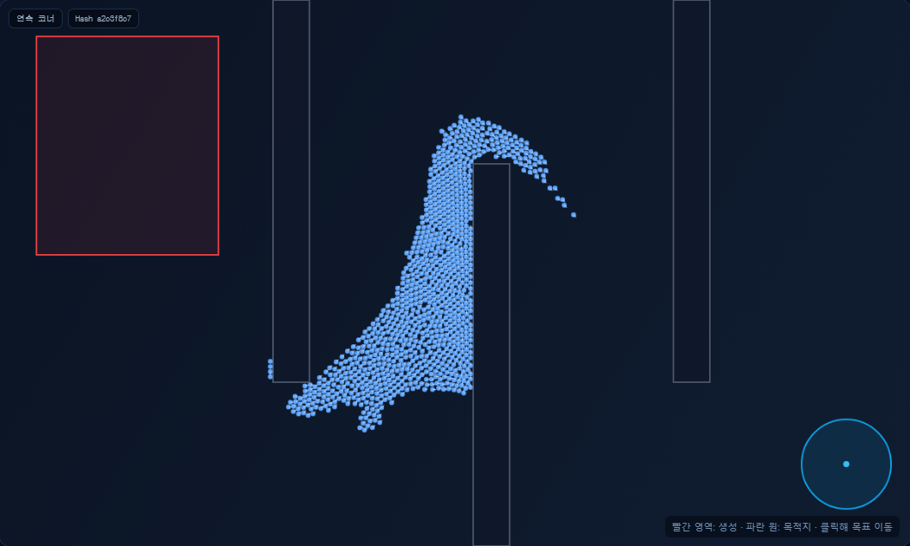

# 밀집 군중의 내부 틈 개선

연속 코너에서 중앙이 긴 줄처럼 비는 현상을 재현해, 목표 밀도와 접촉 보정을 함께 수정했다.
기존 압력 기준은 군중을 일찍 벌렸고, 여러 접촉의 위치 보정을 그대로 합산하면서
그 이동량이 다음 프레임의 속도로 전달돼 틈과 떨림이 커졌다.

- 목표 셀 질량을 8 → 12로 높였다. 경로 혼잡 비용은 정규화 밀도 .75부터 적용하고,
  그 이후의 제곱 비용 가중치를 72로 높여 실제로 혼잡한 길에서는 우회를 유지한다.
- 접촉 수에 따라 보정 합을 완화하고 8회 반복한다. 후보 탐색은 한 번, Agent당 최대
  24개 후보·8개 쌍이며, 뒤의 보정에서 닿을 가까운 쌍도 후보 목록에 남긴다.
- 8회 전체의 누적 접촉 이동 길이는 기존 1.25px 이내다. 매 반복의 정적 투영과
  최종 swept-circle 충돌 검사를 유지한다. 인력이나 시나리오별 예외는 추가하지 않았다.

## 같은 조건의 비교

`winding-corners`, 1,000명, seed 42, 반경 3.2, gap .4, 900 step, dt 1/60.
동일 머신(Node v22.22.0 / Ryzen 9 9950X3D)에서 다른 테스트 실행과 분리해 측정했다.
수정 전 소스는 `0a064ec`이며, 원시 결과는
[수정 전](../baselines/continuity-before.json), [수정 후](../baselines/continuity-after.json)에 있다.

| 지표 | 수정 전 | 수정 후 |
|---|---:|---:|
| 내부 빈 셀 비율 | 1.949% | 0.452% |
| 내부 밀도 분산 지표 | .1245 | .0644 |
| jerk extended P95 | 123,814 | 13,245 |
| 실행 중 최대 측정 침투 깊이 | 1.111px | .632px |
| 벽 겹침 최대 수 | 0 | 0 |
| 평균 목표 방향 속도 | 61.42px/s | 68.81px/s |
| step 시간 P50 / P95 | 1.36 / 2.11ms | 2.31 / 3.10ms |

내부 빈 셀 비율은 반경 4배 크기의 진단 격자를 사용하는 local proxy다.
모든 픽셀의 빈 공간이나 임의 크기 구멍을 검출한 값은 아니다. 원 사이의 작은 틈과
순간적인 접촉 침투는 남으며, 완전 비압축 유체나 정확한 원 패킹을 보장하지 않는다.

[큰 population 측정](../baselines/continuity-10k.json)은 10,000명을 요청했지만 생성 공간 때문에
실제 8,424명이다. 반경 1.5 / gap .05 / 360 step에서 벽 겹침 0,
누적 보정 최대 1.25px, step P50 21.60ms / P95 24.08ms였다.
더 많은 접촉 반복에 따른 CPU 비용 증가가 있으며 이 조건에서 60Hz 처리를 보장하지 않는다.

## 검증과 재현

`npm run verify`의 타입 검사·107개 테스트·빌드와 `npm run test:e2e`의
21개 브라우저 테스트가 통과했다. 연속 코너 회귀에는 내부 빈 셀 비율 .6% 미만,
jerk extended P95 20,000 미만을 추가했고, 8회 전체의 실제 접촉 이동 한도도 검사한다.

접촉 작업량 검사는 반복 횟수를 포함하도록 수정했다. 같은 폭의 관문 우회 비교는
실제 정체를 만들기 위해 양쪽 비교군 모두 압력 기준 8을 명시한다. 밀집 합류 검사는
반경 이내의 가장자리 패킹 이동을 허용하되 후퇴나 반경을 넘는 바깥 이동은 금지한다.
완전 중첩 ablation에서는 격자로 양자화된 점유 면적의 동률을 허용하고 밀도·침투
비악화와 작업량 한도를 계속 검사한다.

```bash
npm run measure:fluid -- --scenario=winding-corners --steps=900
npm run measure:fluid -- --scenario=winding-corners --agents=10000 --steps=360
```

브라우저 재현: `/?scenario=winding-corners&agents=1000&seed=42&step=600&paused=true`.


