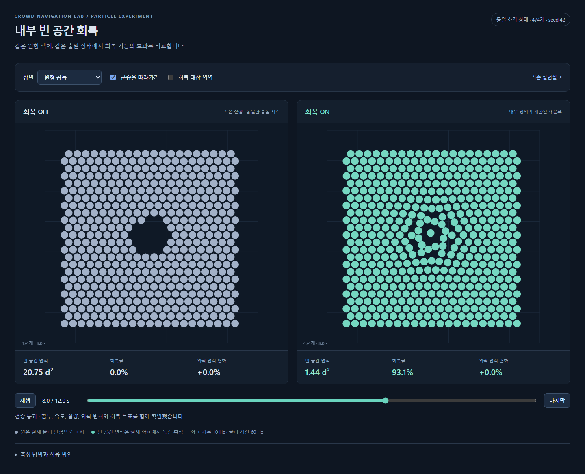

# 실제 원형 객체의 내부 빈 공간 회복 — P0~P2a 구현 결과

작성일: 2026-09-20. [연구 보고서](fluid-navigation-research.md)의 권고안 C를
독립된 TypeScript CPU 기준 backend로 구현했다. 실제 원형 객체를 이동시키며
공동을 채우고, 동일 초기 상태의 회복 OFF/ON 결과를 비교할 수 있다.

**이번 완료 범위는 정답 내부 영역을 제공한 P0~P2a이다.** 자동 영역 판별,
장애물 corridor, 다중 경로, 도착 정책, 1k/10k 성능 검증과 제품 backend 교체는
포함하지 않는다. 원 연구 보고서의 전체 검증 계약을 통과했다고 해석하면 안 된다.

## 실행과 결과 확인

`Navigation/Crowd`에서 실행한다.

```powershell
npm run research:repair
npm run research:audit
npm run dev
```

브라우저에서 `/experiments/fluid-navigation/`을 열면 평지·원형 공동·열린 균열을
같은 시각에 나란히 재생할 수 있다. 실제 반경을 그대로 그리고, 군중을 따라가는
좌표계/월드 좌표계와 알려진 회복 영역 표시를 선택할 수 있다. 원본 제품 화면은
기존 진입점에서 실행된다. `npm run build`는 두 진입점과 재생 자료를 함께 빌드한다.

고정 초기 좌표는 `experiments/fluid-navigation/fixtures/`에 있다. 각 후보가 새로
spawn하지 않고 동일 JSON을 읽는다. 명시적으로 fixture를 재생성할 때만
`npm run research:freeze`를 사용한다. 평가 seed 실행은 다음과 같다.

```powershell
npm run research:repair -- --seeds=7,19,73 --replays=none --output=docs/research/fluid-navigation/particle-holdout
npx vitest run tests/unit/particle-repair.test.ts
npx playwright test tests/browser/particle-repair.spec.ts
```



## 측정 결과

물리 dt=1/60초, 12초, 지름 d=1, 진행 속도 5d/s, 속도 상한 6d/s.
평지 492개, 원형 공동 474개, 열린 균열 472개를 실제로 생성했다.
개발 seed 42와 고정 평가 seed 7·19·73에 같은 매개변수를 사용했다.
3장면 × 4seed × OFF/ON = **24회 모두 이번 프로토타입 기준을 통과했다.**

| 측정 | 결과 |
|---|---|
| 원형 공동, 8초 면적 감소 | 42: 93.07%, 7: 83.94%, 19: 84.94%, 73: 87.76% |
| 열린 균열, 10초 면적 감소 | 모든 seed 100% |
| 회복 OFF의 결손 변화 | 모든 seed 0% |
| 평지에서 자발적인 큰 공동 | 기록된 모든 진단 시점에서 0 |
| 외곽 footprint 면적 변화 | 최대 0.744% |
| 실제/연속 경로 최대 침투 | 1.64e-9 d 미만 |
| 최대 transport/observed 속도 | 5.357 d/s 미만, 상한 6 d/s |
| 상대 면적질량 오차 | 1.21e-14 이하 |
| 투영 반복 | 최대 53회, 재시도 0회 |
| primal / complementarity | 각각 1e-7 / 4.75e-9 미만 |
| coarse density slack | 이번 회복 실행에서는 0 |
| CPU step P95 | 약 20.18~23.36ms |

침투는 최종 위치 전체 쌍, world 경계, 이동 구간의 전체 쌍 최근접 거리를
검사한 값이다. 진단 후보를 제한하지 않는다. 위치 bias는 사용하지 않으므로
위치 보정이 다음 추진 속도로 재주입되는 경로가 없다.

CPU 수치는 AMD Ryzen 9 9950X3D, Node v22.22.0, Windows에서 측정한 기준 구현의
기록이다. 매 step의 필수 전체 쌍 안전 검사와 재산포 비용을 포함한다.
warm-up을 둔 성능 qualification은 아니며 **현재 구현은 500명 규모에서도
60Hz 예산을 넘을 수 있다.** 전체 쌍 검사와 기준 solve를 유지한 채로 10k에
확장할 수 있다는 결론을 내리지 않는다.

원자료:

- [개발 seed 요약 및 소스 SHA-256](research/fluid-navigation/particle-results/summary.json)
- [평가 seed 18회 요약 및 소스 SHA-256](research/fluid-navigation/particle-holdout/summary.json)
- [진단 해상도 교차검사](research/fluid-navigation/particle-results/geometry-audit.json)
- [초기 상태·수치 방법·합격 기준](../experiments/fluid-navigation/particle-protocol.md)

## 지표 해석과 연구 설계에서 구체화한 사항

여기서 회복률은 물리 원의 union에 고정된 작은 틈 닫기 연산을 적용한 뒤의
**큰 빈 연결 영역 면적 감소율**이다. 실제로 반경 0.5d 이상의 빈 원이 들어가는지
원과의 정확한 거리로 확인한다. 회복에 사용하는 mask는 진단에 전달하지 않는다.
열린 균열은 이 단일 수평 군중에서 양쪽의 물리적 지지를 확인하는 별도 bridge
연산으로 찾는다. 분기와 벽이 있는 임의 장면의 내부 판별기는 아직 아니다.

원 보고서의 밀도장 deficit 82.21%와 직접 비교할 수 없다. seed 42의 진단 격자를
0.25d에서 0.125d로 줄이면 원형 공동 회복률은 93.07%에서 88.96%로 바뀐다.
4.11%p 차이가 있으며 두 측정 모두 80% 기준을 통과했다. 균열은 모두 100%다.
평가 seed 전부에 대한 세밀한 격자 검사는 수행하지 않았다.

- 반경을 반영하는 7점 원판 quadrature와 cubic B-spline을 사용한다. 정확한
  원판/셀 적분은 아니며, 경계 정규화의 미분까지 포함해 면적을 보존한다.
- 격자는 알려진 전체 평행이동을 따라간다. 밀도 예측은 `J(v-v_grid)`를 사용한다.
  개별 운동은 유지하며, 실제 원의 위치와 속도는 월드 좌표로 기록한다.
- 알려진 외곽에서는 법선 회복 의도를 완만하게 감쇠한다. 격자 no-flux만으로
  입자 누출까지 막았다고 주장하지 않는다. 이 부분도 자동 mask 단계의 검증 대상이다.
- 공통 투영은 각 제약의 dual/correction을 유지하는 weighted Dykstra다.
  원 보고서의 제안 상한 100회 대신 이 프로토타입은 200회를 사용한다.
  제한 도달 시 결과를 적분하지 않고 substep 재시도 또는 실패 정지한다.
- 원형 속도 상한도 투영 문제 안에서 처리하며, 투영 뒤 전진 강제는 없다.
  실제 위치 재검사 뒤 저장 transport를 끝시점에서 다시 공동 투영한다.
- 위치·회복·충돌·밀도 관련 검사는 필수 실행에 포함한다. 공동 영상 기록은 10Hz,
  geometry 진단은 2Hz다. 원 보고서의 모든 frame 공동 수명·60fps 실패 영상·jerk
  기준을 이번 실행에서 검증한 것은 아니다. 재생 좌표는 1e-6d로 반올림되며
  매우 작은 재생상의 침투와 runtime Float64 검사값을 혼동하지 않아야 한다.

## 검증과 발견한 한계

단위 검증 10개를 수행했다. 면적 보존, 경계·혼합 반경의 미분 유한차분,
J/Jᵀ 내적, subcell cap calibration, 시간 간격에 따른 pair 조건,
접촉/속도 공/밀도 slack의 분석해와 결합 분석해, 잘못된 spawn 거부,
정상 공극·닫힌 공동·열린 균열 구분, 반복 예산 실패 검사를 포함한다.
브라우저 검사 2개는 OFF/ON 동일 초기 상태, 실제 재생·장면 변경,
모바일 overflow와 페이지 오류를 확인했다. TypeScript 검사와 생산 빌드도 통과했다.
제품 이동 정책은 수정하지 않았으며 기존 제품의 전체 시나리오 검증은 재실행하지 않았다.

**강한 압축에서 수렴 비용 문제가 실제로 드러났다.** 약 10d 폭의 실제 원판 패치에
중심 방향 `-3(x-center)`의 큰 선호속도를 주면 압력·접촉 제약이 함께 활성화되고,
200회에 수렴하지 않았다. 진단용 2,000회에서도 primal 약 0.00368,
complementarity 약 0.0348이 남았다. 이 사례는 성공으로 제외하거나 허용오차를
늘리지 않고, 명시적 미수렴을 확인하는 테스트로 보존했다. 밀집 병목에 적용하기
전에 solver의 수렴 가속 또는 다른 기준 최적화 방법과의 비교가 필요하다.

실제 P2a 회복 실행의 slack은 0이었다. 따라서 이 실행만으로 포화 군중의
장거리 압력 전달까지 검증했다고 볼 수 없다. 해당 수학 블록은 작은 분석해와
결합 제약 검사로 확인했으며, 포화 장면의 동적 품질은 후속 작업이다.

## 다음 결정

알려진 내부 영역에서 질량·외곽 안정과 실제 원 비침투를 유지하며 회복하는
효과는 확인했다. **P2b 자동 영역 판별로 진행할 근거는 확보했다.** 다음 작업은
동일 runner에서 oracle mask를 자동 mask로 바꾸고 벽·분기 오분류를 확인하는 것이다.
강한 압축의 수렴성은 별도 실패 항목으로 유지한다. 자동 mask, 강압축, 코너·병목이
검증되기 전에는 현재 제품의 기본 이동 backend를 바꾸지 않는다.

개발 중 임시 실행 결과는 `particle-dev/`에 보존하고 Git 추적에서 제외했다.
임시 파일 삭제 명령은 자동 실행 검토에서 정책상 차단되어 실행되지 않았다.
위 링크의 `particle-results/`와 `particle-holdout/`이 최종 평가 자료다.
