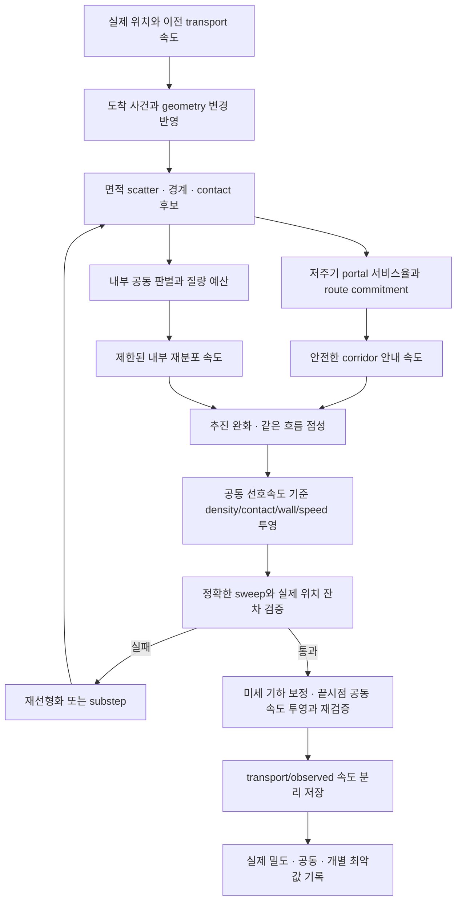
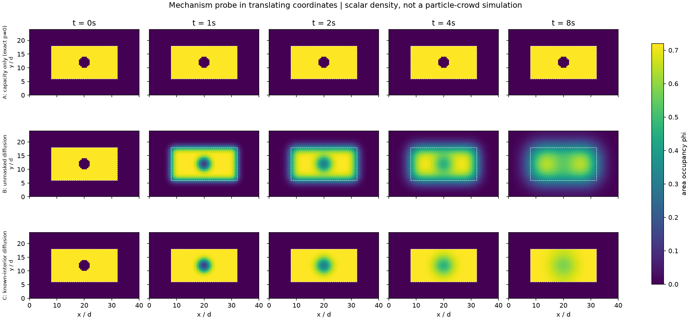

# 밀집 상태를 유지하며 빈 공간을 채우는 군중 이동 연구

작성일: 2026-09-20 · 대상: `Navigation/Crowd` · 범위: 연구, 설계, 독립 최소 실험.

## 1. 결정과 근거 수준

**권고: 경로 corridor를 안정적으로 유지하는 계획기 + 입자별 선호속도 + 내부 공동에 한정한 보존적 재분포 + 격자 밀도와 원형 접촉을 함께 만족시키는 속도 투영.** 객체는 끝까지 개별 원이다. 공유 압력은 과밀을 막고, 재분포는 내부 빈 공간을 채우며, 경로 선택은 다른 통로를 고른다. 세 기능을 하나의 밀도 비용이나 반발력으로 대체하지 않는다.

첫 프로토타입은 **입자 속도를 미지수로 하는 볼록 제약 투영**으로 정확한 기준을 만든다. 격자는 공유 점유율과 압력의 계산 공간이다. 단일 격자 평균속도로 모든 객체의 속도를 교체하지 않는다. 따라서 이 제안은 기존 8방향 격자를 보존하는 결정도, APIC 유체를 그대로 군중으로 사용하는 결정도 아니다. CPU 기준 구현으로 품질을 확인한 뒤 압력 블록·접촉 블록의 병렬화를 진행한다.

핵심 이유는 다음과 같다.

1. 양의 압력과 밀도 상한만으로는 비어 있는 내부를 채우지 못한다. 상한 이하 밀도의 고리 모양 군중이 같은 속도로 평행이동하면 `p=0`인 채 공동이 계속 남는 반례가 있다.
2. 모든 빈 공간을 동일하게 채우려는 균일화는 군중 외부로도 퍼진다. 이번 작은 장 실험에서 이 차이를 확인했다. 내부/외부 구분은 부가 장식이 아니라 핵심 제어 상태다.
3. 목적지 추진과 압력·접촉을 독립적으로 더한 뒤 전진을 강제하면 서로의 결과를 깨뜨릴 수 있다. 선호운동을 먼저 정의하고, 가능한 운동 중 가장 가까운 결과를 구해야 한다.
4. 개별 원판과 연속체의 통과 가능성은 다르다. 직경 몇 개 폭의 병목과 반대 흐름에는 실제 접촉·대기·통행 정책이 필요하다.

**확인 범위:** 1차 문헌 조사, 현재 코드의 데이터 흐름 분석, 기존 엔진 open-field 1,000/10,000명 각 6초 실행, 독립 밀도장 실험을 수행했다. 권고 구조 전체나 새로운 원형 에이전트 이동기는 구현하지 않았다. 코너·합류·분기에서의 시각 품질, 새 구조의 처리량·성능은 아직 검증 대상이다. 보고서의 수치 목표는 향후 구현을 위한 사전 계약이며 달성 실적이 아니다.

제품 코드·기존 테스트·기존 문서·미커밋 변경은 교체하지 않았다. 연구 산출물은 이 문서, `docs/research/fluid-navigation/`, `experiments/fluid-navigation/`에 추가했다.

## 2. 원하는 움직임의 기술적 정의

기준 지름 `d=2r_ref`, 자유 이동 속도 `v0`, 이동 시간 단위 `t0=d/v0`를 쓴다. 길이·시간 단위로 요구사항을 표현하고, 픽셀·프레임 수는 실행 시 변환한다.

| 요구 | 제어·측정 가능한 정의 |
|---|---|
| 연속된 덩어리 | 동일 진행 corridor의 국소 점유율이 연속적이고, 인접 객체의 상대속도가 작다. rigid formation이나 전역 볼록껍질 고정은 요구하지 않는다. |
| 내부 회복 | 객체 한 개가 들어갈 수 있는 내부 공동과 긴 균열의 면적·폭·수명을 제한한다. 회복 과정에서 질량을 만들거나 다른 곳에 같은 크기의 균열을 옮기면 실패다. |
| 코너 흐름 | 벽 법선 침투를 막으면서 접선 이동을 허용한다. 통과 가능한 국소 출구가 열린 뒤에도 남는 개별 객체를 추적한다. |
| 병목 대기 | 유입량이 서비스율을 넘으면 속도가 0까지 떨어지고 대기열이 늘어난다. 압력을 탄성 에너지처럼 축적했다가 방출하지 않는다. |
| 완만한 확장 | 넓은 곳에서 외곽과 내부 재배치가 제한된 속도·가속도로 일어난다. 전체 맵을 채우거나 자유 공간 모두를 점유할 필요는 없다. |
| 안정된 목적지 진행 | 매 프레임 전진 대신 일정 시간창에서 다음 portal까지의 진행을 평가한다. 짧은 옆 이동·후퇴는 정상 동작이다. |
| 합류·분기 | 합류 후 불필요한 경계가 남지 않고, 분기 후 서로 다른 통로를 응집력이 다시 묶지 않는다. 반대 목적지의 속도는 평균하여 소거하지 않는다. |

### 2.1 물에서 가져올 성질과 버릴 성질

| 성질 | 채택 범위 | 그대로 쓰면 생기는 부작용 |
|---|---|---|
| 비압축성 | **포화 부근의 압축 억제**와 공유 수용량 | 전 영역 `div(v)=0` 또는 밀도 등식은 희박한 구간·도착·분기와 맞지 않으며, 공동을 자동으로 없애지도 않는다. |
| 압력 전달 | 여러 객체가 한꺼번에 감속하도록 장거리 제약 전달 | 강한 반발 스프링은 진동·폭발을 만들 수 있다. 압력을 속도 제약의 반력으로 취급한다. |
| 점성 | 같은 진행 성분의 상대속도만 약하게 감쇠 | 모든 이웃을 섞으면 반대 흐름이 정지하고 코너에서 점착한다. |
| 관성 | 시간에 따른 속도 완화, 부드러운 회전 | 운동량 보존을 최우선으로 하면 목적지 정지·급코너·대기가 어려워진다. 게임의 추진/감쇠는 외력이다. |
| 자유표면 | 군중 외곽·새 분기·도착 영역을 내부와 구별 | 실제 물처럼 내부 공동도 공기 경계로만 처리하면 그 공동이 오래 남을 수 있다. |
| 응집성/표면장력 | 필요하면 내부 회복으로 제한된 약한 효과 | 전역 인력·표면적 최소화는 원형 뭉침, 외곽 수축, 통로 가로지르는 당김을 만든다. 기본값으로 쓰지 않는다. |
| 입자 분포 균일화 | 질량과 이동 속도를 보존/제한하는 **국소 재분포** | 단순 위치 relaxation은 순간 이동이고, 전역 확산은 군중을 해체한다. |
| 와도·튀김 | 기본 비활성 | FLIP 잡음이나 vorticity confinement의 에너지 주입은 목표에 필요하지 않다. |

이 구분은 물리적으로 정확한 물을 재현한다는 주장이 아니라 **게임 움직임에 맞춘 모델 선택**이다. PBF·DFSPH의 압력 처리와 APIC transfer의 역할은 [PBF 원문](https://mmacklin.com/pbf_sig_preprint.pdf), [DFSPH 확장 논문](https://dankoschier.github.io/resources/papers/BK17.pdf), [APIC 저자 자료](https://alexey.stomakhin.com/research/apic.html)에서 구분된다.

### 2.2 정상 공극과 비정상 공동

원형 객체의 물리적 합집합 `D=∪ disk(x_i,r_i)`를 기준으로 빈 공간을 잰다. 렌더링 크기·블러·연결된 색 면적은 판정에 사용하지 않는다. 같은 반경 원의 가장 조밀한 육각 배치도 면적 점유율은 `π/(2√3)≈0.907`이며, 세 원 사이 빈 원 반경은 약 `0.155r`이다. 정사각 배치에서는 약 `0.414r`다. 작은 공극이 있다는 사실 자체는 실패가 아니다.

진단 격자 `h_diag=d_min/4`에서 물리 원과 벽까지의 거리를 계산하고, 최대 빈 원을 실제 원/장애물 거리로 재검사한다. 초기 공동 기준은 **빈 원 반경 ≥0.5d_local**, 면적 ≥`π(0.5d_local)²`이다. 길이 ≥`4d_local`이고 폭 ≥`0.75d_local`인 틈도 별도 균열로 기록한다. `d_local`은 주변 반경의 중앙값을 쓰되 혼합 크기에서는 작은 객체가 들어갈 수 있는지 `d_min` 기준도 병기한다.

외부 flood-fill은 닫힌 공동에 유효하지만 외곽까지 열린 긴 균열은 놓친다. 다음 세 유형을 별도로 기록한다.

- **닫힌 공동:** 장애물과 실제 외곽을 제외한 support 내부의 빈 연결 성분.
- **열린 균열:** 동일 corridor·진행 성분의 군중이 양쪽을 지지하고, 짧은 거리로 가로질러 연결될 수 있는 긴 빈 영역. 벽 너머 연결과 정당한 분기 사이 공간은 제외한다.
- **자유표면:** 나머지 외곽. 불확실한 경계는 내부로 강제 분류하지 않고 `unknown`으로 기록한다.

넓은 빈 공간에는 여러 객체가 실제로 이동해야 한다. 외곽도 고정하고, 남은 객체의 밀도도 고정하고, 큰 공동도 채우는 세 요구를 동시에 만족시킬 수는 없다. 회복 패치의 총 면적질량으로 가능한 평균 밀도를 먼저 계산한다.

## 3. 현재 구현: 확인된 사실과 미확인 원인

코드 위치는 조사 시 작업트리 기준이다. 기존 문서의 결론과 테스트 기대값은 새 움직임의 정답으로 사용하지 않았다.

| 확인한 경로 | 근거 파일·줄 | 증상에 대한 해석 |
|---|---|---|
| 밀도→경로→선호속도→격자 압력→접촉→정적 충돌 | `src/core/simulation.ts:283–335` | 후속 제한과 보정까지 포함해 최종 움직임을 봐야 한다. |
| 밀도 상한용 양의 압력, 공동 회복 상태 없음 | `src/core/crowd-flow-solver.ts:164–201` | **복원 기제가 없는 조건은 확인.** 이것만이 관찰된 중앙 균열의 발생 원인이라는 뜻은 아니다. |
| 압력 8회 고정 반복, 매 step 초기화 | 같은 파일 `164–201` | 장거리 수렴 정도는 잔차로 확인되지 않는다. |
| 압력 gradient 제한, gather 후 후퇴 제거·속도 제한, 이후 가속도 제한 | 같은 파일 `203–273`; `crowd-movement-solver.ts:172–204` | 압력 투영과 실제 실행 속도가 다를 수 있다. |
| `correctedDivergence`가 무제한 face gradient 기준 | `crowd-flow-solver.ts:223–225` | 최종 입자 이동의 비압축성 증거로 사용할 수 없다. |
| 후퇴 제거 및 정적 potential 감소 제약 | `simulation.ts:444,481–490`; `flow-field.ts:608–624,720–738` | 코너 탈출·우회에 필요한 임시 후퇴를 막을 가능성. 인과는 미확인. |
| 혼잡 비용을 전체 경로 격자에 8step마다 반영 | `flow-field.ts:212–287`; `simulation.ts:580–609` | 내부 재배치와 통로 선택을 따로 표현하지 않는다. 동시 방향 번복의 후보 원인. |
| 접촉 후보24/쌍8/반복8, 목록1회, 이동상한1.25px | `crowd-movement-solver.ts:15–17,223–419` | 계산량 제한은 있으나 모든 접촉 검출·수렴 보장은 없다. |
| 보정한 전체 변위를 `Δx/dt`로 다음 속도에 반영 | 같은 파일 `607–632` | **보정 에너지 재주입 경로는 확인.** 실제 급확산의 주원인인지는 별도 실험 필요. |
| 도착 반경 내 객체 비활성화 | `simulation.ts:445–478` | 현재 도착은 sink이며, 남아서 정지하는 군중을 검증하지 않는다. |
| 큰 인원 렌더링에서 반경 최소2px | `src/rendering/canvas-renderer.ts:293–299` | 물리반경1.5px인 10k 화면은 틈을 실제보다 작게 보일 수 있다. 연구 시각화는 실제 반경으로 한다. |

기본 `dt=1/60s`에서 접촉 보정 상한 `1.25px`를 속도에 넣으면 최대 `75px/s`에 해당한다. 기본 최고속도 `86px/s`에 가까운 변화가 예측 가속도 제한 뒤에서 생길 수 있다. 정적 투영은 이 접촉 상한과 별개다. 이는 수식·코드로 확인한 위험 경로이지 해당 크기의 폭발이 실제로 발생했다는 측정은 아니다.

기존 `docs/compact-crowd.md`와 before/after JSON은 압력 기준, 경로 비용, 접촉 반복·합산 방식을 함께 바꾼 관측 기록이다. 개별 변경의 인과를 분리하지 못한다. 현재 테스트의 “후퇴 0”이나 일부 미도착 허용을 새 설계 합격 기준으로 물려받지 않는다.

### 3.1 인과를 확인할 통제 실험

동일 seed·초기 원 좌표·경로 commitment·프레임 시간으로 다음 한 항목씩 바꾼다. 처음부터 모든 조합을 실행하지 않는다.

| 가설 | 비교 | 지지하는 관측 / 반증 |
|---|---|---|
| 경로 재선택이 중앙 균열을 연다 | 경로 고정 / 동적 경로 | 경로 변경 직후 같은 위치에 균열·동시 회전이 증가 / 고정 경로에서도 같으면 단독 원인 아님 |
| 후퇴 금지가 코너 체류를 만든다 | 전진 강제 / 허용 | 같은 벽·접촉 조건에서 최악 객체 탈출시간 감소 / 압력 잔차만 늘면 다른 원인 존재 |
| 압력·최종 속도가 불일치한다 | 투영 직후 / 모든 pass 이후의 실제 밀도 예측 | 최종 pass에서 잔차 증가 및 위치 일치 여부 |
| 위치 보정이 급확산을 만든다 | 전체 `δx/dt` / 분리 보정+법선속도 처리 | 통과 처리량 유지하면서 보정 일과 속도 급증 감소 |
| 격자 경계가 코너 체류를 만든다 | 같은 지형을 subcell 이동·회전, h/h÷2 | 체류 위치가 격자에 붙어 움직이면 이산화 기여 |
| 접촉 누락·반복 부족이 틈을 만든다 | 현재 예산 / 누락 없는 소규모 기준 solve | max 침투·보정 집중과 균열 발생의 시간적 관계 |

접촉을 끄면 관통이 허용되므로 그것만으로 “유동이 개선됐다”고 판단하지 않는다. 접촉 on/off는 진단용이며 성능·시각 합격 후보가 아니다. 이번에는 위 원인분리 전체를 실행하지 않았다.

## 4. 실제 확인한 연구와 후보 비교

### 4.1 1차 자료와 해석 범위

| ID | 직접 확인한 출처 | 문헌이 말하는 내용 | 이 프로젝트에서의 추론 |
|---|---|---|---|
| R1 | [PBF, Macklin & Müller 2013, §3·4·9](https://mmacklin.com/pbf_sig_preprint.pdf) | 밀도 등식 `ρ/ρ0−1=0`을 위치에 적용한다. 음압의 tensile clumping과 이웃 결핍, 인공압력·반복 수의 한계를 논한다. | 원 논문과 상한 부등식 변형을 구별해야 한다. `s_corr`는 그 자체로 응집력이 아니다. 자유표면 수축을 음압 조정만으로 제어하기 어렵다. |
| R2 | [DFSPH, Bender & Koschier 확장 논문](https://dankoschier.github.io/resources/papers/BK17.pdf) | 밀도 오차와 밀도 변화율을 별도 solve하고 계수 재사용·warm start를 한다. 구현에서 음압을 0으로 제한한다. | 압축 안정성 후보지만 공동 치유 보장은 아니다. 2개 solve 비용과 경계 이웃 오차를 확인해야 한다. |
| R3 | [APIC, Jiang et al. 2015 저자 페이지](https://alexey.stomakhin.com/research/apic.html), [각운동량 보존 APIC 원문](https://arxiv.org/pdf/1603.06188) | PIC의 소산, FLIP의 잡음에 대응하여 입자 affine 속도를 저장한다. transfer의 운동량 보존과 보간 선택에 따른 안정성을 분석한다. | APIC는 경로·압력·응집 모델이 아니다. 본 과제에서 회전 정보 보존의 이점이 추가 상태·잡음 위험보다 큰지 후속 A/B가 필요하다. |
| R4 | [Continuum Crowds, Treuille et al. 2006](https://grail.cs.washington.edu/projects/crowd-flows/78-treuille.pdf) | 그룹별 potential에 거리·시간·discomfort를 결합한다. §4.5의 pair separation은 완전한 최소거리 보장과 같지 않으며 보정 artifact를 명시한다. | 혼잡 회피와 국소 운동을 강하게 결합하면 경로 안정성을 별도로 검증해야 한다. |
| R5 | [Aggregate Dynamics, Narain et al. 2009](https://gamma.cs.unc.edu/DenseCrowds/narain-siga09.pdf), [저자 연구실](https://gamma-web.iacs.umd.edu/research/crowds/#densecrowds) | unilateral incompressibility와 입자/장 결합, 부분 장애물 셀 용량, 별도 최소거리 보정을 사용한다. 속도 재정규화 뒤 재투영을 다룬다. | 본 권고의 과밀 제어 근거. 내부 빈 공간과 경로 선택을 해결한 것으로 확대 해석하지 않는다. |
| R6 | [Handling congestion in crowd motion modeling, Maury et al. 2011, §5·6.2](https://arxiv.org/pdf/1101.4102) | 선호속도의 허용집합 투영, 다중 그룹 총밀도 제약과 공통 압력, 미시 원판의 arch jam과 거시 흐름 차이를 다룬다. | 입자별 의도를 보존하되 압력을 공유한다. 총 flux가 상쇄되는 반대 흐름에는 별도 접촉이 필요하다. |
| R7 | [Indicative Routes, Karamouzas et al. 2009](https://webspace.science.uu.nl/~gerae101/pdf/fdg09.pdf), [Explicit Corridors 저자 자료](https://webspace.science.uu.nl/~gerae101/UU_crowd_simulation_publications_ecm.html) | route→corridor→local motion을 나누고 clearance와 경로 자유도를 제공한다. | corridor 내부 빈 공간 채우기와 다른 통로 선택을 분리할 근거다. 중심선 추종을 강제할 필요가 없다. |
| R8 | [ORCA 저자 페이지](https://gamma-web.iacs.umd.edu/ORCA/), [공식 RVO2](https://github.com/snape/RVO2) | pairwise velocity 제약과 선호속도 최적화, 개별 객체·장애물 지원. | 희박한 독립 이동의 좋은 기준선. 집단 공동 회복·밀집 연속성은 별도 목표다. |
| R9 | [Bridson & Müller-Fischer 강의 저자 페이지](https://www.cs.ubc.ca/~rbridson/fluidsimulation/), [학술기관 원문 사본](https://cg.informatik.uni-freiburg.de/intern/seminar/animation%20-%20Grid%20Fluids%20-%20SIGGRAPH%20Course%20-%202007.pdf) | MAC 압력 투영, 자유표면 압력, 고체 법선 유량과 소격자 경계 처리를 설명한다. | 벽에서 접선을 보존하고 투영·보간·기하 충돌이 같은 경계를 보도록 해야 한다. |
| R10 | [XPBD, Macklin et al. 2016](https://mmacklin.com/xpbd.pdf) | compliance를 `α/dt²`로 사용하고 누적 multiplier를 갱신한다. 알고리즘은 보정 위치 차이로 속도를 갱신한다. | XPBD를 쓰는 것만으로 게임의 보정 에너지 문제가 없어지지 않는다. 아래 분리 속도 설계는 원 XPBD와 다른 의도적 선택이다. |
| R11 | [SPlisHSPlasH 저자 구현](https://github.com/InteractiveComputerGraphics/SPlisHSPlasH), [pressure solver 공식 문서](https://splishsplash.readthedocs.io/en/latest/creating_pressure.html) | 여러 SPH solver와 경계·점성 모듈 및 비압력/압력/advection 분리를 제공한다. | 입자 후보의 검증 참고용이다. GPU 이웃 탐색 지원을 전체 crowd solver 성능으로 바꾸어 인용하지 않는다. |

접근 기록: R1/R2/R3/R4/R6/R7/R9 사본/R10은 본문 또는 저자 문서를 열어 확인했다. R5 PDF 서버는 직접 열기에서 오류가 나서 검색 도구가 반환한 원문 수식·문단과 저자 자료를 확인했다. UBC R9 PDF는 timeout으로 학술기관 사본을 사용했다. 모든 논문을 다운로드해 전문을 재현·검증했다는 의미는 아니다. 아래 수치 설정과 설계 결합은 문헌의 보장값이 아닌 **본 프로젝트 제안**이다.

### 4.2 유망 후보 네 가지

- **A — 입자 밀도 제약:** 상한형 PBF 또는 DFSPH + 내부 재분포 + corridor. WCSPH의 stiff equation-of-state를 기본 후보로 삼지 않는다. 반복 solve를 피하는 대신 작은 dt·압축/진동 제어 부담을 받기 때문이다.
- **B — 단일 유체:** MAC pressure + PIC/FLIP/APIC + 목적지 외력. 실제 유체 구조를 가장 직접적으로 적용하는 비교안.
- **C — 다중 의도와 공통 수용량:** corridor + 입자 의도 보존 + 격자 점유율 투영 + 내부 재분포 + 원판 접촉. **권고안.**
- **D — 경로와 개별 회피:** corridor + ORCA + 제한된 응집/재분포. 희박한 장면과 구현비용의 비교 기준.

| 판단 기준 | A: PBF/DFSPH 계열 [R1·R2](https://dankoschier.github.io/resources/papers/BK17.pdf) | B: PIC/FLIP/APIC [R3](https://alexey.stomakhin.com/research/apic.html) | C: 공통 수용량 [R5·R6](https://arxiv.org/pdf/1101.4102) | D: ORCA [R8](https://gamma-web.iacs.umd.edu/ORCA/) |
|---|---|---|---|---|
| 목적지와 압력 충돌 | 추진 후 입자 제약; 이후 추진 재가산 금지 | 외력 후 pressure; 강한 관성은 감속 방해 | 하나의 선호속도에 가장 가까운 공동 허용속도 | 선호속도를 충돌회피 가능 영역에 투영; 조밀하면 feasible 영역 고갈 |
| 내부 틈/수축 | 상한만으로 회복 안 됨; 음압 등식은 뭉침 위험 | 비압축성만으로 공기 공동 제거 안 됨; 표면장력은 수축 | 내부 회복 drive와 상한 pressure를 분리 | 응집을 추가해야 하며 좁은 통로 정체와 충돌 가능 |
| 자유표면 | kernel 이웃 결핍과 벽을 구별해야 함 | fluid/air 표식은 명확하나 내부 공동을 공기로 보존할 수 있음 | topology·시간 이력을 쓰는 내부 mask가 핵심 미검증 요소 | 별도 군중 support가 없으므로 동일한 분류 문제가 추가됨 |
| 벽·코너·좁은 곳 | boundary sample/SDF와 실제 원 접촉 필요; 이웃 결핍 편향 | face fraction/SDF 유리; 해상도보다 좁은 통로 소실 | 반경별 corridor와 실제 원 접촉, coarse 밀도는 완화 가능 | 반경별 장애물 처리 유리; arch/deadlock 해결 보장 없음 |
| 정체와 우회 | 별도 계획기 필요 | density potential과 직결하면 대규모 회전 위험 | portal 서비스율·대체 topology로만 장기 경로 변경 | 별도 전역 route 상태 없으면 국소 deadlock |
| 혼합 크기 | 면적질량·support 변형·경계 보정 복잡 | 충분한 footprint rasterization 필요 | 면적 가중 수용량 + 개별 clearance/contact | 개별 반경 자연스러움; 거대 객체 통행 협조 필요 |
| 반대 흐름 | 입자 의도는 보존, 전역 XSPH는 상쇄 | 단일 셀 평균속도는 상쇄; APIC만으로 해결 안 됨 | 개별 의도 보존, 공통 압력+개별 충돌; lane/교대 정책 별도 | 희박한 교행에 강점, 조밀한 대향은 정지 가능 |
| 대표 실패 | tensile, 경계 clumping, 장거리 반복 부족, 위치 보정 속도화 | PIC 소산, FLIP 잡음, 부적절한 APIC 보간 에너지 증가 | support 오분류, kernel 용량 편향, 투영 블록 잔차·과한 복잡도 | deadlock, 회피 진동, 공동 장기 잔존, 응집과 회피의 싸움 |

위 표에서 알고리즘 원리 외의 군중 적용 평가는 문헌을 연결한 설계 추론이다. 특히 “APIC가 코너 체류를 해결한다”, “ORCA는 밀집 병목을 항상 통과한다”는 보장은 사용하지 않는다.

| 구현·민감도 | A | B | C | D |
|---|---|---|---|---|
| dt·해상도 | 이웃 support·dt·반복·경계 샘플에 민감. PBF 안정성과 정확성은 다름 | CFL·셀 폭·transfer 차수·Poisson 잔차; 작은 형상 해상도 필요 | dt·kernel/cap 보정·접촉범위·내부 mask 해상도; 질량과 실제 원 검증 필요 | time horizon·이웃반경·dt에 민감, collision 책임 가정 |
| 밀도·객체 수 | 밀집시 이웃 수와 수렴 반복 증가 | N 외에 활성 셀 G와 표면 추적 비용 | N·G·실제 pair E 및 블록 간 수렴이 비용 지배 | 보통 O(Nk); 혼잡 LP 제약과 재탐색 증가 |
| CPU 시간 차수 | O(Nk I), 검색 별도 | O(Ns+G I_p+E I_c) | 기준형 O(I(Ns+E+G)), 재분포 O(G); 아래 §8 참조 | O(Nk)+공간검색, 최악 LP/이웃 비용은 구현에 의존 |
| 메모리 | O(N+Nk) pair/cache | O(N+G), APIC는 2D 입자당 affine4개 추가 | O(N+G+E+Ns), 목적지 수만큼 전체 격자 복제하지 않음 | O(N+Nk), obstacle graph |
| GPU | 이웃 구축·Jacobi 병렬화 가능, 반복 동기화 | scatter와 pressure solve 병렬화 친화적 | scatter/transpose·pair·격자 병렬화, reduction·접촉 충돌·route batching 난도 높음 | 불규칙 이웃/분기·가변 LP로 균일 격자보다 까다로움 |
| 구현 난도 | 작은 물 demo는 낮음, 군중 boundary/크기까지는 높음 | transfer+경계+압력+목적지 결합으로 높음 | 기준 구현은 가장 엄밀하나 joint solve·mask가 어려움 | 초기 구현 가장 쉬움, 요구 밀집 연속성을 맞추는 추가 규칙은 증가 |

**차선안은 A의 상한형 입자 제약+같은 경로/재분포 계층**이다. 좁은 통로·큰 반경 편차가 많아 격자보다 실제 contact가 지배하고, C의 공동 solve 비용이 예산을 넘으면 A를 비교한다. 대부분 희박하고 목적지가 제각각이면 D로 바꾼다. 한 방향의 연출용 유체 덩어리가 주가 되고 개별 목적지·혼합 크기 요구가 사라지면 B를 재검토한다.

## 5. 경로 계획과 국소 유동

### 5.1 기본 흐름

정적 장애물의 radius-aware navmesh/visibility graph에서 연결 관계와 portal을 만든다. 객체 반경에 따라 통과 가능한 portal을 판정한다. corridor 내부에서는 다음 portal의 **선분 전체** 또는 도착 영역까지의 거리/이동시간장 `T`를 계산한다. `u_goal=-v_free ∇T/(|∇T|+ε)`를 기본으로 하되, 기하적으로 안전한 lookahead와 곡률 감속을 사용한다. 중심선으로 당기는 힘은 넣지 않는다.

`T`는 목적지를 향하는 안내다. 접촉/압력 이후 `v·(-∇T)≥0`를 강제하지 않는다. corner 경계에서 거친 gradient를 보간할 때는 벽 반대편 값을 섞지 않는다. 단순 8방향 최단거리장을 반드시 유지할 이유는 없다. corridor와 local motion 분리는 [Indicative Routes](https://webspace.science.uu.nl/~gerae101/pdf/fdg09.pdf)의 구조를 참고한다.

### 5.2 군중은 순간적인 경로 장애물이 아니다

같은 통로의 높은 밀도는 **속도와 통과 용량의 상태**다. 경로를 막힌 것으로 바꾸는 것은 벽·닫힌 문·지나갈 수 없는 반경 등 topology 변화다. 군중 정체는 부드러운 예상 지연 비용에만 들어간다. 단, 영구적으로 정지해 남는 객체는 명시적인 점유 장애물/도착 시설로 모델링할 수 있다.

같은 corridor 내부의 빈 자리에는 재분포·국소 선호속도로 이동한다. 다른 corridor 선택은 route manager가 한다. 밀도 gradient를 곧바로 전체 Dijkstra 비용에 강하게 넣어 전 군중이 동시에 빈 쪽으로 갈아타게 하지 않는다.

### 5.3 일시적 정체와 실제 우회

portal마다 유입·첫 통과 횟수·대기 면적질량·밀도·서비스율을 기록한다. 서로 다른 크기는 인원수와 면적질량 서비스율을 함께 기록한다.

```text
eta(route) = static_travel_time + sum(filtered_queue_area / max(filtered_service_rate, q_floor))
if current route became geometrically invalid:
    invalidate commitment immediately
    choose a feasible alternative, or set guidance=0 and wait if none exists
    # 안전 무효화는 아래 시간·이득·cohort 조건을 우회한다.
else:
    switch only if:
        another radius-feasible topological route exists
        and its ETA improvement > switch_travel_cost + max(2 s, 0.15 * currentETA)
        and improvement persisted >= 2 s
        and agent is in a decision region
```

서비스율 0은 짧은 측정창에서 흔하다. `q_floor`는 정체를 삭제하는 장치가 아니라 ETA 추정을 유한하게 하는 값이며, 불확실성 상한·측정시간도 저장한다. 실제 다른 경로가 없으면 **안정적으로 기다린다**. 높은 밀도만으로 실패/우회 상태가 되지 않는다. 대체 경로가 있어도 너무 돌아가거나 반경이 맞지 않으면 바꾸지 않는다.

시작 시간 규모: 물리 60Hz, route 평가 0.5초, queue EWMA 3초, 이득 유지 2초, commitment 최소4초 또는 다음 decision portal까지. 평활계수는 `1-exp(-dt_route/τ)`로 계산한다. agent ID 기반 phase로 route 평가 시점을 분산하고, 한 번의 평가 구간에서 같은 decision region의 변경 인원을 10% 이내로 제한하여 다음 서비스율 관측을 기다린다. 이는 명시적인 경로 혼잡 제어 정책이며 물리 solver의 예외가 아니다. 수치는 §9에서 검증할 제안값이다.

### 5.4 코너 탈출과 반대 흐름

- 장애물의 비침투 법선 제약만 두고 접선 속도는 보존한다. 짧은 후퇴를 허용한다.
- 국소 progress는 2초 창의 portal 거리 감소로 보고, 바로 앞이 막힌 대기와 나 혼자 벽에 갇힌 상태를 분리한다. 국소 배출 가능 공간이 없으면 대기시간을 corner 실패로 세지 않는다.
- 단일 객체 시험부터 실패하면 군중 파라미터 대신 corridor·clearance·lookahead를 고친다.
- 서로 마주 오는 객체에 공유 압력만 적용하면 총 flux가 상쇄되어 충돌을 못 볼 수 있다. 실제 pair contact를 필수로 둔다. 반대 성분 사이 점성은 끈다.
- 통로 폭이 두 방향 교행을 허용하면 route manager가 부드러운 우측 선호를 만든다. 폭이 교행 불가능하면 portal 단위의 방향별 배치 통행/aging fairness가 필요하다. 대향 원판 두 개가 물리적으로 지나갈 수 없는 경우 solver 힘을 올려 해결하지 않는다. 해당 정책 없는 버전은 그 장면을 지원한다고 주장하지 않는다.

### 5.5 도착

**sink형:** 정해진 도착 경계와 서비스율을 통과할 때만 객체·질량을 제거한다. 삭제 직후 생긴 외곽을 내부 공동으로 오인하지 않도록 support 이력도 함께 갱신한다.

**정지형:** 도착 영역의 면적·capacity와 분산된 정지 목표를 정의한다. 하나의 점으로 무한히 몰지 않는다. `v_goal≤sqrt(2 a_stop s)`와 속도 완화로 감속한다. 정지 객체는 밀도·접촉에 남으며 도착 슬롯 예약으로 뒤따르는 군중을 대기시킨다. 가득 찬 목적지는 물리적 용량 부족 상태로 보고한다. 강한 압력으로 계속 압축하거나 이미 도착한 객체를 무조건 삭제하지 않는다.

## 6. 권고 구조의 구체 설계

아래 전체는 문헌을 결합한 신규 설계다. 첫 구현의 검증 가능성을 우선하며, 처음부터 최적화된 물 solver로 대체하지 않는다.

### 6.1 저장 상태

| 영역 | 상태 |
|---|---|
| Agent SoA | `id, x, v_transport, v_observed, radius, area=πr², inverseMass`, goal/route/corridor/portal ID, 진행 성분, route commit 시각, filtered progress, arrival mode, preferred velocity, 이번 step 보정 변위·법선 impulse·solver residual |
| 정적 geometry | 정확한 obstacle primitive/BVH, signed distance와 법선 보조장, 반경별 clearance/portal 가능성, 셀 가용면적, 벽을 건너는 stencil 차단 정보 |
| 밀도 격자 | `phi`, cap 및 calibration, agent→cell 가중치와 미분, `Jv`, pressure multiplier, density slack, pressure active set, solver scratch. 같은 셀의 서로 다른 진행 의도는 agent에 유지 |
| 회복 격자/패치 | obstacle-aware support, 외부 연결, 공동/균열 ID·수명·신뢰도, 직전 support의 이류 이력, donor 패치, area mass, 가능한 평균밀도, 보존적 flux와 제한 잔차 |
| contact | 누락 없는 broad phase 결과, pair gap/normal, wall constraint, 누적 dual 값, candidate overflow·재구축 횟수 |
| route manager | topology graph, corridor-local 안내장 캐시, portal queue/service EWMA, ETA 신뢰구간, commitment/decision cohort |

기본은 Float64 CPU 기준 구현이다. GPU Float32 버전은 별도의 오차 허용 범위로 비교한다. 큰 객체의 질량은 우선 면적에 비례시키되, 게임상 동일한 밀림을 원하면 그 정책을 별도 실험한다.

### 6.2 점유율·목표밀도·수용량

셀 가용면적 `A_c`와 정규화된 면적 전달 가중치 `W_ic(x_i,r_i)`로

```text
phi_c(x) = sum_i area_i * W_ic / A_c
sum_c W_ic = 1
J_ci = ∂phi_c / ∂x_i       # 2-vector; 정규화·경계 보정의 미분도 포함
phi_pred = phi + dt * J v
```

`phi`는 사람 수가 아니라 **무차원 면적 점유율 추정**이다. 기준 구현은 반경 footprint를 적분한 compact kernel과 smooth derivative를 사용한다. 큰 객체를 점 질량 하나로 scatter해 좁은 통로에서 작은 객체와 같은 분포로 취급하지 않는다. 셀 중심 위치에 따른 밀도 편향은 비중첩 정규 배열을 subcell 이동하여 교정한다. 벽으로 잘린 kernel의 질량 보존과 실제 `A_c`를 일관되게 사용한다.

시작값은 `phi_target≈0.72`, `phi_cap≈0.82`로 제안한다. 등반경 이상 packing 한계보다 여유를 두려는 가설이지 보편적인 물성값은 아니다. `phi_target`은 회복 가능한 희망 분포, `phi_cap`은 coarse 과밀 제어 기준, 실제 원판 비중첩은 별도 hard constraint다. 모든 비중첩 배치가 kernel cap 이하인 것은 아니므로 coarse 밀도에 명시적인 slack을 둔다. 혼합 크기·벽 인접층에서 같은 값이 유효한지 calibration 단계에서 확인한다.

### 6.3 내부 회복: 외곽 수축 없이 가능한 양만 이동

1. 물리 원의 union과 obstacle-aware support를 별도로 만든다. 작은 정상 공극을 잇기 위한 형태학적 closing 길이는 시작값 `0.5d`다. 벽을 가로지르는 closing은 금지한다.
2. flood-fill로 닫힌 공동을 검출한다. 열린 균열은 양측의 같은 corridor 진행 성분, 폭·길이, 직전 0.5초 support를 이류한 이력으로 판별한다. 분기 decision 이후 서로 다른 corridor의 간격은 치유하지 않는다. `unknown`에는 회복을 적용하지 않는다.
3. 공동 주변에서 geodesic 거리로 최대 `8d`까지 donor 패치를 확장한다. 패치 평균 `phi_eq=M_patch/A_patch`가 최소 유지밀도 `0.60` 이상인 경우에만 해당 범위 회복을 시도한다. 부족하면 목표를 낮춰 감추지 말고 `insufficient_mass`로 보고한다. 큰 공동은 단계적 패치 확장으로 처리한다.
4. 패치 내부 face에서 `q=-kappa grad(phi)`, 경계에서 `q·n=0`인 보존적 재분포를 만든다. 장애물 face도 0이다. 따라서 이 항만으로 외곽에서 질량을 빨아오거나 밖으로 내보내지 않는다. 각 face의 유출량은 donor 질량·속도 상한으로 제한하고 반대 셀에 같은 양을 더한다.
5. occupied 영역에서 `b≈q/max(phi,phi_floor)`를 선호속도로 gather한다. 빈 셀의 가상 속도로 입자를 생성하지 않는다. `|b|≤0.15v0`, 변화율 ≤`0.5a_drive`로 제한하고 최종 접촉/밀도 투영에 맡긴다. 전역 이동 자체는 경계의 no-flux 대상이 아니며, 군중 외곽은 평소 흐름으로 움직일 수 있다.

연속 방정식 수준에서 이 항은 패치 안의 질량을 보존하며 평균밀도 쪽으로 완화한다. 입자 gather·속도 제한·접촉과 결합한 실제 회복률은 동일하지 않다. **이번 실험은 알려진 고정 마스크에서 4번의 성질만 확인했다.** 마스크 재구축 시 질량/영역을 바꾸거나 실제 분기를 접합하는 실패가 가장 큰 미검증 위험이다.

격자 kernel 자체는 미세한 원 간 간격을 균일하게 만들지 못한다. 필요하면 같은 진행 성분의 `1–2d` 거리 이웃에만 약한 간격 선호를 넣되, coarse 공동 회복과 중복되지 않는지 ablation한다. 첫 프로토타입에는 추가하지 않는다.

### 6.4 추진과 점성

```text
u_i = arrival_limited(route_direction_i * v_free) + b_internal_i + lane_bias_i
v_star_i = v_i + limit_norm((1-exp(-dt/tau_drive)) * (u_i-v_i), a_drive*dt)
```

같은 corridor·진행 성분이며 벽을 사이에 두지 않는 가까운 이웃에만 상대속도 감쇠를 적용한다. 비음수 가중치의 implicit Laplacian solve로 `sum w_ij |v_i-v_j|²`를 줄인다. 반대 성분·분기 뒤 서로 다른 corridor는 섞지 않는다. 점성은 평활화 역할만 맡기고 공동을 채우는 인력으로 사용하지 않는다.

### 6.5 공통 속도 투영: 마지막에 전진을 다시 더하지 않는다

기준 지름·속도로 무차원화한 다음 아래 볼록 문제를 푼다. 구형 속도 상한은 quadratic objective+convex ball 제약이며 순수 선형제약 QP와는 구별한다.

```text
min_(v,e>=0)  1/2 Σ_i m_i ||v_i-v_star_i||² + η/2 Σ_c A_c e_c²
subject to
  phi_c + dt*(Jv)_c <= cap_c + e_c
  n_ij · (v_i-v_j) >= -gap_ij/dt             # gap=|xi-xj|-ri-rj
  n_wall · v_i >= -(sdf(x_i)-r_i)/dt
  ||v_i|| <= v_max_i
```

`n_ij=(x_i-x_j)/|x_i-x_j|`이며 `n_wall`은 벽에서 자유공간으로 향한다. 모든 잠재 충돌쌍은 swept bound로 수집한다. 최소 검색범위는 `r_i+r_j+(vmax_i+vmax_j)dt`다. 접촉 pair의 고정 법선 반공간은 비중첩 초기 상태에서 보수적인 다음 step 조건이다. 벽의 선형 제약은 실제 곡선·모서리 전체를 대체하지 않으므로 마지막에 정확한 swept-circle 검사를 한다.

밀도 multiplier `p≥0`는 `v=v_star-dt M^-1 J^T p + contact terms`로 작용한다. **scatter derivative J와 gather Jᵀ를 정확히 짝지어** 한 목적함수를 푼다. 이 p는 무차원화된 제약 multiplier이며 Pa 단위의 물 압력이라고 부르지 않는다. 비활성·자유표면 밀도 제약의 multiplier는 0이다. 임의 음압·복원 스프링을 저장하지 않는다.

`e`는 kernel cap과 원판 기하가 충돌할 때 hard contact를 우선하는 명시적 과밀 slack이다. `eta`는 허용 잔차 calibration으로 정하고 숨겨진 관통 허용량으로 쓰지 않는다. `e>0.02`가 0.5초 이상 지속되는 셀은 검증 실패/모델 불일치로 표시한다. 초기 겹침은 허용하지 않고 spawn에서 거부한다. 합법적인 원판 배치지만 coarse 과밀인 경우에는 slack으로 정지할 수 있어야 한다. 폐공간의 수용량이 모자라는데 강제로 풀려고 폭발시켜서는 안 된다.

구현은 sparse primal-dual 또는 ADMM의 density/contact/speed 블록으로 한다. 처음에는 고정 선형화에 대해 잔차까지 수렴시키는 CPU 기준 solve를 만든다. 각 블록의 dual/correction을 유지하고 **같은 `v_star`에 대한 문제**를 풀어야 한다. 독립 clamp를 한번씩 순서대로 실행하는 것은 이 문제의 해가 아니다. density 블록 연산자는 `J M^-1 Jᵀ`이며 일반 MAC 5점 Laplacian과 동일하다고 가정하지 않는다. 초깃값은 이전 step의 dual을 유효한 제약에 한해서 warm-start하고 contact/route topology 변화 때 폐기한다.

반복 이후 `x_trial=x+dt*v`에서 **실제 phi와 모든 contact/wall**을 다시 계산한다. 선형화 오차가 허용치를 넘으면 relinearize 또는 dt를 반으로 줄여 재시도한다. 반복 상한 도달은 성공이 아니라 `solver_unconverged`다. 이미 안전한 상태에서 속도 0은 기하 제약의 보수적 fallback이 될 수 있지만, coarse cap까지 만족한다는 보장은 없으므로 slack을 기록한다. 허용 substep 예산까지 실패하면 해당 step을 안전 정지시키고 실패를 보고한다.

추가 구현 조건: `sum_c A_c J_ci=0`인 면적가중 질량 보존과 adjoint 내적을 검사한다. dt 변경 시 multiplier warm-start는 첫 구현에서 폐기한다. 부등식 pressure에 임의의 zero-mean 정규화를 하지 않는다. 이미 과밀인 초기 상태는 dt를 줄일수록 한 step 해소에 더 큰 속도를 요구할 수 있으므로, substep을 초기 과밀의 만능 해결책으로 쓰지 않는다. 가속도는 선호속도에서 완화하고 hard 제약으로 추가하지 않는다. 충돌 안전에 의한 급감속까지 `a_drive` 이하라는 보장은 없으며 별도 측정한다.

### 6.6 위치 보정과 속도의 분리

대부분의 비침투는 위 **예측 속도**에서 해결한다. 마지막 위치 보정은 부동소수·기하 선형화의 작은 잔차만 제거한다.

```text
x_trial = exact_swept_move(x_old, v_solved, dt)
if sweep discovers a new contact or clips meaningful motion:
    add constraints and retry this substep's joint solve
x_next, dx_bias = repair_tiny_residual(x_trial)
v_transport = endpoint_joint_projection(v_solved, x_next, actual_contacts, speed_cap)
v_observed = (x_next-x_old)/dt
# 다음 추진/운동량에는 v_transport를 사용. dx_bias/dt는 재주입하지 않는다.
# 밀도는 반드시 실제 x_next에서 다시 scatter한다.
```

벽 충돌로 잘린 법선 속도와 pair 접근속도는 제거한다. 이 작업도 pair별 clamp가 아니라 **활성 법선·속도 상한·density slack을 함께 다루는 수렴한 끝시점 투영**이다. 선호값은 `v_solved`로 두고 추진을 다시 넣지 않는다. 실제 접촉의 법선 접근속도는0 이상으로 제약한다. 결과는 다음 step에 저장하는 속도이며, 현재 step 위치를 그 속도로 다시 적분하지 않는다. 보정 변위만 버리고 충돌 전 속도를 남기는 방식은 같은 침투를 반복하므로 금지한다. 마지막에는 저장 속도 전체의 제약과 실제 `x_next` 밀도·접촉을 재검사한다. 이 추가 solve의 비용도 성능에 포함한다.

`v_observed`도 저장하여 실제 프레임 변위의 가속도·jerk와 보정량을 감사한다. 이것은 원 PBF/XPBD의 속도 갱신식과 다른, 기하 보정을 추진에 넣지 않는 게임 설계 선택이다([XPBD Algorithm 1](https://mmacklin.com/xpbd.pdf)). 전체 계의 에너지 보존을 주장하는 것은 아니다.

잔차 위치 보정 목표는 `|dx_bias|≤0.002d_min/step`, 누적 P99도 기록한다. 큰 보정을 잘라 성공으로 처리하지 않는다. `dx_bias`가 이 범위를 넘으면 substep/solve 실패다. 부동소수 잔차 보정을 군중 이동이나 공동 회복 수단으로 사용하지 않는다.

### 6.7 경계·코너

실제 충돌은 개별 반경에 맞는 정확한 기하로 판정한다. 장애물 SDF는 guide/normal lookup용이며 벽을 가로지르는 보간·회복 stencil은 차단한다. 다중 벽이 만나는 코너에서는 활성 법선들을 함께 적용한다. 단일 법선으로 밀어낸 뒤 다른 벽을 관통하는 순차 보정을 피한다.

coarse cell의 가용면적은 물리 장애물로 계산하고, 중심 이동의 radius clearance는 route/contact에서 처리한다. 둘을 중복 팽창시켜 통로를 닫지 않는다. 극히 작은 cut-cell은 인접 연결 셀에 병합하거나 pressure constraint를 보수 완화하며 정확한 원 충돌은 유지한다. 셀보다 좁지만 원은 통과 가능한 passage는 continuum 장이 해상하지 못함을 표시하고 해당 구간의 contact 중심 solve로 넘긴다. 이런 구간이 대부분이면 C 대신 A를 선택할 근거다.

## 7. 한 step의 흐름과 중복 보정 점검



```text
step(dt):
    apply_arrival_events_and_topology_changes()
    choose_substep_from_CFL_and_geometry()
    for each substep:
        area_field, J = scatter_actual_disks_and_derivatives()
        contacts = build_all_swept_candidates_without_silent_truncation()
        if route_tick: update_service_estimates_and_committed_routes()
        guidance = corridor_velocity_with_clearance_and_arrival()
        repair = classify_voids_and_make_mass_feasible_local_flux()
        v_star = relaxed_drive(guidance + bounded(repair))
        v_star = dissipate_same_stream_relative_motion(v_star)
        v, slack, residual = solve_joint_convex_projection(v_star, J, contacts)
        trial = integrate_and_exact_sweep(v)
        if actual_density_or_geometry_fails(trial): retry_smaller_step_or_report_failure()
        commit_positions_with_tiny_bias_only()
        jointly_project_endpoint_velocity_and_recheck_all_constraints()
        publish_transport_velocity_without_bias_and_observed_velocity_with_bias()
    collect_actual_geometry_metrics_and_unique_portal_crossings()
```

| 기능 | 담당 범위 | 중복 방지 규칙 |
|---|---|---|
| route | 통로 topology와 예상 지연 | 순간 density gradient로 개별 route를 매 프레임 교체하지 않음 |
| guidance | corridor 내부 진행 선호 | 중심선 응집·반발·접촉 보정 없음 |
| internal repair | 확신 있는 공동의 분포 회복 | 외곽 전체를 당기지 않음, cap 초과를 풀지 않음 |
| viscosity | 같은 진행의 상대속도 감쇠 | 반대 흐름 상쇄·공동 채움 역할 없음 |
| density pressure | coarse 과밀 억제 | 낮은 밀도를 목표값으로 강제하지 않음 |
| contact/wall | 실제 원과 벽의 비침투 | 제약 solve 후 전진 추진을 재가산하지 않음 |
| position bias | 아주 작은 기하 잔차 | 속도 추진·주된 회복 수단으로 사용하지 않음 |

밀도와 접촉은 일부 중복된다. 이를 부정하지 않고 **같은 목적함수 안에서 coarse capacity와 실제 geometry를 다루며**, 양립하지 않는 coarse 부분은 slack으로 드러낸다. joint solve가 너무 비싸서 예외 clamp를 계속 추가해야 한다면 이 구조의 장점이 사라진다. 단순한 입자 중심 차선안으로 전환할 조건이다.

## 8. 안정성·파라미터·계산 예산

### 8.1 시작 설정과 실패 판정

다음은 후보 비교 전에 고정할 초기 설계값이다. 튜닝은 development seed에서만 하고, holdout 합격 기준은 변경하지 않는다.

| 항목 | 시작값·규칙 | 설정 이유와 실패 신호 |
|---|---|---|
| 물리 dt | `1/60s`, 비교 `1/30,1/120` | frame-rate 독립성 확인. `max|v| dt≤0.2 min(h,d_min)`까지 substep; step당 최대4회 이후 실패 기록 |
| 밀도 h | `d_ref`, 비교 `0.75d,1.5d` | 원 단위 분포와 CPU 비용 절충. 지름 몇 개의 문은 반드시 실제 기하 검증 |
| 진단 h | `d_min/4`, 의심 이벤트 `d_min/8` | 원 간 정상 공극과 한 객체 크기 공동 분리; 빈 셀만 세지 않음 |
| `phi_target/cap` | 0.72/0.82, donor 평균 하한0.60 | 수축하지 않는 질량 예산과 압축 여유; raw kernel 수치에 그대로 대입하지 않고 §6.2 calibration |
| `tau_drive` | 0.35초 | 작은 dt에서 계수 재조정 없이 속도 완화 |
| `a_drive` | `2v0/s` | 평상시 급가속 억제. 최종 안전 감속은 별도 관측 |
| 회복 `kappa` | `0.6d²/s` | 반경2d 공동의 수초 회복 가설. diffusion만 쓰는 경우 `dt*kappa/h²≤1/4` |
| 회복 속도 | `0.15v0`, 가속 `0.5a_drive` | 목적지 추진을 압도하지 않음. 큰 공동은 물리 이동시간이 필요 |
| 같은 흐름 점성 | 상대속도 완화 시간0.5초, implicit | explicit 안정성 제약과 큰 반발 회피. 코너 처리량 손실 시 제거 ablation |
| pressure/contact 잔차 | 정규화 primal `≤1e-3`, 최종 실제 침투 별도 | 반복 횟수가 아니라 출력 정확도로 판정. 초기 상한100회, 상한도달 실패 |
| coarse slack | `e≤0.02`, 0.5초 이상 초과 셀0 | 비현실적 cap·벽 kernel 오류를 숨기지 않음 |
| 위치 bias | step당 `0.002d_min` 이하 | 순간 보정을 이동 수단으로 쓰지 않음 |
| 경로 시간 | 평가0.5초/EWMA3초/유지2초/commit4초 | 물리 시간과 분리. 장애물 topology 변경은 즉시 무효화 |

압력 iteration=100 또는 substep=4는 실시간 성능 목표가 아니다. 기준 solve에서 실패를 드러내기 위한 상한이다. 실제 잔차를 만족하는 iteration 분포와 비용을 기록한 후 최적화한다. 이웃 최대24·쌍8 같은 현재 제한을 물려받지 않는다. 후보가 많으면 메모리 확장·타일 재분할 또는 실패를 보고하고 조용히 버리지 않는다.

### 8.2 계산량과 병렬화

`N`: 실제 객체 수, `G`: 활성 격자 셀, `s`: 입자당 footprint stencil, `E`: 잠재 접촉쌍, `I`: 전체 투영 반복이다.

- scatter/실제 밀도 재평가: `O(Ns+G)`; 내부 판별·국소 flux: `O(G)` 수준의 raster/flood-fill, component 추적 비용 추가.
- 기준 joint solver: matrix-free 한 iteration `O(Ns+E+G)`. 이 식은 **iteration 수가 일정하다는 보장이 아니다**. ADMM을 쓰면 primal global solve의 내부 반복도 따로 기록한다. 단순 Poisson 비용으로 축소해 예측하지 않는다.
- contact broad phase: 정상 분포에서 `O(N+E)`에 가까운 hash/grid, 최악의 중첩·한 셀 집중에서는 `E=O(N²)`. spawn admission과 geometry validity가 필요하다.
- 경로: topology graph 갱신은 geometry 변경 시, route ETA는 0.5초 단위. 안내장은 goal/size/corridor 조합별 공유 캐시. agent마다 전체 맵 Dijkstra를 실행하지 않는다.
- CPU 병렬: 밀도·도함수 scatter를 tile local buffer로 누적, pair gather/reduce, 회복 패치별 계산. contact write conflict는 coloring 또는 Jacobi reduction. 부동소수 reduction 순서는 기록한다.
- GPU 후보: spatial sort/prefix sum → stencil scatter → primal-dual matvec/reduction → pair solve → diagnostics. 전역 pressure reduction과 CPU route readback은 동기화 비용이다. WebGPU/UE compute 구현은 아직 하지 않았다.

**메모리 예시(추정):** `N=10,000, G=30,000, s=25, E=60,000`, CPU Float64라고 가정하면 agent 상태128B×N=1.28MB, stencil index+weight+미분28B×Ns=7.00MB, grid160B×G=4.80MB, pair48B×E=2.88MB, 2N double scratch8개=1.28MB로 약17.24MB다. geometry·route 캐시·JS 객체 overhead·추가 solver buffer·기록은 제외한다. 실제 메모리를 뜻하지 않는다. 배열 기반으로 측정해야 한다. APIC를 붙이면 affine 값만 32B×N이 추가되며 transfer 비용도 늘어난다.

단일 근접 군중의 점유 면적은 대략 `Nπd²/(4phi)`지만, 실제 G는 맵 크기·활성 band·h에 좌우된다. 객체를 작게 하여 같은 맵에 10배 넣는 방식과 같은 d·밀도로 맵을 확장하는 방식은 서로 다른 성능 실험이다.

## 9. 수행한 최소 실험과 현재 엔진 기준 측정

### 9.1 내부 회복과 자유표면 확산을 분리한 장 실험

실행 전에 [조건과 기준](../experiments/fluid-navigation/protocol.md)을 파일로 작성했다. [재현 코드](../experiments/fluid-navigation/field_probe.py), [원자료 JSON](research/fluid-navigation/field-probe.json), [동시점 화면](research/fluid-navigation/field-probe.png), [0.5초 간격 연속 프레임](research/fluid-navigation/field-probe.gif)을 함께 보관한다.

동일한 40d×24d 영역에 24d×12d 사각 군중 지지영역, 점유율0.72, 중심 반경2d 공동을 만들었다. 공통 평행이동을 뺀 좌표계에서 상대속도는 처음0이다. `dt=1/60`, 8초, `kappa=0.6d²/s`, 기본 h=0.5d(80×48셀), 추가 h=1d·0.25d를 사용했다.

**A는 pressure solver 구현이 아니라 상한0.82에 대한 정확한 `p=0` 정지 해**다. B/C는 같은 보존적 finite-volume 확산이고, C에만 알려진 초기 내부 경계에서 no-flux를 준다. 개별 에이전트 수는 **0명(밀도장 실험)**이며, PBF/DFSPH/APIC 전체의 우열 비교가 아니다.

| h=0.5d, 8초 결과 | A: 상한만 | B: 외부 포함 확산 | C: 알려진 내부만 |
|---|---:|---:|---:|
| 원래 공동 평균 deficit 회복률 | 0% | 75.72% | 82.21% |
| 초기 지지영역 밖으로 이동한 면적질량 | 0% | 29.75% | 0% |
| 초기값보다 큰 밀도 overshoot | 없음 | 없음 | 없음 |

공동 회복률은 `mean(phi in initial hole)/0.72`이다. 군중의 위치·질량을 새로 생성한 값이 아니다. C에서도 공동을 채울 질량은 주변 밀도 감소에서 얻는다. 닫힌 패치의 모든 셀이 정확히 원래0.72로 돌아갈 수는 없다.

사전 기준은 질량 오차≤1e-10, phi 범위 보존, A 회복0, C 8초 회복≥50%와 누출0, B 외부 질량>5%, h=0.25/0.5의 C 회복 차이≤5%p였다. **모두 통과**했다. C 회복은 h=1/0.5/0.25d에서 각각83.02/82.21/82.30%, 세밀한 두 해상도 차이는0.086%p였다. 전체 실행의 상대 질량 오차는 부동소수 오차 수준이며 원자료에 기록했다.



**이 실험이 지지하는 주장:** 상한 압력만으로 치유가 필요하다는 요구를 충족할 수 없으며, 내부 재분포와 외부 확산은 구별해야 한다. **입증하지 않은 주장:** 이동하는 군중의 자동 mask, 원형 접촉, 속도 제한, 코너, 분기, 혼합 크기, 권고 구조 전체의 회복시간·성능. C의 경계가 이미 알려졌으므로 외부 누출0은 설계한 경계 조건의 확인이며 실제 분류기의 성공률이 아니다.

Python3.13.4, NumPy2.5.3, matplotlib3.11.2, Pillow12.3.0으로 실행했다. matplotlib·Pillow는 수치 결과 그림/연속 프레임 생성에만 사용했다. 설치는 임시 경로 `%TEMP%/codex-crowd-research-python`에 격리했다. 다른 환경에서는 별도 Python 환경에 [requirements.txt](../experiments/fluid-navigation/requirements.txt)를 설치하고 다음을 실행한다.

```powershell
python Navigation/Crowd/experiments/fluid-navigation/field_probe.py
```

현재 Windows 세션의 재현은 `PYTHONPATH`를 위 임시 경로로 설정해야 한다. 실행시간 벤치마크는 하지 않았으며 이미지 생성 시간을 군중 성능으로 해석하지 않는다.

### 9.2 현재 엔진 1,000명·10,000명 실측

두 실행은 새 엔진이 아닌 **조사 시 현재 작업트리의 실행 기준선**이다. [1k 원자료](research/fluid-navigation/current-open-1000.json), [10k 원자료](research/fluid-navigation/current-open-10000.json). [소스 SHA-256 manifest](research/fluid-navigation/source-manifest.json)에 HEAD 및 실행 관련 파일 hash를 기록했다. manifest는 실행 후 수집했으며 이 작업 중 제품 소스는 변경하지 않았다. 상태 hash는 결과 상태 식별자이고 소스 버전의 대체가 아니다.

```powershell
# Navigation/Crowd에서 실행
npm run measure:fluid -- --scenario=open-field --agents=1000 --steps=360 --output=docs/research/fluid-navigation/current-open-1000.json
npm run measure:fluid -- --scenario=open-field --agents=10000 --steps=360 --output=docs/research/fluid-navigation/current-open-10000.json
```

Windows, AMD Ryzen9 9950X3D 16-Core, Node v22.22.0, seed42. 1200×720px, dt=1/60초, 360step=6초, nav/crowd cell24px(50×30), pressure8회, contact8회/최대8쌍/24후보. 별도 warm-up 없이 한 번 실행했다. 렌더링·외부 진단을 제외한 `simulation.step()` 시간이며 내부 timing wrapper/step metrics는 포함한다.

| 측정 | 1k | 10k |
|---|---:|---:|
| 요청 / 실제 생성 | 1,000 / 1,000 | 10,000 / 10,000 |
| 반경 / 초기 gap(px) | 3.2 / 0.4 | 1.5 / 0.05 |
| step P50 / P95(ms) | 1.401 / 2.352 | 19.687 / 22.829 |
| 격자속도 pass 평균(ms) | 0.454 | 2.960 |
| contact 구축 평균(ms) | 0.168 | 3.078 |
| contact solve 평균(ms) | 0.497 | 9.752 |
| 측정 중 최대 침투(px, 제한 표본) | 0 | 0.3602 |
| 기존 내부 empty-cell 누적 proxy | 21.87% | 2.41% |
| 상태 hash | `4c4bd3c5` | `00559ab8` |

10k simulation P95 자체가 60Hz 프레임16.67ms를 넘는다. 새 구조의 CPU/GPU 성능은 여기서 추정할 수 없다. 두 실행은 반경·점유율이 달라 **순수 N scaling 비교가 아니다**. 원자료 pass 시간은 inclusive이므로 모두 합산하면 중복된다. 이전 `continuity-10k.json`의 실제 생성8,424명과 이번 실제10,000명을 혼동하지 않는다.

기존 지표의 한계도 기록한다. 내부 empty-cell은 상하좌우3셀 안 점유를 보는 proxy라 임의 공동 크기·수명을 뜻하지 않는다. 침투는 후보 제한과 예측 위치 grid 재사용 때문에 전체 정확한 최대가 아니다. `x=660` crossing은 재교차를 셀 수 있어 출구 순처리량이 아니다. 이번 화면은 현재 제품 renderer로 촬영하지 않았고, 위 수치를 코너/빈틈의 시각 합격으로 사용하지 않는다.

## 10. 새 구조의 사전 검증 계약

### 10.1 장면과 초기 조건

각 후보는 **동일 JSON geometry, 실제 생성 원 좌표/반경/goal, command timeline**을 읽는다. 후보별 spawn을 다시 돌리지 않는다. 개발 seed42로 수정하고 holdout seed7·19·73을 고정한다. 시작 원은 비중첩, 기본 면적 점유율0.72, 기준 `v0=5d/s`다. 표의 숫자는 새 프로토타입을 위한 정규화 형상이며 기존 시나리오 ID에 종속되지 않는다.

| 장면 | 고정할 형상·사건 | 핵심 질문 |
|---|---|---|
| S1 장애물 없음 | 100d×50d, 시작 사각24d×24d, +x 이동, 30초 | 압력/재분포가 필요 없는 덩어리를 스스로 수축·분해하는가 |
| S2 연속 급코너 | 폭6d, 각 길이20d인 직각 통로4개, 좌/우 교대3회, 45초 | 실제 원 경계에서 매끈한 회전과 최악 객체 탈출 |
| S3 입구→넓은 곳 | 16d 폭 접근→폭3d 길이6d 문→폭24d 공간, 45초 | 대기·감속·통과 후 급확산 여부 |
| S4 우회 없는 병목 | S3에서 t=8초 유입 정지 명령, t≥10초 문 swept 영역이 비면 닫고4초 후 재개, 45초 | 막힘을 견디고 재개하는가, route reversal이 생기는가 |
| S5 우회 있는 병목 | 출발/도착 동일한 두 corridor, 짧은 길60d/문3d, 긴 길80d/문8d; 짧은 문 정체2초 및10초 버전 | 짧은 정체 무시와 지속 정체의 유익한 우회 구별 |
| S6 합류/분기 | 폭6d 두 유입→폭10d 20d 공통부→폭6d 두 유출, 분기 goal50:50, 45초 | 합류 seam 회복, 분기 뒤 다시 당기지 않음 |
| S7 의도적 공동 | S1에서 반경2d 원형 공동, 별도 폭1.5d×길이10d 열린 균열; 제거한 객체는 삭제하고 남은 질량/면적 기록 | 공동 회복과 다른 곳의 결손 생성 여부 |
| S8 코너 밀림 객체 | S2의 첫 회전 바깥벽에 비중첩 객체5개를 별도 초기 배치, 주 흐름도 동일 | 출구가 열린 뒤 최악1명이 계속 남는가 |
| S9 대향·크기 | 폭8d 교행/폭1.5d 교행 불가 각각, 목표 반대50:50; 큰 반경2r 5% 및4r 1% | 평균속도 상쇄·관통·fairness·불가능 통행 판정 |
| S10 도착 | 충분한 sink/처리율 제한 sink/용량 명시 정지 영역 각각 | 삭제·정지·남은 군중 압축을 구분하는가 |

형상 최종 JSON은 P0에서 freeze한다. 표의 시작 사각은 소규모 국소 품질 fixture다. 1k/10k 전 장면에 같은 좁은 spawn을 억지로 쓰지 않는다. 통로 폭·d·밀도는 유지하고 접근 대기영역 길이와 생성영역을 늘려 실제 수를 맞춘다. 예를 들어 S1의 시작 폭24d를 유지하면 길이는 적어도 `Nπd²/(4×0.72×24d)`이며, 원 경계 여유를 더하고 world도 확장한다. 생성 좌표를 확정한 뒤 모든 후보가 같은 파일을 사용한다. 10k는 pipeline 품질 smoke 장면만 먼저 실행하고, 1k 합격 후 전체 장면으로 확대한다. 미생성 수가 있으면 그 수를 숨기지 말고 요청 규모 실험 실패로 기록한다.

30/45초는 국소 품질 관측창이다. 전체 배출/마지막 객체 검증은 별도 실행하며, 후보 실행 전에 충분히 수렴한 reference의 배출시간 `T_ref`를 측정해 `timeout=1.5T_ref+10초`로 freeze한다. 10k 대기열을45초 안에 모두 배출하라고 요구하지 않는다. 문 닫힘은 객체를 벽 속에 넣지 않는 순서로 실행하고 실제 닫힘 시각을 기록한다. 유입 정지에 실패해 문 영역이 비지 않으면 fixture 제어 실패이며, 억지로 문을 닫지 않는다.

### 10.2 지표·합격 기준

아래 기준은 아직 권고 시스템에 실행하지 않았다. 물리적으로 불가능한 장면은 미리 `infeasible`로 표기하고, 안정 대기·명시적 admission 거부가 정답이다. 결과를 본 뒤 불가능으로 재분류하지 않는다.

| 지표 | 정의·집계 | 사전 통과 기준 |
|---|---|---|
| 내부 공동 크기·수명 | component별 최대 빈 원·면적·폭·track 수명, 매 frame 최대와 상위10개 | S1~6의 자발 공동 중 빈 반경≥0.5d인 성분이 2초 이상 지속하지 않음; 긴 균열도 동일 |
| 의도적 회복 | 원래 결손 deficit와 현재 최대 공동을 함께 추적 | S7 닫힌 공동은8초 안 면적80% 감소, 열린 균열은10초 안80% 감소, 대체 공동 생성 없음 |
| 외곽/내부 구분 | 수동 라벨 소규모 fixture precision/recall, 분기 오결합 | 내부 precision≥99%, recall≥95%; 벽너머·정당한 분기 회복 작동0 |
| 수축·확장 | 아래 정의한 고정 연산 support 면적, 질량 보정 평균밀도, 0.1초 sliding window | S1 초기 과도2초 뒤 footprint 변화≤5%/10초; S3 문 통과 후 0.1초 내 support 증가≤5%, 외곽 수직 속도 P99≤0.2v0 |
| 코너 체류 | radius-feasible downstream이 열린 때부터 agent별 portal 탈출 지연 | S2/S8 고립 객체 최대3초; 전체 마지막 객체 배출 후 잔류0. 정상 대기열 시간은 별도 |
| 방향 번복 동시성 | 0.25초창에 route ID 변경 또는 안내 대비90° 이상 반전한 고유 객체 비율 | S1~4 ≤5%; S5 route 전환 cohort≤10%; 곡선 자체 회전과 국소 후퇴는 route 번복과 분리 |
| 속도·가속도 | `v_transport`와 `v_observed` 각각 P50/P95/P99/max, 공간 heatmap | `v_transport≤vmax`; 비접촉 가속 P99≤1.1a_drive; 안전 접촉도0.1초 속도 변화 max≤0.5v0, 초과는 실패 사건으로 기록 |
| jerk·떨림 | 유한차분, 연속10frame 교대 부호·스펙트럼, clamp 없는 값 | 반복 법선 왕복 변위 peak-to-peak≤0.05d; jerk P99≤`20v0/s²`, max 별도 보고 |
| 침투·벽 관통 | 최종 위치에 재구축한 무제한 broad phase + 정확한 원/벽 검사 | pair max≤0.005d_min, P99≤0.001d_min; 벽 max≤1e-4d_min, swept 관통0 |
| 위치 bias | `dx_bias`와 누적 변위, 관련 속도 급등 | 매 step≤0.002d_min, bias로부터 다음 transport 에너지 주입0; 초과는 실패 |
| density residual | 실제 이동 후 scatter, slack, active set 잔차 | §8 잔차·slack 조건 충족; 상한도달/overflow/안전정지0 |
| 처리량·대기 | 고유 agent 첫 portal crossing/s, 순 flux, queue P95/max, 마지막 통과 | S3/S4 재개 후 steady 처리량이 같은 형상의 저속 안전 reference의95% 이상; 완전한 길막 deadlock0 |
| 우회 효과 | S5 지속 정체에서 route-fixed 대조 대비 총 배출시간·P95 도착 | 지속10초 정체에서 P95 도착시간≥10% 개선, 일시2초 정체에서 전체 route 변경≤5% |
| 반대 흐름 fairness | 방향별 순처리량·최장 대기, 동일 입력 양방향 | S9 충분한 폭에서 처리량 비0.8~1.25; 단차선 배치 통행에서 빈 출구에도10초 이상 기아0 |
| 실행시간 | sim/route/solver/diagnostics/render 분리, P50/P95/P99/max | 기준 머신 simulation P95:1k≤4ms, 10k≤12ms; 렌더 포함60Hz는 전체 frame P95≤16.67ms 및 dropped step0 |

면적 지표의 정확한 연산: 진단 격자에 실제 원의 union을 만든 뒤, 자유공간 안 geodesic 원반 반경0.5d_ref로 dilation→erosion closing을 한다. 이어 외부에서 flood-fill해 닫힌 내부 구멍만 포함한 footprint를 만들고 `h_diag²`로 면적을 잰다. 이 길이는 후보별로 바꾸지 않는다. 벽 건너 연결은 금지하며 분기 뒤에는 corridor별 footprint를 합집합한다. 이는 실제 원 union 면적(비중첩이면 거의 상수)과 다르다. 제어 mask와 독립적으로 계산하고, 면적만으로 잘 안 보이는 늘어짐은 cohort의 주축 P5~P95 extent와 실제 외곽 객체의 법선 이동속도로 함께 기록한다. S3의0.1초 면적 변화는 같은 객체 cohort를 추적하여 문 통과 인원 증가와 구별한다.

2차원 density-cap 연속체가 아닌 실제 원의 처리량 reference가 필요하다. P0/P1에서 **같은 geometry·초기상태, 작은 dt, 충분히 수렴시킨 contact 기준 solver**로 처리량을 먼저 만들고 후보를 평가한다. reference 자체가 deadlock이면 후보 통과 기준을 나누어 낮추지 말고 그 fixture의 통과 가능성/통행 정책을 재검토한다. 마찰 없는 원의 아치와 반경 혼합은 특히 유의한다.

S7은 객체를 제거한 뒤 donor 질량으로 평균0.60 이상 회복 가능한 상태로 고정한다. 대향 단차선·목적지 초과수용 장면에서는 일반 배출 기준 대신 미리 정의한 배치 정책·수용 거부 기준을 적용한다. 급감속·순간 확산 수치는 타당성을 검증할 가설이며, 실패하면 실패로 남긴다. 불가능한 요구가 발견되면 다음 버전의 계약을 명시적으로 작성하고 현 버전 실패 결과도 보관한다.

### 10.3 평균에 가리지 않는 기록과 화면

매 run에 요청/실제/미생성/도착/활성 수, CPU·GPU·OS·runtime, dt·substep 분포·h·kernel·solver tolerance·반복 분포·후보 수·정체 정책·seed·코드 hash를 저장한다. JSON summary 외에 매 frame 이벤트와 상위 실패 component/agent의 이력을 남긴다. 특정 객체의 장기 체류를 99% 도착 평균으로 가리지 않는다.

각 장면에서 같은 시뮬레이션 시각 0·2·5·10·20초의 전체 화면과 corner/door/void 확대를 저장한다. 실패 사건 전후2초는60fps 좌표와 영상으로 보관한다. 객체는 실제 반경의 원으로 그리며 최소픽셀 확대·blur·메타볼·밀도색 면 채움은 성공 화면에 사용하지 않는다. 별도 debug overlay에 경로·속도·pressure·contact·bias·내부 mask를 토글한다. S7은 co-moving frame과 world frame을 모두 비교한다.

정량 측정은 renderer에서 독립시킨다. 작은 장면은 모든 pair를 검사해 broad phase 진단을 교차확인한다. 큰 장면은 **누락 없는 최종 위치 broad phase**를 쓰고 overflow를 실패로 기록한다. 해상도에 민감한 최악 공동은 정확한 원 거리와 더 작은 진단 격자로 확인한다.

성능 run은 warm-up120step 뒤1800step, 3회로 고정한다. 타이밍에는 solver substep·필수 route 작업을 포함하고 UI/진단은 별도 열로 보고한다. 평균만 비교하거나 느린 frame의 physics step을 버려 실시간으로 보이게 하지 않는다. 이번 현재 엔진6초 측정과 이 qualification 성능 조건은 다르다.

### 10.4 필요한 순서로만 확대할 비교

1. A/B/C/D 전체를 구현하지 않는다. **C의 100–1,000명 기준 solver와 D의 공식 RVO2 기반 소규모 대조**를 먼저 만든다. C의 이점이 공동 회복·좁은 곳에서 분명하지 않으면 큰 구현을 중단한다.
2. C에서 `repair off`, `route fixed`, `viscosity off`, `transport/bias 분리 off`를 해당 실패 질문에 한해 비교한다. 합격한 항목을 이유 없이 재검사하지 않는다.
3. C의 비용 또는 mixed-size contact가 실패하면 A의 상한형 입자 제약 최소 prototype를 같은 S2/S3/S7에서 비교한다. PBF 원형의 밀도 등식·음압과 상한 변형을 명확히 표기한다.
4. C의 PIC 유사 감쇠 때문에 코너 처리량·회전이 손실될 때만 APIC transfer를 별도 A/B한다. APIC를 붙이더라도 개별 의도를 보존하는 경로를 유지한다. 순수 FLIP의 낮은 소산은 우선 목표가 아니다.
5. dt/h/밀도0.55·0.72·0.82/반경 혼합 sweep는 전체 조합 대신 기준+각 축 단독 변화부터 한다. 상호작용 실패가 확인된 축만 조합한다. 최종 holdout은 고정 파라미터로 실행한다.

## 11. 구현 순서와 단계별 종료 조건

| 단계 | 만들 것 | 통과 조건과 다음 결정 |
|---|---|---|
| P0 관측·fixture | `experiments/` 하위 독립 실행기, JSON scene/초기상태 freeze, 실제 원 renderer, 공동 tracker, 정확한 접촉 진단, route-fixed reference | 정상 packing 공극/내부 구멍/열린 균열/분기/벽 fixture 분류 통과. 실제 생성 수 일치. 기존 제품은 baseline adapter로만 연결 |
| P1 수학 기준 | 100~300명, CPU Float64 공동 속도 투영, cap calibration, adjoint·질량·접촉·dt 변환 검증 | 닫힌 통로 과밀은 slack으로 정지, 전진 후 투영이 제약을 깨지 않음. 실제 위치 잔차·보정 에너지 기준 통과 |
| P2 회복 | 알려진 mask→자동 mask 순서, 제한 flux, S1/S7 | 빈틈80% 회복 기준과 외곽 변화·오분류 기준 동시 통과. 실패하면 pressure 튜닝 대신 mask/질량 예산 재설계 |
| P3 기하·병목 | radius-aware corridor, corner lookahead, S2/S3/S4/S8 | 최악 코너 잔류0, no-bypass 안정 대기, 후퇴 허용, 확산·관통 기준 통과 |
| P4 다중 흐름·계획 | portal 서비스율, commitment, 합류/분기 라벨 수명, 교행/단차선 정책, sink/정지형 도착 | S5/S6/S9/S10 방향 번복·fairness·도착용량 기준 통과. 잘못된 분기 재결합0 |
| P5 최적화 | 1k→10k sparse arrays, warm-start, tile parallel, 필요시 GPU | 모든 품질 기준을 유지한 채 §10 성능 계약 통과. CPU/GPU 각각 실제 실행 수와 환경 보고 |
| P6 적용 | 실험 결과 검토 후 제품 backend 선택 기능으로 병행 연결, 저장 맵/에디터 어댑터 | holdout 전체 통과와 visual 비교 완료 후에만 기본 backend 변경 검토. 현 작업에서는 수행하지 않음 |

제안 모듈 경계는 `RouteManager`, `CorridorGuidance`, `AreaTransfer`, `InteriorRepair`, `VelocityProjection`, `ExactContacts`, `ArrivalPolicy`, `ResearchMetrics`다. 각 입력/출력을 step snapshot으로 저장하여 특정 pass를 재생할 수 있게 한다. 신규 움직임이 확정되기 전 기존 테스트 기대값을 대량 변경하지 않는다. 정적 sweep·맵 입출력·고정 clock 등 움직임 정책과 무관한 회귀 검증은 재사용할 수 있다.

첫 개발 cycle의 범위는 P0~P2다. 여기서 내부 mask와 보존적 재분포의 이점이 확인되지 않으면 P3 이후를 선행 구현하지 않는다. 전체 엔진 교체를 먼저 한 뒤 마지막에 시각 품질을 맞추는 순서는 피한다.

## 12. 남은 위험과 권고를 뒤집을 조건

- **내부 영역 추정:** 열린 균열과 실제 분기의 구분이 불안정하면 현재 권고의 핵심 전제가 실패한다. 명시적인 게임 squad support를 제공하거나 더 단순한 corridor별 목표 분포로 바꾸어야 한다. 예외 조건을 장면마다 늘리지 않는다.
- **물리적 질량 부족:** 큰 공동을 채우면서 외곽·나머지 밀도를 모두 유지할 수 없다. donor 부족을 성공으로 숨기지 않고, 허용되는 외곽 수축/밀도 저하를 게임 요구로 다시 정의해야 한다.
- **통합 solver 비용:** 10k 품질 기준에서 반복 수가 커지거나 contact가 지배하면 입자 제약 차선안 A와 비교한다. sparse grid solve를 단순히8회로 자르고 수렴했다고 선언하지 않는다.
- **kernel와 원 geometry 불일치:** 충분히 합법적인 배치에서 density slack이 상시 커지면 cap 조정만 반복하지 말고 footprint/경계/셀 해상도를 다시 설계한다. 좁은 통로 대부분이 격자보다 작으면 입자 중심 구조가 낫다.
- **방향 수가 많은 희박 군중:** 밀집 연속성보다 개별 독립 경로가 주가 되면 D가 구현·성능 면에서 유리하다. pressure와 mask의 비용을 유지할 이유가 줄어든다.
- **좁은 대향 흐름과 아치:** 물리적 통행 정책 없이 solver만으로 해결할 수 없는 장면이 있다. 개별 원의 존재가 요구되는 한 연속체 처리량을 그대로 보장할 수 없다.
- **수치 감쇠/에너지:** PIC 성격의 감쇠가 과하면 APIC를 검토하되, contact·drive 결합 시스템의 안정성을 따로 검증한다. 보존적인 transfer가 게임 목적에 언제나 더 좋은 것은 아니다.
- **코너 예외의 누적:** 후퇴 강제, 코너 전용 kick, goal-near push 등 규칙을 추가해야만 통과한다면 안내장·접촉·도착 용량 모델을 수정한다. 전진과 반발을 더 세게 하는 방향으로 가면 이 권고의 목적을 잃는다.

현재 근거로 **C를 최소 prototype의 우선순위로 결정할 수 있지만, 제품 교체나 10k 성능 보장을 결정할 근거는 아직 없다.** 연구의 다음 행동은 P0~P2 구현이며 성공 판정은 공동 회복·외곽 안정·실제 원 비침투를 동시에 만족하는 것이다. 이번 연구는 필요한 출처, 반례, 최소 장 실험, 현재 실행비용, 구현 계약을 확보한 지점에서 종료한다.
