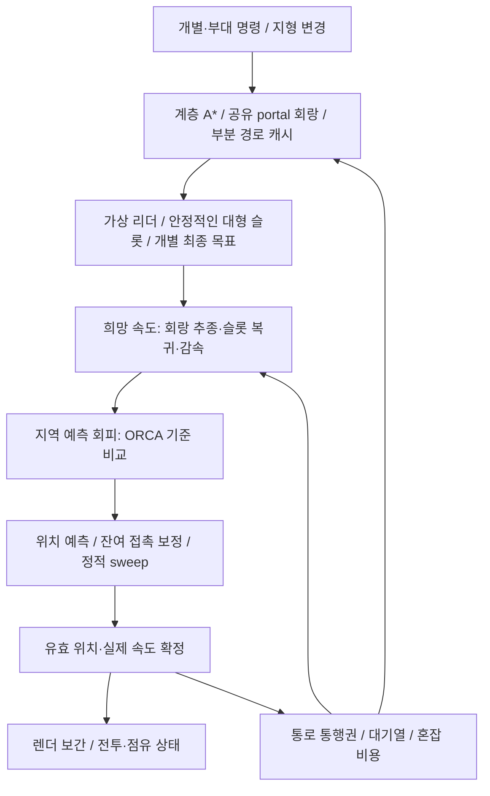
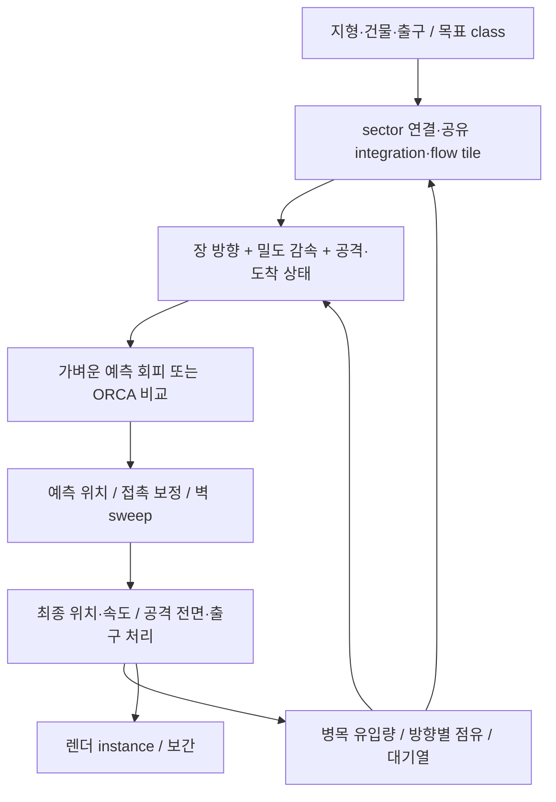

# RTS·디펜스의 1만–5만 유닛 이동: 공개 근거와 구현 설계

조사일: 2026-09-20. 대상: 지상 2D/2.5D, 엔진·하드웨어 미정. 범위: 웹 조사와 설계. **이번 작업에서 프로젝트 코드를 변경하거나 벤치마크를 실행하지 않았다.**

## 1. 먼저 내릴 결정

**RTS는 ‘부대별 공유 경로 회랑 + 안정적인 대형·도착 슬롯 + 예측 지역 회피 + 잔여 접촉 보정’으로 시작한다. 디펜스는 ‘소수 목적지의 타일 Flow Field + 밀도에 따른 감속 + 접촉 보정 + 병목 유입 제어’로 시작한다.** 두 구성 모두 CPU 데이터 배열 기반 기준 구현을 먼저 만들고, 5만 명 실험에서 실제 병목을 확인한 뒤 GPU 전환을 판단한다. 이것은 아래 공개 사례를 조합한 **설계 권고**이며 어느 한 게임의 내부 구조를 복제했다는 뜻이 아니다.

| 결정 | 근거 | 아직 검증할 것 |
|---|---|---|
| 전역 경로와 지역 이동을 분리한다 | Supreme Commander 2의 field/physics 분리, AoE IV의 계층 A*·flow·steering, DetourCrowd 코드 | 조합한 시스템의 5만 활성 유닛 비용·품질 |
| 목적지뿐 아니라 중간 portal·회랑도 공유한다 | Emerson의 portal field cache, Factorio의 부분 경로 재사용 | 개별 목적지 수 증가에 따른 캐시 적중률·메모리 |
| RTS에는 부대·슬롯 상태가 필요하다 | AoE IV 발표, jdxdev의 flow 기반 대형 실패 경험 | 코너·좁은 길에서 대형 해제와 재형성 정책 |
| 회피와 접촉 보정 외에 통행 정책을 둔다 | ORCA의 국소 최적·교착 한계, 정지 유닛에 갇히는 실제 구현 보고 | 예약·우선순위가 처리량·공정성·명령 반응성에 주는 영향 |
| 10만 확장은 조건부 목표로 둔다 | 10만 PBD 논문·HŌRU 개발 데모가 있으나 기능·계측 조건이 서로 다름 | 10만 전원 활성, 동적 지형, 다중 목적지, 전투·렌더 포함 60 FPS |

직접 근거: [GPG 원문](https://www.gameaipro.com/GameAIPro/GameAIPro_Chapter23_Crowd_Pathfinding_and_Steering_Using_Flow_Field_Tiles.pdf), [AoE IV 공식 발표 개요](https://www.gdcvault.com/play/1027659/Pathing-in-Age-of-Empires), [Factorio 경로 캐시](https://www.factorio.com/blog/post/fff-121), [ORCA 원문](https://gamma.cs.unc.edu/ORCA/publications/ORCA.pdf).

**이번에 확인한 자료만으로 ‘일반적인 RTS에서 5만 개가 각자 다른 목적지를 갖고 모든 이동 기능을 수행하며 전체 게임 60 FPS를 달성한다’고 확정할 수 없다.** 1만 표시, 1만 지역 회피, 1만 경로 요청, 1만 전투 유닛은 서로 다른 부하다. 하드웨어가 정해지지 않았으므로 성능 보장 대신 실패 여부를 판단할 실험 계약을 제시한다.

수만 규모의 핵심 조건은 다음 다섯 가지다.

1. 매 tick 모든 유닛의 장거리 경로를 다시 구하지 않는다. 명령·지형 변경에 반응하여 필요한 구간만 갱신한다.
2. 이동 가능한 면적·통로 폭에 맞는 밀도를 유지한다. 수용량을 넘는 유입은 대기해야 하며, 더 큰 반발력으로 해결할 수 없다.
3. 지역 계산 비용은 총 유닛 수뿐 아니라 **실제 이웃 후보 수·접촉 쌍 수·반복 횟수**로 관리한다.
4. 도착을 점 하나에 수렴하는 문제로 만들지 않는다. RTS는 슬롯·영역, 디펜스는 출구·공격 전면과 후방 대기를 정의한다.
5. 계산·렌더링·네트워크에서 무엇을 근사하는지 명시한다. 갱신률 축소나 비활성화로 얻은 성능은 전원 정밀 시뮬레이션 성능과 분리한다.

## 2. 근거 표시와 조사 범위

- **[직접]** 개발사·원저자 문서에서 확인한 내용. 공개 문서에 그렇게 쓰였다는 사실과 독립 재현 성공은 다르다.
- **[코드]** 공개 소스의 실제 함수·데이터 구조를 읽어 확인한 내용.
- **[자체측정]** 저자가 발표한 벤치마크. 이번 조사에서 재실행하지 않았다.
- **[경험]** 구현자·사용자의 실패 보고. 버전·설정에 종속되며 보편적 결함으로 일반화하지 않는다.
- **[제안]** 조사 결과를 조합한 설계·목표·계산 예시.
- **미공개 / 미확인**: 읽은 자료에 조건이 없거나, 자료 접근·실행으로 확인하지 못한 사항.

영문 검색을 중심으로 회사 블로그·GDC·Game AI Pro·GitHub 코드/이슈·개발 포럼·YouTube·원저자 논문을 조사했다. GPG와 Planetary Annihilation은 Emerson의 같은 기술 계보이므로 독립적인 두 알고리즘 증거로 세지 않는다. 커뮤니티의 재인용도 원문과 합쳐 한 근거로 취급한다. 아래 기술 주장은 원저자·공식 자료와 코드에 근거하며, 커뮤니티 글은 해당 작성자의 구현 경험에만 사용한다.

## 3. 공개 사례 비교

### 3.1 상용 게임과 개발사 자료

이 표에서 ‘미공개’는 해당 자료를 기준으로 한다. 게임의 최소/권장 사양은 특정 이동 실험의 측정 하드웨어가 아니다.

| 회사·게임 / 공개 시점 | 확인된 규모·실행 조건 | 공개한 처리 계층 | 설계에 가져올 것 / 한계·재현성 |
|---|---|---|---|
| **Gas Powered Games / Supreme Commander 2**, Emerson, Game AI Pro 2013 | [직접] 수백–수천을 대상으로 설명. 정확한 전체·활성 N, HW, Hz, 이동 ms·백분위 미공개 | cost→integration→flow, sector/portal 계층 경로, 캐시, steering, 별도 physics | 공유 경로의 가장 직접적인 상용 근거. 상용 엔진 소스·동일 실험 재현 없음. [원문 pp.307–316](https://www.gameaipro.com/GameAIPro/GameAIPro_Chapter23_Crowd_Pathfinding_and_Steering_Using_Flow_Field_Tiles.pdf) |
| **Uber Entertainment / Planetary Annihilation 개발 발표**, 2013-03-23 업로드 | [직접] 테스트 앱의 navigation 설명. N·HW·이동 ms·Hz 미공개, 테스트 속도와 실제 게임 속도가 다름을 발표자가 설명 | sector A*→필요 구간 field, 이동 종류별 비용, steering/formation | 공식 YouTube 설명과 24–36분 자동 자막 확인. GPG와 같은 Emerson 계보로 독립 알고리즘 증거 수에 중복 합산하지 않음. [34:06 경로 계층 설명](https://www.youtube.com/watch?v=5Qyl7h7D1Q8&t=2046s) |
| **Microsoft / World’s Edge 발표, Age of Empires IV**, Frank Cheng, GDC 2022 | [직접] 공식 개요는 수백 유닛. 슬라이드의 8인×200=1,600은 설계 요구이며 전원 이동 실측 아님 | hierarchical A* + flow fields + steering, 다양한 크기·통과 능력, 동적 건설·대형 | RTS의 공유 경로와 대형을 함께 다룬 사례. 상세 슬라이드는 재게시본 경유; 5만 성능 근거 아님. [공식 개요](https://www.gdcvault.com/play/1027659/Pathing-in-Age-of-Empires) |
| **Wube / Factorio**, 2015·2016·2019 | [직접] 큰 저장 파일에서 경로 요청 포화를 분석. 정확한 활성 N·HW·이동 ms·Hz 미공개 | 짧은 경로 요청 억제, 양보, 부분 경로/실패 캐시, 계층 heuristic | 경로 계산량보다 **요청 수와 지연**을 관리하는 근거. 게임 엔진 소스 공개 재현 없음. [FFF117](https://www.factorio.com/blog/post/fff-117), [121](https://www.factorio.com/blog/post/fff-121), [317](https://www.factorio.com/blog/post/fff-317) |
| **Ubisoft / Assassin’s Creed Unity**, François Cournoyer, GDC 2015 | [직접] 화면 NPC 10,000, ‘real AI’ 40, 고해상도 모델 120. 나머지 NPC의 정확한 이동 기능·갱신률 미공개 | AI/표현 LOD, pooling, 간단한 crowd brain | 1만 표시와 1만 완전 AI의 차이를 보여준다. 40만 이동한다는 뜻도 아니다. 수만 활성 경로·접촉 증명으로 사용할 수 없음. [공식 개요](https://gdcvault.com/play/1022141/Massive-Crowd-on-Assassin-s) |
| **Numantian Games / They Are Billions**, 현재 공식 제품 설명·2019 정식 출시 | [직접/회사 주장] 자체 엔진으로 실시간 최대 20,000, 각 감염체 AI라고 설명. 전원 동시 이동·경로 공유·밀도·Hz·60 FPS 조건 미공개 | AI 존재와 규모만 공개; 내부 경로/회피 알고리즘 미확인 | 상용 대규모 디펜스의 존재 근거. **Flow Field 사용을 추측해 기재하지 않는다.** 상용 코드·재현용 벤치 없음. [개발사 게시 Steam 설명](https://store.steampowered.com/app/644930/They_Are_Billions/) |
| **Dragon Pirate Games / MMORTS MVP**, 2021-06-13 | [직접/경험] MVP 2에 구현. N·HW·시간·출시 상태 미공개 | sector Flow Field | 공통 경로로 과도하게 수렴하는 문제를 후속 과제로 남김. 완성된 상용 해법·성능 근거로 사용하지 않음. [개발 블로그](https://dragonpirategames.com/blog/flowfieldpathfinding) |
| **HŌRU / 개발 중 RTS**, 2021-08-21·09-18 | [회사/개발자 주장] 100k 제어와 60 FPS 초과, 별도 멀티플레이 데모 100k. HW·활성 N 추이·밀도·목표 수·이동 ms·p99 미공개 | UE4 사용자 정의 DX12 렌더러, CPU pathfinding/movement, GPU animation, float lockstep | 가능성 탐색 근거. 별도 날짜의 기능을 합쳐 동일 조건의 완성된 벤치로 만들지 않는다. 코드 미공개·독립 재현 없음. [제어 데모](https://horugame.com/control-100k-units/), [멀티플레이 설명](https://horugame.com/100k-units-in-multiplayer/) |

**GPG에서 확인한 핵심:** 1m 격자·10×10m sector, portal을 이용한 상위 경로 및 field cache, 이동 종류·크기에 따른 통과 비용, 변경 sector의 dirty 처리와 계산 예산, 방향 보간을 설명한다. 최종 목적지가 달라도 같은 중간 portal의 장을 재사용할 수 있다. 밀기·벽 미끄러짐은 별도 물리 계층이다. 논문의 GPU 생성·다중 goal 등 *Future Work*를 당시 구현 기능으로 취급하지 않았다. [원문](https://www.gameaipro.com/GameAIPro/GameAIPro_Chapter23_Crowd_Pathfinding_and_Steering_Using_Flow_Field_Tiles.pdf)

**AoE IV의 상세 접근 제한:** 공식 PDF는 403으로 직접 열리지 않았다. [공식 PDF 주소](https://media.gdcvault.com/GDC%2B2022/Speaker%2BSlides/Pathing%2BIn%2BAge_Cheng_Frank%2B2022-03-29%2B00.16.38.pdf)와 제목·발표자가 일치하는 [공개 재게시 슬라이드 본문](https://www.scribd.com/document/835142790/Pathing-In-Age-Cheng-Frank-2022-03-29-00-16-38)을 읽었다. 슬라이드 20–22는 짧고 겹치는 segmented flow의 캐시/품질 절충, 32는 가상 리더→대형 슬롯 추종과 슬롯 LOS 상실 시 flow 복귀를 설명한다. 공식 개요에서도 계층 A*·flow·steering 조합은 별도로 확인된다. 따라서 이 조합의 존재와 세부 설명의 접근 경로를 구분한다.

### 3.2 수치가 있는 연구·공개 구현: FPS 순위가 아닌 조건 비교

| 사례·시점 / 근거 | N·목표·장면·알고리즘 범위 | 실행 조건과 공개 시간 | 해석할 수 있는 범위 / 빠진 조건 |
|---|---|---|---|
| **Continuum Crowds**, SIGGRAPH 2006, [원저자 논문](https://grail.cs.washington.edu/projects/crowd-flows/78-treuille.pdf) | 10,001명 예: 2,000명이 8,001명으로부터 후퇴, 60×60 grid. 공통 의도 그룹의 장 + minimum-distance 보정 | [자체측정] Python+C++, Pentium 3.4GHz, Quadro FX3400. 시뮬레이션 2–5Hz, 보간 렌더 24FPS; 10,001 예는 렌더 12FPS | 60FPS 증거가 아니다. 해당 예의 정확한 simulation ms·p99 미공개. EA 평가/라이선스 언급은 특정 출시 게임의 적용 증거와 다름 |
| **ORCA**, ISRR/2011 출판, [원문 §5–7](https://gamma.cs.unc.edu/ORCA/publications/ORCA.pdf) | 5,000명 원형 대향 이동: 서로 반대편 개별 목표. 별도 office evacuation | [자체측정] Xeon Clovertown 2.66GHz 8코어, OpenMP. 원형 LP 회피 계산 8ms; 사무실 업데이트 15.6ms | 렌더·게임 전체 125/64 FPS로 환산하지 않는다. 공식 [25,000 Hajj 데모](https://gamma.cs.unc.edu/ORCA/)는 별도 사례이며 이 시간과 연결 불가. p99 미공개 |
| **Position-Based Multi-Agent Dynamics**, MiG 2017, [논문 Table 1](https://arxiv.org/pdf/1802.02673) | 밀집 대향 10,032명, 미래 충돌 LR 또는 A 변형 사용. 병목 100,048명에서는 **LR/A 모두 비활성** | [자체측정] CUDA, GT750M, dt=1/48초·프레임당 2 substeps·제약 반복 6회. 10,032: LR 14.06 / A 13.63ms/frame. 100,048: 43.66ms/frame. **렌더 제외** | 10만 풀기능 60FPS 증거 아님. 전역 planner도 단순 목표 추종. p95·최악 미공개. 공개 CPU 코드로 CUDA 수치 직접 재현 불가 |
| **AoE IV**, GDC 2022, [슬라이드 34 재게시](https://www.scribd.com/document/835142790/Pathing-In-Age-Cheng-Frank-2022-03-29-00-16-38) | cavalry 1 / 10 / 200. 장면·목표 수·활성 정의 미공개 | [자체측정] flow 0.247 / 0.376 / 1.11ms, steering 0.008 / 0.044 / 0.561ms | HW·CPU/GPU·Hz·통계량·렌더 범위 미공개. 5만으로 외삽하지 않는다 |
| **Aron Granberg / Unity Burst 실험**, 2019, [저자 답변](https://forum.arongranberg.com/t/rts-game-pathfinding/6623) | 20,000 agent, quad 한 mesh, 개별 GameObject 없음, **경로 탐색 없음** | [자체측정] 20FPS 또는 RVO 주기 제한·double buffer로 렌더 120FPS 설명 | HW·활성 비율·낮춘 회피 Hz·p95 미공개. 저자도 실제 게임에 동일 수 기대를 경고. 120Hz 이동으로 읽지 않는다 |
| **jdxdev RTS prototype**, 2020/2024 수정, [작성자 글](https://www.jdxdev.com/blog/2020/05/03/flowfields/) | 전체 500×500 grid, 50×50 tile 생성. 유닛 전체 이동 실험 아님 | [자체측정] 한 tile 약 0.3ms, Unity DOTS 맥락. HW·전체 path/이동 시간 미공개 | tile 수·목적지 수에 따라 총비용 증가. 약 100명 코너 대형에서 수렴 문제를 겪고 waypoint 접근으로 이동한 경험도 함께 읽을 것 |
| **Codeplay SYCL crowd**, [고정 README](https://github.com/codeplaysoftware/sycl-crowd-simulation/blob/3cb076c1fb5d47cb4bb8c0a159a4d2efd51f9997/README.md) | 50,000 actors, 입력 checkpoints, Social Force. 도착자는 업데이트 제외, 활성 N 추이 미공개 | [자체측정] Titan RTX, headless, STATS off, 500 iterations. ‘평균 kernel’ 0.40853ms와 total 20.75141초 병기 | 현재 코드의 submit 주변 CPU 계측과 이후 host access를 확인. **5만 이동이 0.41ms라는 근거로 채택하지 않는다.** 상세 감사는 §9 |

PBD의 2 substeps와 논문 ms/frame은 저자 실험 단위 그대로 인용했다. 이를 임의의 게임 tick 비용으로 바꾸지 않았다. 모든 행에서 미공개인 메모리·백분위·활성 비율을 다른 사례의 값으로 채우지 않았다.

### 3.3 실제 구현 실패에서 얻는 요구사항

| 원문·공개 시점 | 직접 읽은 경험 | 설계·실험에 반영할 것 |
|---|---|---|
| [jdxdev Flowfields](https://www.jdxdev.com/blog/2020/05/03/flowfields/), 2020 | 큰 집단이 코너에서 한두 줄로 모이고, Boids·대형 힘 추가만으로 원하는 부대 이동을 얻지 못함 | 회랑 폭 활용, 슬롯 유지, 좁은 곳에서 대형 해제 후 재형성. Flow Field 자체가 실패한 보편적 증거는 아님 |
| [Reddit 구현자 질문](https://www.reddit.com/r/gamedev/comments/16137cy/), 2023-08-25 | flow를 개별 waypoint로 바꾼 뒤 field를 버림. 밀려서 벽 뒤로 간 유닛이 복귀 못함 | 회피·접촉 이후 corridor 재결합과 LOS 상실 처리. 단순 ‘경로 계산 성공률’ 외에 실제 도착률 측정 |
| [Aron 포럼 locked agent](https://forum.arongranberg.com/t/rvoagent-stuck-when-other-rvoagents-lock/5240), 2018 | 정지 유닛 뒤에 다른 유닛이 갇힘. 저자가 local optimum과 상호 회피 전제 차이를 설명 | 정지·대기·공격 고정 상태 분리, 책임 가중치, 경로·통행 수준 복구 |
| [Aron 포럼 공통 목표](https://forum.arongranberg.com/t/group-select-move-to-same-point-with-rvo/6383), 2019 | 선두가 목표를 차지하자 후속 유닛이 맴돎. 저자가 주변 밀도로 정지시키는 실험 설명 | 목표 영역/슬롯·정지 hysteresis. 당시 임계값을 보편적 상수로 복사하지 않음 |
| [GameDev.net / Dyankov](https://gamedev.net/tutorials/programming/general-and-gameplay-programming/pathfinding-and-local-avoidance-for-rpgrts-games-using-unity-r3703), 2014 | 당시 RVO의 벽/코너 stuck, Unity NavMesh 약 100명에서 교차·떨림 보고 | 오래된 개인 설정 경험. 현재 엔진 순위 근거로 쓰지 않고 코너·교차 시험의 필요성에 사용 |
| [Detour Discussion #675](https://github.com/recastnavigation/recastnavigation/discussions/675), 2023 | 큰 군집 모퉁이 stuck. 답변은 같은 waypoint 쟁탈 등을 원인 후보로 제시, 재현 요구 | 확정 버그가 아닌 보고. 코너 점을 지나치게 공유하는지 확인 |
| [N:ORCA Discussion #11](https://github.com/Nebukam/com.nebukam.orca/discussions/11), 2024 | 벽/포위 정지. 관리자가 open obstacle을 닫는 처리와 표시 불일치를 확인, 후속 수정 지연 | ORCA 이론과 geometry 구현 버그 분리. 장애물 방향·닫힘·반경·디버그 표시가 실제 입력과 같은지 검증 |

커뮤니티·이슈의 첨부 동영상은 별도로 시청하지 않았으며 본문과 답변을 확인했다.

## 4. 계산량을 결정하는 변수와 기술 비교

### 4.1 같은 ‘5만 명’도 전혀 다른 작업량이다

**[제안: 설계용 비용 모델]** `N`=실제 활성 이동 수, `D`=서로 다른 최종 목표/목표영역, `P`=부대/경로 요청 수, `G`=활성 navigation 셀, `F`=동시에 캐시하는 field 수, `K_i`=유닛 i의 실제 조회 후보 수, `I`=접촉 반복 수로 둔다.

- 개별 A*: 대략 `요청 수 × 탐색한 노드·간선 비용`. A* 최악 탐색 범위와 휴리스틱에 민감하다. 매 tick N개 요청하는 설계가 문제이지 A* 자체를 항상 배제할 이유는 없다.
- 공유 field: 고정 차수 grid에서 Dijkstra 생성은 일반적인 heap 구현 기준 `O(G log G)`, 제한된 정수 비용의 bucket·동일 비용 BFS 등은 조건에 따라 더 낮아진다. 조회는 agent당 O(1)이지만 생성·캐시 비용은 F에 비례한다.
- 지역 계산: 공간 구축 + `ΣK_i` + solver 비용. 고정 밀도에서 근사 선형이 가능하지만 한 셀에 몰리면 후보 열거가 다시 제곱 수준으로 커질 수 있다. 가까운 K개만 **선택하는 비용**도 측정한다.
- PBD 접촉: 후보 구축 + 반복별 후보 검사 + 실제 제약 투영. 반복마다 이웃을 조회하면 대략 `I × ΣK_i`가 들고, 실제 겹친 쌍이 적어도 후보 검사 비용은 남는다. 후보를 재사용할 때는 예측 이동/누적 보정 범위를 포함해야 한다.
- 연속체·밀도 격자: 입자 scatter/gather `O(N)` + 그룹별 장 생성·격자 반복. 목표 그룹·방향 채널이 늘면 메모리와 계산이 증가한다.

이웃 공간 분할의 최악 O(N²)와 병렬 쓰기 충돌은 [NVIDIA GPU Gems의 원저자 설명](https://developer.nvidia.com/gpugems/gpugems3/part-v-physics-simulation/chapter-32-broad-phase-collision-detection-cuda)에도 명시된다. ‘spatial hash이므로 항상 O(N)’은 성립하지 않는다.

**[제안: 메모리 산술 예시, 실측 아님]** 1024² 셀에서 목적지별 integration float32+direction 2바이트=6바이트/셀이라고 가정하면 1 field가 6MiB, 32개가 192MiB다. 5만 개 개별 목표의 전면 field는 약 293GiB다. 정적 비용·버퍼 복제·clearance·캐시 메타데이터는 별도다. 따라서 `D=N`일 때 목적지별 전체 맵 field는 채택하지 않는다. 100k×64바이트 상태는 약 6.10MiB, 100k×16개×4바이트 이웃 ID도 약 6.10MiB이며 ping-pong·접촉 목록·GPU 정렬 scratch가 추가된다.

### 4.2 경로 계획 계층

| 기술 | 해결 / 해결하지 못함 | 전제·적합한 게임 | 비용·고밀도 실패 | 결합 관계·공개 근거 |
|---|---|---|---|---|
| **Grid/NavMesh + A*** | 장애물을 돌아 목표로 가는 연결 경로 / 유닛 간 회피·슬롯·교착은 별도 | 개별 목표 RTS, 불규칙 지형은 NavMesh; 잦은 타일 건설은 Grid도 실용적 | 노드·간선·요청 수·경로 길이·동적 갱신. 매 agent 재요청하면 queue 폭증 | Grid/NavMesh는 공간 표현이고 A*는 탐색법. field와 상위/하위에서 결합 가능. [Factorio317](https://www.factorio.com/blog/post/fff-317), [Detour](https://github.com/recastnavigation/recastnavigation) |
| **계층 경로·회랑·부분 경로 캐시** | 큰 맵의 탐색량·중복 요청 감소 / 통로 안 실제 통과 순서는 별도 | 장거리 RTS·디펜스 모두 | portal 수·chunk 크기·무효화 빈도. 거친 연결만 믿으면 실제 폭·건물에 막힘 | 실제 저수준 통과성 검증, 반경·통과권·지형 version 포함. [GPG](https://www.gameaipro.com/GameAIPro/GameAIPro_Chapter23_Crowd_Pathfinding_and_Steering_Using_Flow_Field_Tiles.pdf), [Factorio121/317](https://www.factorio.com/blog/post/fff-121) |
| **Integration/Flow Field** | 목표 방향을 다수 agent가 공유 / 지역 충돌·겹침·대형은 해결 안 함 | 소수 목표 디펜스, 같은 portal을 지나는 RTS 부대 | 활성 셀×field 수, 지형 변경. 코너·목표로 쏠림, 방향 양자화·격자 경계 진동 | 필요한 타일만 캐시, 방향 보간+통과성 검사, local avoidance/contact와 결합. [GPG 원문](https://www.gameaipro.com/GameAIPro/GameAIPro_Chapter23_Crowd_Pathfinding_and_Steering_Using_Flow_Field_Tiles.pdf) |
| **Continuum Crowds·밀도 기반 장** | 공통 의도의 집단 흐름과 혼잡 영향 / 개별 명령·정밀 대형·엄밀한 원판 비중첩은 별도 | 대량 동일 방향 적, 흐름 분산 실험 | grid 해상도·그룹 수·장 재계산. 반대 흐름을 하나의 평균 속도로 합치면 상쇄, 좁은 길 해상도 문제 | 원논문도 최소거리 보정을 추가. 전체 solver와 단순 density cost를 구별. [원저자 논문 §4.5](https://grail.cs.washington.edu/projects/crowd-flows/78-treuille.pdf) |
| **단순 Potential Field** | 목표 유인·장애물 반발 같은 지역 선호 / 일반적인 도달 가능 경로 보장 없음 | 이미 경로가 있는 구간의 보조 선호 | local minimum·U자 막힘·힘 상쇄·진동 | 최단거리 integration potential과 단순 유인/반발 합은 다르다. Boids와 마찬가지로 전역 planner 대체로 쓰지 않음. [Reynolds의 계층 구분](https://www.red3d.com/cwr/steer/) |

### 4.3 지역 회피·대형 계층

| 기술 | 해결 / 해결하지 못함 | 적용·비용 변수 | 실패·결합 주의 | 근거 |
|---|---|---|---|---|
| **Boids / Steering / Separation** | 선호 방향·완만한 군집·간격 / 미로 경로·비중첩·전체 교착 보장 없음 | 경로 위 희망 속도 생성. `ΣK_i`, 행동 가중치 | opposing force 진동, 과도한 cohesion이 벽/다른 집단 너머를 당김. 같은 부대·회랑 내부로 alignment/cohesion 제한 | [Reynolds GDC1999](https://www.red3d.com/cwr/steer/), [jdxdev 경험](https://www.jdxdev.com/blog/2020/05/03/flowfields/) |
| **VO / RVO / ORCA** | 예측 시간 안 충돌 위험을 줄이는 속도 선택 / 전역 경로·대형·교착 해소 없음 | 상대 위치·속도, 이웃 수, time horizon, 장애물 선분. ORCA는 반평면+LP | 밀집 feasible set 공집합, 정지/비협조 상대, 대칭 마주침. 상호 책임 모델을 어기는 상대는 별도 취급 | [ORCA 원문](https://gamma.cs.unc.edu/ORCA/publications/ORCA.pdf), [RVO2 Agent 코드](https://github.com/snape/RVO2/blob/1c25b27258d191e26c2df83ff6e31abc8efbdaed/src/Agent.cc) |
| **속도 샘플링 회피** | 희망 속도·현재 속도·충돌 시간 비용으로 후보 선택 / 연속 feasible 해·전역 해 보장 없음 | 후보 수×이웃/장애물 수 | 후보가 거칠면 급회전·유효 속도 누락. 작은 후보 수의 비용 절충을 직접 측정 | DetourCrowd는 ORCA가 아닌 이 방식. [실제 호출](https://github.com/recastnavigation/recastnavigation/blob/9f4ce64458dfae86e1239c525ddc219c4e9e06f1/DetourCrowd/Source/DetourCrowd.cpp#L1297) |
| **리더·경로 회랑·대형 슬롯** | 부대 의도·폭 활용·도착 위치 / 슬롯으로 가는 안전 이동은 별도 | 부대 수·슬롯 할당·재배치 빈도 | 대형이 통로보다 넓음, 코너에서 안쪽 압축, 슬롯 교환 진동. 좁을 때 일렬/열 단위 통과 후 재형성 | [AoE IV 공식 개요](https://www.gdcvault.com/play/1027659/Pathing-in-Age-of-Empires), [슬라이드32 접근본](https://www.scribd.com/document/835142790/Pathing-In-Age-Cheng-Frank-2022-03-29-00-16-38) |

VO 계열은 같은 지역 회피 슬롯에서 대안 관계다. Boids는 희망 속도를 만드는 보조이며 회피 solver와 같은 보장을 제공하지 않는다. **ORCA 뒤에 임의의 가속도 제한·보간을 적용하면 원래 안전 속도 집합을 벗어날 수 있다.** 접근 가능한 속도·회전 제약을 선택 과정에 넣거나, 제한된 이동 모델용 변형을 검토하고 접촉 보정을 안전망으로 둔다. 원문도 사후 clamp 한계를 명시한다. [ORCA §7](https://gamma.cs.unc.edu/ORCA/publications/ORCA.pdf)

### 4.4 겹침 해소·혼잡 관리 계층

| 기술 | 해결 / 해결하지 못함 | 전제·비용 | 고밀도 실패와 보완 |
|---|---|---|---|
| **위치 보정 / PBD·XPBD 계열** | 남은 원판 겹침·접촉 제약 / 원하는 경로·통행권·정밀 비관통 자동 보장 없음 | 예측 위치, 이웃 구조, 반복별 후보 검사+제약 투영. Jacobi는 병렬화 쉬우나 반복 필요 | 큰 보정이 벽을 넘거나 다음 tick 추진으로 되돌아가 떨림. 정적 sweep·보정 한도·잔차 검사 필요. 제한된 반복/K에서 무겹침 보장 금지. [PBD 원문](https://arxiv.org/pdf/1802.02673), [Detour 보정](https://github.com/recastnavigation/recastnavigation/blob/9f4ce64458dfae86e1239c525ddc219c4e9e06f1/DetourCrowd/Source/DetourCrowd.cpp#L1323) |
| **통로 예약·우선순위·대기열** | 좁은 통로의 통행 방향·순서·공정성 / 지역 접촉 자체는 별도 | [제안] portal 단위 관리, 대기자/부대 수, 만료·소유권 상태 | 무기한 우선권·서로 물린 예약·출구 포화. 제한된 구간만 예약, aging·lease·출구 공간 확인·취소/후퇴 정책. ORCA 국소 한계를 보완하는 상위 제어 |
| **혼잡 비용·유입 제어** | 대체 경로 선택·유입 과다 억제 / 미시적 비중첩·도착 판정은 별도 | [제안] 밀도/흐름 누적·낮은 주기 경로 갱신 | 모든 부대가 동시에 우회로 변경해 왕복 진동. 시간 평활·경로 유지 최소시간·재경로 전환 이득 기준 필요. Continuum은 원리 근거이며 제안 정책 전체의 상용 증거 아님 |
| **도착 슬롯·목표 영역·정지 상태** | 한 점 쟁탈·끝없는 밀기 억제 / 목표 영역 자체의 수용량 초과는 해결 불가 | [제안] 유효 슬롯 수·반경·도착자·후방 대기자 | 이동 중 대기를 도착으로 오판, 도착자가 새 통행을 막음. arrived/waiting/blocked를 분리하고 양보 여부를 게임 규칙으로 정의. [원저자 포럼](https://forum.arongranberg.com/t/group-select-move-to-same-point-with-rvo/6383) |

PBD와 ORCA는 대체·보완 양쪽이 가능하다. 미래 충돌 제약을 가진 PBD와 ORCA를 동시에 강하게 적용하면 같은 회피를 중복 해결한다. 첫 실험에서는 **ORCA+약한 잔여 접촉**과 **단순 선호속도+예측 PBD**를 별도 변형으로 비교한다. 강한 separation까지 모두 더하는 식으로 시작하지 않는다.

### 4.5 실행 최적화 계층

| 기술 | 해결하는 비용 / 해결하지 못함 | 비용 변수·실패 | 적용 원칙 |
|---|---|---|---|
| **공간 해시·균일 격자** | 전체 이웃 순회 감소 / 접촉 정책·항상 선형 보장 없음 | 셀 크기, query 반경, 최대 밀도, 크기 편차. 한 셀 집중·후보 truncation | navigation grid와 접촉 grid 해상도를 분리. 반경이 크게 다른 유닛은 크기 class·다단계 구조 검토. [NVIDIA 설명](https://developer.nvidia.com/gpugems/gpugems3/part-v-physics-simulation/chapter-32-broad-phase-collision-detection-cuda) |
| **ECS/SoA·멀티스레드·SIMD** | 객체 순회·메모리·병렬 처리 효율 / 나쁜 복잡도·교착 해결 안 함 | 구조체 폭·캐시 miss·할당·작업 크기·barrier. 불균등 밀도는 worker 쏠림 | 배열/고정 ID/읽기 snapshot/다음 상태 분리. sparse/dense 비용을 보고 task 분할. [RVO2 doStep](https://github.com/snape/RVO2/blob/1c25b27258d191e26c2df83ff6e31abc8efbdaed/src/RVOSimulator.cc#L196), [N:ORCA Jobs](https://github.com/Nebukam/com.nebukam.orca/blob/703ec434f4a5a56863991c8954015c3a3150ec37/Runtime/Jobs/ORCALinesJob.cs) |
| **LOD·주기 분산·활성 영역** | 불필요한 장거리 계획·인지·정밀도 감소 / 숨은 유닛의 결과 정확성 자동 보장 없음 | 활성 N·승격률·경계 오차·catch-up. 화면 밖 병목도 gameplay 영향 | 카메라 LOD와 권위 시뮬레이션 LOD 분리. 접촉 중인 유닛을 단지 보이지 않는다고 정지시키지 않음. [Ubisoft LOD](https://gdcvault.com/play/1022141/Massive-Crowd-on-Assassin-s) |
| **GPU Compute** | 대량 동일 연산·격자·접촉 반복 / 전송·렌더 경쟁·결정론 자동 해결 안 함 | 정렬·scatter·barrier·readback·분기·메모리 대역폭 | 상태와 렌더 instance를 GPU에 유지할 때 유리. CPU가 최신 전체 위치를 매 tick 요구하면 별도 비용. [CUDA Best Practices](https://docs.nvidia.com/cuda/cuda-c-best-practices-guide/) |

## 5. 권장 아키텍처 A — 개별 명령·대형 중심 RTS

**[제안] 기본값은 CPU 권위 시뮬레이션, 고정 tick, SoA 배열이다.** GPG/AoE IV/Factorio/Detour의 계층 분리와 공유 방법을 참고했다. 아래의 구체적인 갱신 주기·예약·복구 조건은 해당 게임의 공개 내부 정책이 아니라 설계 제안이다.



### 5.1 전역 경로와 개별 목표

1. **지형:** 먼저 2D grid+sector/portal로 검증한다. 최종 엔진에서 불규칙 지형·오프메시 연결이 중요하면 NavMesh+portal corridor로 같은 인터페이스를 유지한다. 2.5D에서는 층/표면 ID와 높이 연결을 명시해 다리 위·아래 유닛을 같은 이웃으로 취급하지 않는다.
2. **명령:** 한 부대의 클릭은 부대 회랑 하나를 요청하고 최종 위치 슬롯을 배정한다. 개인 명령은 개인 회랑을 갖되 이미 있는 중간 경로와 연결할 수 있다. 목표·반경·통과 class·지형 version이 다른 경로를 무조건 공유하지 않는다.
3. **field 선택:** 같은 portal/segment의 추종자가 충분히 많을 때만 그 구간에 flow tile을 생성한다. 혼자 가는 유닛은 A* 회랑 코너를 추종한다. 공유 여부를 N 총수로 정하지 않고 실제 재사용 횟수와 생성 비용으로 결정한다.
4. **개별 목표 5만 개:** 공통 이동 구간만 공유하고 말단은 개별 짧은 경로/직접 목표 추종으로 처리한다. 목표가 모두 다르고 매 tick 바뀌는 작업은 최악 부하로 분리한다. 이를 소수 목적지 디펜스의 벤치 결과로 대체하지 않는다.
5. **캐시:** `(이동 class, 반경 class, sector, portal/goal region, topology version, cost/경계조건 version)`를 key 또는 유효성 검사 항목으로 두고 byte 한도·마지막 사용·재생성 비용을 관리한다. 실패 경로 캐시는 연결성 version 변경 시 무효화한다. 통행 혼잡에 따른 일시 실패를 영구 도달 불가능으로 저장하지 않는다.

### 5.2 희망 속도·대형·도착

- 가상 리더는 회랑 안에서 진행하고 유닛은 자신의 슬롯과 회랑을 함께 본다. 슬롯이 벽 뒤에 있거나 LOS가 없으면 회랑/flow로 복귀한다. 코너 점 하나를 모든 유닛의 중간 목적지로 강제하지 않는다.
- 슬롯 배정은 이전 소유권을 유지하는 공간 정렬·근접 매칭으로 시작한다. 거대한 부대에 매 tick 전역 최적 매칭을 돌리지 않는다. 신규 명령·부대 분할·통로 통과 완료에만 재배치하고 슬롯 교환 횟수를 측정한다.
- 통로의 유효 폭이 대형보다 작으면 `formation → compressed columns → reform` 상태로 전환한다. 후방 유닛의 늦음을 무조건 앞 유닛의 강한 후진 힘으로 바꾸지 않는다.
- 목표는 충돌 반경과 지형을 만족하는 슬롯 또는 도착 영역이다. 자리가 없으면 후방 대기 영역을 지정한다. 도착 후에는 희망 속도를 0으로 만들고, 작은 접촉 이동마다 다시 목표로 돌진하지 않도록 진입/이탈 임계값을 다르게 둔다.
- 명령 반응은 ‘새 장거리 경로 완성’과 별도로 계측한다. 명령 접수 즉시 상태를 바꾸되 미계산 구간으로 장애물을 뚫고 이동하지 않는다. 새 길이 없으면 안전한 기존 회랑 구간까지만 진행하거나 대기한다.

### 5.3 지역 회피와 최종 이동

- 회피 비교 기준은 RVO2의 ORCA다. 이웃 조회는 snapshot을 읽고 agent별 결과를 별도 기록한다. 초기 후보 수 8/16/32를 실험하되, **접촉 안전용 후보와 회피용 K 상한을 분리**한다.
- 반경은 물리 반경과 선호 여유 간격으로 분리한다. 큰 separation 반경을 모든 집단에 강제하여 통로 용량을 낭비하지 않는다. 같은 부대 alignment는 약한 희망값이고 벽·접촉 제약보다 우선하지 않는다.
- 가속도/회전 제약은 희망 속도 및 도달 가능한 속도 집합에 반영한다. ORCA 결과를 나중에 마음대로 부드럽게 바꿔도 안전하다고 가정하지 않는다. 자동차형 유닛은 원판 보행자와 별도의 운동 제약이 필요하다.
- 위치를 예측하고 남은 원판 겹침을 Jacobi 방식으로 보정한다. 모든 agent를 읽은 뒤 보정 결과를 동시에 publish한다. 완전 동일 위치의 법선은 안정적인 ID 규칙으로 만든다.
- 정적 충돌은 현재→예측 위치뿐 아니라 보정 이동도 검사한다. 끝점만 장애물 밖으로 투영하면 얇은 벽을 건너갈 수 있다. 보정 범위가 넓으면 후보를 다시 구하거나 swept bound에 포함한다.
- 유닛끼리도 한 tick 안에 서로 통과한 뒤 끝점에서 안 겹칠 수 있다. 최대 상대속도×dt와 최소 지름을 기준으로 substep/이동 상한을 정하고, 빠른 유닛·넉백에는 swept-disc 검사를 비교한다. 끝점 PBD만으로 연속 비관통을 주장하지 않는다.
- 최종 실제 속도와 희망 속도를 따로 저장한다. 위치 보정량을 제한 없이 다음 tick 운동량으로 되먹이면 접촉 떨림이 커질 수 있다. 애니메이션은 실제 이동량에 맞추되 시각 보간이 충돌 상태를 바꾸지 않게 한다.

### 5.4 갱신·병렬화·교착 복구

| 단계 | 첫 실험의 제안 주기·조건 | 병렬화·안전 조건 |
|---|---|---|
| 명령 수용·최종 적분·접촉 | 우선 60Hz fixed tick. 30Hz는 별도 변형으로 비교 | SoA double buffer, 공간 cell 구간 작업. 접촉 island 경계의 ghost/read snapshot 일관성 |
| 지역 회피 | 30/60Hz 비교, 급접근·접촉 영역은 높은 주기 | 낮은 주기 사이의 안전 이동 범위·예측 오차 기록. 접촉 solver를 함께 무조건 늦추지 않음 |
| 리더·슬롯 희망값 | 15/30Hz 비교, 새 명령 즉시 dirty | 슬롯 소유 변경은 deterministic event 순서 |
| 혼잡 통계·경로 비용 | 2–5Hz부터 비교 | 시간 평활·경로 전환 hysteresis. dirty topology는 이 주기를 기다리지 않고 즉시 통과 차단 |
| 경로 요청 | 명령 변경, 회랑 무효, 지속적 진행 실패, 이득 있는 우회 | 고정 노드/작업 예산 큐. 우선순위+대기 aging, 명령 처리 지연 p95/p99 측정 |

순간적으로 다른 유닛에 막힐 때마다 A*를 재요청하지 않는다. 먼저 짧은 대기·양보를 시도하고, 일정 시간창의 portal 진행량과 앞 통로 점유를 본다. 진행 없음이 지속되면 **대기 원인 분류 → 통행권 요청 → 안전한 대피 위치로 일부 후퇴 → 회랑 재결합 → 대체 경로 요청** 순서로 복구한다. 무작위 흔들기를 기본 복구 정책으로 쓰지 않는다.

단일 차선은 방향별 제한 크기 batch를 통과시키고 기다린 시간에 따라 반대편 우선권을 올린다. 다음 구간 출구에 공간이 없으면 진입을 보류한다. 여러 portal을 무한히 선점하지 않고, 소유권 만료·부대 취소·사망 시 해제한다. 교차로에서는 짧은 충돌 구역만 예약한다. 후퇴 공간도 없거나 목적지가 물리적으로 수용 불가능하면 정지/명령 실패를 명시해야 하며, 이 경우 모든 agent 도착을 보장할 수 없다.

예약 만료는 **신규 진입권**을 취소한다. 이미 들어간 집단의 물리 점유는 완전히 빠져나갈 때까지 유지하며, 시간 만료만으로 반대 방향 통행을 허용하지 않는다.

## 6. 권장 아키텍처 B — 공통 목표·지속 유입 중심 디펜스

**[제안] 기본값은 목적지/이동 class별 공유 Integration/Flow Field와 CPU 지역 이동이다.** 지속 유입·공통 의도에서 공유율을 높인다. 처음부터 무거운 continuum 압력 solver 전체를 구현하지 않는다. 기본 접촉 비용이나 흐름 품질이 실패할 때 밀도 격자·GPU PBD를 추가 비교한다.



### 6.1 공유 경로와 동적 길막

- 목표 수 D=1/4/16부터 시험한다. 공격 건물·출구·진입 portal 단위 목표영역을 사용한다. 대체 가능한 출구에는 multi-source integration을 검토할 수 있지만, 서로 다른 명령의 개별 목적지까지 같다고 취급해서는 안 된다.
- 건물 설치/파괴로 막힌 셀·portal을 즉시 표시하고 변경 tile의 geometry부터 갱신한다. field 재생성 완료 전에는 old field 방향을 참고하더라도 새 정적 장애물로 진입하지 못하게 한다. 완성된 field version을 일괄 교체하고 반쯤 계산된 field를 읽지 않는다.
- dirty 전파는 변경 tile에서 시작하되, portal 비용/연결에 의존하는 upstream integration 경계와 회랑까지 전파한다. 변경이 국소적이어도 갱신 범위는 전역일 수 있다. 해당 tile 하나만 고친 채 오래된 상위 경로를 계속 유효하다고 보지 않는다. 게시 시 연결 경계의 version도 일치해야 한다.
- 연결이 끊긴 경우의 게임 규칙을 정한다: 대기, 다른 목표, 벽 공격 중 하나다. 전역 경로가 존재하지 않는 상태에서 local steering에 해결을 맡기지 않는다.
- 목적지가 조금 움직였다고 전체 맵을 매 tick 다시 계산하지 않는다. 목표영역/sector 이동 기준과 최종 구간 직접 추종을 조합한다. 공유 경로의 정확도가 gameplay 요구를 만족하는지 비교한다.

### 6.2 자연스러운 밀집 흐름

- 각 유닛은 field 방향·자유 속도를 갖고, 앞쪽 밀도와 통행권에 따라 0까지 감속한다. 무조건 전진 최소 속도를 보장하면 포화 통로에 압축을 계속 가한다.
- 접촉 grid와 별도로 거친 density/flux grid를 둔다. 역방향·교차 그룹의 속도를 하나로 평균하지 않고 목표 그룹 또는 방향 채널로 통계를 보존한다. 반대 흐름을 분리해야 할 필요가 확인된 뒤 채널 수를 늘린다.
- 순방향 집단에는 약한 예측 회피+잔여 PBD부터 적용한다. 양방향·교차가 잦은 맵이면 ORCA 변형을 비교한다. 미래 회피 없는 접촉-only 방식이 머리끼리 맞댄 정지·파동을 만들면 예측 계층을 추가한다.
- density는 두 역할을 구분한다: **국소 감속**은 앞 사람과의 간격을 조절하고, **저주기 경로 비용**은 다른 통로를 선택한다. 같은 밀도 반발을 steering·경로·접촉에 세 번 강하게 중복 적용하지 않는다.
- 목적지가 탈출 지점이라면 gameplay 규칙에 따라 통과 후 제거해 유입/유출을 평형화한다. 성능 시험에서는 제거 전후 실제 활성 수를 기록한다. 건물 공격형이라면 공격 슬롯·전면 수용량과 후방 대기가 필요하며 도착자 충돌을 몰래 끄지 않는다.

### 6.3 실행 전략과 10만 확장 조건

우선 최종 적분·접촉 60Hz, 희망값/회피 30 또는 60Hz, 혼잡 장 2–5Hz를 비교한다. 표시만 60Hz이고 solver가 30Hz인 결과는 따로 표기한다. 격자 공간 구축은 이동 tick마다 수행하고 인접 셀의 경계 유닛도 같은 snapshot에서 조회한다.

5만에서 높은 비용이 접촉·격자 구축에 집중되고 전투·타깃도 GPU 데이터와 연동 가능하면 **GPU resident 상태 → 공간 정렬 → field lookup → 예측/접촉 반복 → 렌더**로 확장한다. CPU에는 스폰·명령·삭제를 배치 전달하고, 필요한 이벤트·요약만 비동기 회수한다. CPU가 매 tick 전체 최신 위치를 필요로 하면 CPU SIMD·thread 방식과 end-to-end로 다시 비교한다.

10만은 먼저 **고정 밀도에서 맵 면적을 확장한 실험**으로 계산 확장성을 확인하고, 같은 맵에 몰아넣는 실험은 별도의 과밀 시험으로 둔다. 10만을 보여주기 위해 반지름을 줄이거나 도착자를 비활성화했다면 같은 조건의 확장 성공으로 보지 않는다. 5만 단계의 품질 기준을 낮추어 통과한 결과도 별도 모드다.

## 7. CPU·GPU·멀티플레이 선택

### 7.1 어느 쪽이 유리한가

| 조건 | 먼저 검토할 방식 | 이유·검증 항목 |
|---|---|---|
| 개별 명령이 잦고 CPU 전투·타깃·건설이 최신 위치를 사용 | CPU SoA + jobs/threads + SIMD | 경로 그래프·이벤트 분기·권위 상태 접근을 단순화. 한 스레드 기준 대비 실효 배속·작업 불균형·메모리 대역폭 측정 |
| 소수 목표, 유사한 원판 이동, 대량 반복 접촉, GPU 렌더 instance와 결합 | GPU resident crowd | grid 구축·stencil·agent별 독립/반복 연산에 적합. dispatch·sort·barrier·렌더 경쟁까지 측정 |
| CPU는 상위 부대/portal 관리, GPU는 미시 이동 | 하이브리드, 단 프로토콜 명확히 | CPU의 통로 점유·공격 판정이 얼마나 오래된 GPU 상태를 허용하는지 정의. 지연 데이터로 양방향 진입을 동시에 허용하지 않음 |
| 서로 다른 GPU/OS의 deterministic lockstep 필수 | 우선 검증 가능한 CPU 권위 경로 | GPU가 불가능해서가 아니라 계산 순서·compiler·device 차이를 검증할 범위가 크기 때문. GPU는 먼저 표현·애니메이션에 사용 가능 |

**[제안] CPU pipeline:** 명령/dirty 적용 → 경로 큐 → agent intent → 공간 구축(count/prefix/index) → 지역 회피 → 접촉 반복 → 정적·연속 충돌 → 결과 publish. agent별 임시 할당을 피하고 scratch 배열을 재사용한다. 가까운 cell을 연속 저장하고 읽기 snapshot과 쓰기 버퍼를 분리한다. 이웃 수가 많은 cell은 고정 agent 개수 분할만으로 부하가 균등해지지 않으므로 실제 후보 수를 profiling한다. SIMD는 분기·데이터 배치에 따라 이득이 달라지며 자동 성능 보장이 아니다.

**[제안] GPU pipeline:** 명령 delta upload → field 갱신/공간 정렬 → 희망속도 → agent 회피/접촉 ping-pong → 최종 상태 → 동일 buffer를 instanced rendering에서 사용. 렌더용 피부·LOD·그림자 비용도 별도로 센다. CPU readback은 가급적 이벤트·선택 대상·구역 요약으로 제한한다. [NVIDIA 공식 지침](https://docs.nvidia.com/cuda/cuda-c-best-practices-guide/)은 전송 최소화·배치와 device 상주를 권장하며, 비동기 복사 중첩에도 메모리·stream·장치 조건이 있음을 설명한다.

**[제안: 전송량 산술, 시간 추정 아님]** 100k의 위치+속도 16바이트를 60Hz로 회수하면 96MB/s(십진)다. 대역폭 숫자가 작아 보여도 매 tick fence로 GPU 완료를 기다리면 병렬성이 깨질 수 있다. SoA stride, 추가 전투 상태, upload, 복제 버퍼는 별도다. 따라서 전송 bytes와 함께 **CPU 대기 시간·GPU critical path·상태 지연 tick 수**를 측정한다.

GPU kernel 시간만 빠른 경우도 전체 game frame이 빠르다는 뜻이 아니다. 아래 공개 WebGPU 예제는 compute와 render 시간이 크게 다른 capture를 제공하며, Codeplay는 CPU submit 계측을 kernel 시간처럼 읽을 위험이 있다. 수치보다 계측 구간을 먼저 확인한다.

### 7.2 결정론·락스텝

락스텝에서는 입력을 공유하고 각 참여자가 같은 상태를 재계산하므로 가장 느린 참여자도 권위 이동 부하를 감당해야 한다. 상태를 자동 보정받는 구조가 아니다. Wube는 서로 다른 CPU 코어 수와 작업 순서가 desync를 만든 실제 사례를 공개했다. [Factorio FFF76](https://www.factorio.com/blog/post/fff-76), [FFF415](https://www.factorio.com/blog/post/fff-415)

**[제안] 초기부터 고정할 규칙:**

- 고정 dt, 고정 입력 tick·유닛 ID·tie-break, 고정 난수 스트림.
- 이웃/접촉 순서, 합산 순서, solver 반복 수를 정의한다. race가 없어도 순서가 달라지면 결과가 달라질 수 있다.
- worker 완료 순서가 아니라 정해진 tick/ID 순서로 경로·field 결과를 반영한다. 권위 경로 작업 예산은 경과 ms보다 노드/작업 수로 정한다. ms는 성능 관측에 사용한다.
- 카메라 위치·로컬 FPS·사용자 GPU 여유에 따라 권위 agent를 생략하지 않는다. LOD 승격/갱신 스케줄은 공유 상태에서 결정한다.
- worker 1/2/4/8, 서로 다른 플랫폼·컴파일러 설정에서 동일 replay의 tick별 state hash를 비교하고 최초 차이를 저장한다.

float가 곧 비결정론이고 fixed-point가 곧 결정론인 것은 아니다. Box2D 원저자는 작업별 bit array 병합으로 순서를 유지하고 fast-math·FMA·삼각함수·컴파일러 차이를 관리하는 방법을 설명한다. fixed-point도 overflow·반올림·동시 쓰기 순서 규약이 필요하다. [Box2D Determinism, 2024](https://box2d.org/posts/2024/08/determinism/)

GPU의 float atomic 누적·다른 장치의 계산 결과를 CPU와 같다고 가정하지 않는다. stable sort·고정 reduction·정수 누적 등을 검토할 수 있지만 비용과 지원 범위를 검증해야 한다. 권위 서버+상태 동기화 방식이면 이종 장치의 bit equality 요구를 줄일 수 있는 대신 snapshot 대역폭·지연·보간·interest management 비용이 생긴다. 10만 최신 상태 전체를 매 tick 전송하는 설계도 별도 병목이다. 네트워크 방식이 정해지기 전에 GPU 전용 권위 이동을 확정하지 않는다.

## 8. 최소 프로토타입과 검증 계약

아래 구현 순서·수치들은 모두 **제안 목표**다. 이번 조사에서 달성한 실적이나 공개 구현의 보장 수치가 아니다.

### 8.1 첫 구현의 범위와 비교 기준

**공통 최소 실험기:** 2D 원판, 정적 벽/사각형 장애물, 고정 dt, seeded spawn, 목표영역, 명령 replay, 실제 활성 수, 공간 격자, 벽 sweep, 접촉 보정, pass별 timer, 궤적·접촉·대기 원인 시각화. AI 공격·고품질 애니메이션은 처음부터 섞지 않되 이후 전체 프레임 시험에서 포함한다.

| 순서 | 첫 구현 / 비교 대상 | 판단하려는 질문 |
|---|---|---|
| 1 | **B0:** 개별 A* 회랑 + seek/arrival + 약한 separation + 동일 접촉 solver | 구현이 단순한 기준. 공유의 이득과 지역 품질을 각각 분리해 비교 |
| 2 | **B1:** 공통 목표 reverse Dijkstra/Flow Field + B0와 동일 지역 계층 | 경로 공유만 바꿨을 때 D·맵 크기·명령 빈도별 비용과 도착률 |
| 3 | **R:** B0/B1 위에 RVO2형 ORCA, RTS 가상 리더·슬롯·회랑 복귀 | 추가 비용 대비 대향·교차 흐름 및 명령/대형 품질 향상 |
| 4 | **Q:** 통로 방향 batch·aging·대기영역·동적 지형 무효화 | 지역 회피만으로 남는 교착이 정책으로 해소되는가 |
| 5 | **D:** B1 위에 density 감속·낮은 주기 혼잡 경로 비용 | 디펜스 병목 처리량과 과도한 압축·우회 진동의 절충 |
| 후속 | 계층 portal cache, 다중 반경, SIMD/jobs, GPU resident PBD, simulation LOD | 앞 실험에서 확인된 병목/품질 실패가 있을 때만 도입 |

정확성 기준용 1천 명 소규모 실험에서는 후보 누락 없이 충분히 반복한 접촉 결과를 비교용으로 둔다. 이 고비용 참조를 제품 solver로 채택한다는 뜻은 아니다. ablation은 **한 번에 한 계층**을 바꾼다: sharing on/off, ORCA/separation, contact 반복 수, queue on/off, density cost on/off, 30/60Hz. 모든 조합을 무작정 전수 실험하지 않고 실패한 장면 중심으로 확대한다.

### 8.2 단계별 규모·목적지·명령 실험

| 단계 | 규모·목적지 구성 | 통과 후 진행 조건 |
|---|---|---|
| **1천** | D=1/4/32/N. RTS 소부대·독립 명령, 디펜스 공통 목표. 모든 장면과 접촉 correctness 참조 | 벽/상대 관통·미복구 교착·도착 맴돌기 해결. 실패한 계층을 좁힌 뒤 확대 |
| **1만** | 동일 밀도 확대 + 동일 면적 과밀을 분리. 공통 목표, 부대별 목표, 전원 개별 목표 각각 | 단계별 ms·메모리·명령 queue·cache 적중률 확보. 품질 통과한 변형만 5만으로 확대 |
| **5만** | 전원 처음부터 이동, 지속 유입/유출 steady-state, 일괄 새 명령, 동적 길막 burst | 전체 활성 수 유지 구간에서 품질·시간 예산 통과. CPU/GPU 판단은 실제 병목으로 결정 |
| **10만 선택** | 5만과 같은 물리 반경·밀도·기능을 유지한 넓은 맵 우선. 개별 목표는 별도 stress tier | 게임 요구와 예산에 따라 기능·Hz 타협을 명시. 5만 품질을 유지하지 못하면 10만 지원으로 선언하지 않음 |

`N_requested`, `N_spawned`, `N_moving`, `N_waiting`, `N_arrived`, `N_contactActive`를 tick별로 기록한다. 대기자는 이동 속도 0이어도 주변 접촉 계산이 필요할 수 있으므로 ‘활성’의 정의를 하나로 뭉개지 않는다. 도착자가 빠져나가는 벤치에서는 N_active가 높은 구간과 감소 구간의 시간을 별도로 낸다.

명령 패턴은 정지 상태의 1회 이동, 여러 부대가 순차 수신, 전원 동시 재명령 burst, 목적지 이동을 구분한다. `D=N`은 고정된 개별 목적지와 계속 바뀌는 목적지를 분리한다. 사용자가 체감하는 명령 지연과 planner backlog를 함께 측정한다.

### 8.3 장면 정의

기준 지름 `d`, 자유 속도 `v0`, 시간 단위 `t0=d/v0`로 맵을 기술한다. 제안 초기 점유율은 희박 0.15, 중간 0.40, 높은 밀도 0.65로 나누되 실제 원판 면적/통과 가능 면적으로 계산한다. 물리적 수용량을 넘는 spawn을 숨기거나 잘라낸 채 요청 N을 실측 N으로 쓰지 않는다.

| 장면 | 고정할 조건 | 주요 실패·측정 |
|---|---|---|
| **열린 평지** | 같은 방향 공통 목표와 원형 반대편 개별 목표. 맵 확대와 고정 면적 두 종류 | 비용 scaling, 회피만의 교차 품질, 자유 속도 손실, 좌우 진동 |
| **좁은 문·연속 코너** | 폭 1.2d / 2.5d / 6d, 벽 두께·코너 반경 고정, 대기 공간 확보 | 한 줄 대기, throughput, 코너 수렴, 접촉 압축, 통과 불가능 크기 처리 |
| **양방향 통로** | 유입 50:50 / 90:10, 단일 차선·복수 차선, 후퇴 공간 있음/없음 | 교착 회복, 방향별 최대 대기, 우선권 굶주림, lane 안정성 |
| **교차로·합류** | 직각 4방향 교차, Y 합류, 유입 부하 단계 증가 | 정중앙 정지, 서로 양보만 하는 현상, throughput·방향별 공정성 |
| **목적지 밀집** | 충분한 슬롯 / 수용량보다 많은 N, 도착자 유지 / 규칙에 따른 출구 제거 | 도착률, 맴돌기, 재활성화 횟수, 도착 후 이동 거리, 후방 대기 |
| **동적 길막** | 이동 중 건설·철거, 완전 차단과 우회 가능 차단, 문 안에서 차단 | stale field 침투, invalidation 범위, 재탐색 지연, 실패 캐시 해제 |
| **고속·크기 편차** | 5% 큰 유닛 2d, 빠른 유닛·넉백, 초깃값 접촉/완전 중첩은 별도 복구 시험 | broad phase 누락·agent끼리 tunneling, 큰 유닛의 거짓 통과성, 후보 overflow |

통로가 물리적으로 포화된 시험에서는 모든 유닛의 즉시 도착을 요구하지 않는다. 유입률이 처리율보다 큰 지속 실험은 큐 증가를 정상으로 보고, 큐의 진동·관통·굶주림을 실패로 본다. 완전 차단과 교착을 구분한다.

### 8.4 측정 방법

| 지표 | 기록 방법·해석 |
|---|---|
| **이동 연산 시간** | CPU wall-clock 및 worker 총 CPU time, GPU timestamp, upload/readback/fence를 분리. 경로 생성·cache·grid·회피·접촉·static·최종 publish별 평균/p50/p95/p99/max. ms/tick와 실제 Hz, 렌더 프레임당 누적 이동 비용 모두 기록 |
| **전체 프레임 시간** | 동일 camera·해상도·mesh·animation·shadow·render LOD에서 CPU/GPU frame time·present 간격. CPU/GPU가 겹치므로 단순 합으로 전체 시간 추정 금지. headless 결과와 별도 그래프 |
| **메모리** | 상태/field cache/이웃·접촉/정렬 scratch/렌더 buffer별 CPU RAM·GPU VRAM peak. field hit/miss·eviction·재생성 수 동반 |
| **도착률·진행** | 도달 가능한 agent 중 제한 시간 내 도착 비율, 도착시간 분포, 회랑 arc-length 진행. 도착 불가능/대기 슬롯을 별도 분모로 기록 |
| **통로 처리량** | 측정선 한 방향 통과를 ID+방향으로 중복 제거, agents/s와 방향별 값. steady-state 구간과 시작/배출 transient 분리 |
| **교착 지속 시간** | 유효 출구·대기 공간이 있는데 목표 방향 진행이 임계값 이하인 연결 집단의 시간. 정상 queue/공격 정지와 분리. p95/max·복구 방식 기록 |
| **겹침·관통** | `max(0,r_i+r_j-distance)/(r_i+r_j)`의 p95/max, agent·시간 비율, 벽 침투와 상대 궤적 교차. solver의 잘린 이웃 목록과 독립된 감사 grid로 검출 |
| **방향 진동·급회전** | 일정 속도 이상에서 희망 경로 접선 대비 yaw 변화, 횡방향 속도 부호 전환/초, 각속도·가속도·jerk 분포. 정지 중 방향 노이즈와 정상 코너 회전을 분리 |
| **대형·명령** | 유효 슬롯 대비 RMS 거리/d, 슬롯 교환 수, 병목 통과 후 재형성 시간. 명령 접수→첫 유효 반응과 새 회랑 게시 지연을 각각 측정 |
| **후보 정확성·결정론** | 조회 후보 수·truncation/overflow 비율·미해결 침투, fixed replay state hash, thread 수·compiler·platform별 차이 |

성능 run은 프로파일러 과부하를 최소화하고, 같은 replay의 품질 감사 run에서 비제한 후보 탐색·trajectory 검사를 수행한다. 실시간 품질 표본을 쓰면 표본률·누락 가능성을 적는다. **solver가 보지 못한 쌍을 같은 후보 목록으로 검사한 뒤 ‘겹침 없음’이라고 보고하지 않는다.**

재현 manifest에 코드 SHA, config·맵·seed·명령 로그, CPU/GPU·RAM·OS·driver·compiler·build flags·엔진/runtime, thread 수·clock/power 설정, dt·solver 반복·K·grid 크기·D·활성 N·render 조건을 기록한다. 제안 절차는 Release build, 10초 warm-up 후 60초 이상 측정, 고정 seed 5개와 같은 replay 반복이다. 큰 명령·길막의 최악 구간을 별도로 보존한다. 평균 FPS로 spike를 숨기지 않는다.

### 8.5 유지·변경 판단 기준

**모두 측정 전 제안 목표이며 목표 하드웨어를 정한 뒤 확정한다.** 아래 이동 시간은 렌더 60Hz에 사용할 시스템 예산의 출발점이고, 30Hz solver의 평균 비용만 반으로 나누어 합격시키지 않는다.

| 항목 | 제안 목표 | 미달 시 다음 결정 |
|---|---|---|
| 1만·5만 이동 예산 | 해당 목표 tier의 이동 비용 p95 ≤4ms, p99 ≤6ms/렌더 프레임. tick당 비용도 병기 | 경로 병목이면 공유/dirty/요청 큐, 이웃 병목이면 밀도·격자·후보 열거, 접촉 병목이면 예측·PBD/GPU 비교. 품질을 유지한 채 변경 |
| 전체 게임 60 FPS | 대표 worst scene에서 전체 frame p99 ≤16.67ms, 긴 hitch 별도 보고 | CPU·GPU critical path에 따라 렌더·애니메이션·전투 또는 이동 예산 재배분. headless 통과를 전체 통과로 선언하지 않음 |
| 벽·상대 관통 | 정적 벽 관통 0, 지속적인 agent 교차 관통 0 | swept 검사·dt/substep·보정 경계 문제 우선 수정, 단순 K 축소 금지 |
| 잔여 겹침 | 평상시 접촉 pair의 정규화 침투 p95 ≤1%, 0.5초 넘는 5% 초과 침투 0. 별도 초기 중첩 복구 시험 제외 | 후보 누락·반복·물리 수용량 검토. K truncation이 원인이면 접촉 후보 정책부터 변경 |
| 도착·안정 정지 | 수용 가능 목표에서 ≥99% 도착; 평가 시간은 1천 고품질 참조의 완주 시간×1.5를 시작 기준으로 사용. 도착 후 2초 이동 ≤0.25d | slot/arrival·회랑 복귀 수정. 수용량 초과 목표는 도착률 대신 대기 안정성 평가 |
| 통로·공정성 | 같은 밀도·폭의 안전한 1천 참조 대비 steady throughput ≥90%, 처리율 여유가 있을 때 방향별 무한 대기 없음 | 문 전방 과잉 회피·대형 폭·진입 batch·출구 점유 검토 |
| 교착 | 복구 가능한 구성에서 2초 이내 감지, 5초 이내 진행 재개. 수용량 부족 queue는 제외 | local force 튜닝 반복 대신 통행권·부분 후퇴·대체 경로 정책 변경 |
| 명령 반응 | 첫 유효 반응 p95 ≤100ms, 새 장거리 회랑 게시 p95 ≤250ms. 전체 재명령 burst 별도 표기 | job budget·우선순위·공유율 조정. 평균 비용 감소가 명령 지연을 악화시키지 않는지 확인 |
| 떨림·대형 | 평지 횡방향 반전 빈도 B0 대비 ≥50% 감소, 개별 속도·도착 성능을 함께 유지. 넓은 구간 슬롯 RMS ≤0.5d, 병목 후 3초 내 재형성 | time smoothing·stable slot·회피 책임·접촉 velocity feedback을 하나씩 분리 검증 |
| GPU 채택 | 같은 품질·활성 N에서 upload/fence/render 경쟁 포함 이동 critical path가 CPU보다 ≥25% 감소 | 개선이 없으면 CPU 유지. kernel-only 개선으로 전환하지 않음 |
| 결정론 | 지원할 모든 조합의 동일 replay hash 불일치 0 | 비결정 reduction·스케줄·float 설정 수정 또는 네트워크 모델 재검토 |

**구조를 유지할 조건:** 1만에서 여섯 필수 장면의 품질을 통과하고 5만의 병목이 공유율·메모리·지역 계산 중 어디인지 설명된다. **구조를 바꿀 조건:** D 증가로 field cache가 붕괴하면 개별/부대 회랑 쪽으로, 고밀도 교착이 남으면 통행 관리 쪽으로, 접촉 시간이 지배하면 GPU/PBD 쪽으로 바꾼다. 자료 수를 더 모으는 것보다 이 분기 실험이 구현 결정을 앞당긴다.

## 9. 공개 구현 점검과 실행 순서

아래는 GitHub API의 기본 브랜치 최신 커밋과 raw 코드·라이선스·빌드 파일을 조사일에 읽은 결과다. **모두 실행 미검증**이다. archived=false는 유지보수 보장이나 최신 엔진 호환 보장이 아니다. 핵심 파일이 오래되고 최근 커밋이 문서/의존성 변경일 수 있다.

### 9.1 채택·비교 후보

| 순서·저장소 | 라이선스·유지보수 확인 | 읽은 핵심 구현 / 용도 | 재현 시작점과 한계 |
|---|---|---|---|
| **1. [공식 RVO2](https://github.com/snape/RVO2)** | Apache-2.0 [LICENSE](https://github.com/snape/RVO2/blob/1c25b27258d191e26c2df83ff6e31abc8efbdaed/LICENSE). HEAD `1c25b27258d191e26c2df83ff6e31abc8efbdaed`, 2026-07-27, 비보관 | [RVOSimulator.cc doStep](https://github.com/snape/RVO2/blob/1c25b27258d191e26c2df83ff6e31abc8efbdaed/src/RVOSimulator.cc#L196): kd-tree→이웃/새 속도→별도 갱신, 조건부 OpenMP. [Agent.cc](https://github.com/snape/RVO2/blob/1c25b27258d191e26c2df83ff6e31abc8efbdaed/src/Agent.cc#L270): ORCA/LP | C++·CMake≥3.26. Circle/Blocks/Roadmap 예제로 회피 비교. 경로·대형·전체 게임 없음 |
| **2. [Recast/DetourCrowd](https://github.com/recastnavigation/recastnavigation)** | Zlib [License.txt](https://github.com/recastnavigation/recastnavigation/blob/9f4ce64458dfae86e1239c525ddc219c4e9e06f1/License.txt). HEAD `9f4ce64458dfae86e1239c525ddc219c4e9e06f1`, 2026-02-27, 비보관 | [dtCrowd::update](https://github.com/recastnavigation/recastnavigation/blob/9f4ce64458dfae86e1239c525ddc219c4e9e06f1/DetourCrowd/Source/DetourCrowd.cpp#L1046): corridor→separation→속도 샘플링→4회 접촉 보정 | C++·CMake≥3.15, 데모 SDL2/OpenGL. RecastDemo Crowd 도구. 전체 Crowd를 그대로 5만으로 확대할 근거 없음 |
| **3. [WebGPU PBD crowd](https://github.com/wayne-wu/webgpu-crowd-simulation)** | BSD-3-Clause [LICENSE](https://github.com/wayne-wu/webgpu-crowd-simulation/blob/8caf9be46ec35e26dc28b3ecae000d7aa4d0d177/LICENSE.txt), 모델 자산 별도. HEAD `8caf9be46ec35e26dc28b3ecae000d7aa4d0d177`, 2026-03-18, 비보관 | [contactSolve](https://github.com/wayne-wu/webgpu-crowd-simulation/blob/8caf9be46ec35e26dc28b3ecae000d7aa4d0d177/src/shaders/contactSolve.compute.wgsl), [constraintSolve](https://github.com/wayne-wu/webgpu-crowd-simulation/blob/8caf9be46ec35e26dc28b3ecae000d7aa4d0d177/src/shaders/constraintSolve.compute.wgsl): grid 접촉/미래 제약, ping-pong | Node/npm·WebGPU 환경. 아래 명령. 전역 장애물 planner 없음. 교육 프로젝트, 상용 적용 아님 |
| **4. [N:ORCA](https://github.com/Nebukam/com.nebukam.orca)**, Unity 선택 시 | [핵심 소스 헤더](https://github.com/Nebukam/com.nebukam.orca/blob/703ec434f4a5a56863991c8954015c3a3150ec37/Runtime/Jobs/ORCALinesJob.cs) MIT 전문. 루트 LICENSE.md는 0바이트, 의존 패키지 별도. HEAD `703ec434f4a5a56863991c8954015c3a3150ec37`, 2024-07-30, 비보관 | ORCALinesJob: Burst·IJobParallelFor·NativeArray/kd-tree·LP; ORCAApplyJob: XY/XZ 결과 적용 | package.json Unity2022.1/Burst1.8.17/Collections1.3.1/Jobs0.70-preview.7/Mathematics1.3.1. manifest와 의존성 고정 후 samples. 최신 Unity 호환 미검증 |
| **5. [yoreei/crowd_pathfinder](https://github.com/yoreei/crowd_pathfinder)**, 읽기/실험 후보 | HEAD `c63b8af05f8694cd6e0d0e46061f8b9f2d6c57bf`, 2024-02-06, 비보관. 저장소 LICENSE 미발견·API null, 핵심 cpp는 Epic copyright 표기. 재사용 허용 범위 미확인 | [CrowdPFImpl.cpp](https://github.com/yoreei/crowd_pathfinder/blob/c63b8af05f8694cd6e0d0e46061f8b9f2d6c57bf/Plugins/CrowdPF/Source/CrowdPF/Private/CrowdPFImpl.cpp): PropagateWave, CalculateFlowFields, ConvertFlowTilesToPath | UE5.3.2/VS2022; .uproject 생성·빌드 후 Automation의 CrowdPF.FT1/50/200UnitMaze 등. flow→개별 경로 adapter 비용과 통합 한계 학습 |

**RVO2 시작 명령** — 해당 SHA checkout 후, OpenMP는 기본 OFF이므로 명시한다. 생성되는 예제의 출력 I/O가 성능을 가리지 않게 한다. [CMake/예제 정의](https://github.com/snape/RVO2/blob/1c25b27258d191e26c2df83ff6e31abc8efbdaed/examples/CMakeLists.txt)

```text
cmake -S . -B build -DCMAKE_BUILD_TYPE=Release -DENABLE_OPENMP=ON -DBUILD_EXAMPLES=ON -DOUTPUT_TIME_AND_POSITIONS=OFF
cmake --build build --config Release
ctest --test-dir build -C Release --output-on-failure
```

Circle 예제는 250명·반대편 목표·이웃 상한 10·dt=0.25이다. dt는 시뮬레이션 시간 간격이며 실행 성능 4FPS를 의미하지 않는다. 실제 1만–5만 시험에는 앞 절의 맵·명령·측정 harness가 추가로 필요하다. [예제 코드](https://github.com/snape/RVO2/blob/1c25b27258d191e26c2df83ff6e31abc8efbdaed/examples/Circle.cc)

**Detour 시작 명령** — SDL2/OpenGL을 준비하고 [공식 빌드 문서](https://github.com/recastnavigation/recastnavigation/blob/9f4ce64458dfae86e1239c525ddc219c4e9e06f1/Docs/_2_BuildingAndIntegrating.md)의 플랫폼 절차를 따른다.

```text
cmake -S . -B build -DRECASTNAVIGATION_DEMO=ON -DRECASTNAVIGATION_TESTS=ON
cmake --build build --config Release
```

DetourCrowd의 기본 이웃 상한은 6이며 proximity grid에 agent ID를 `unsigned short`로 넣는 코드가 있다. 단일 인스턴스 100k에는 ID 폭부터 검토해야 한다. 헤더의 오래된 ‘20–30명, 25명/0.5ms’ 안내는 HW·조건이 없어 현재 최대 성능으로 해석하지 않는다. core 파일의 마지막 수정이 2022년인 점도 최신 저장소 커밋과 구분했다. [헤더](https://github.com/recastnavigation/recastnavigation/blob/9f4ce64458dfae86e1239c525ddc219c4e9e06f1/DetourCrowd/Include/DetourCrowd.h), [ID 삽입 코드](https://github.com/recastnavigation/recastnavigation/blob/9f4ce64458dfae86e1239c525ddc219c4e9e06f1/DetourCrowd/Source/DetourCrowd.cpp#L1071)

**WebGPU 시작 명령** — [README](https://github.com/wayne-wu/webgpu-crowd-simulation/blob/8caf9be46ec35e26dc28b3ecae000d7aa4d0d177/README.md)와 [package.json](https://github.com/wayne-wu/webgpu-crowd-simulation/blob/8caf9be46ec35e26dc28b3ecae000d7aa4d0d177/package.json)을 읽었다. `npm start`는 개발 서버, build 후 production은 `serve`다. 오래된 Canary/unsafe flag 안내를 현재 모든 환경의 필수 조건으로 가정하지 않는다.

```text
npm i
npm run build
npm run serve
```

이 예제의 [희망 속도](https://github.com/wayne-wu/webgpu-crowd-simulation/blob/8caf9be46ec35e26dc28b3ecae000d7aa4d0d177/src/shaders/explicitIntegration.compute.wgsl)는 목표로 직진하며 복잡한 planner는 TODO다. 도착 1 unit 이내 agent는 invalid cell로 바뀌어 접촉 처리에서 빠진다. README의 compute 4.17ms·render 41.60ms capture에는 HW·해당 N·활성 N이 연결되어 있지 않아 5만 성능 근거로 쓰지 않았다. 장점은 [동일 GPU agent buffer를 계산과 렌더에 쓰는 구조](https://github.com/wayne-wu/webgpu-crowd-simulation/blob/8caf9be46ec35e26dc28b3ecae000d7aa4d0d177/src/sample/crowd/main.ts#L675)다.

N:ORCA는 실제 Jobs/Burst 참조이지만 agent별 임시 NativeList 생성도 확인된다. 무할당이라고 가정하지 않는다. README는 독립 pathfinder가 아니며 움직이는 polygon obstacle이 물리적으로 밀어내지는 않는다고 설명한다. 구체적인 N·HW·p95가 있는 성능 보증은 확인하지 못했다. [고정 README](https://github.com/Nebukam/com.nebukam.orca/blob/703ec434f4a5a56863991c8954015c3a3150ec37/README.md)

yoreei는 i7-13700H·63.6GB RAM·UE5.3.2·VS2022에서 1/50/200명, 단순 장애물/미로, 5회 평가를 기재한다. 표의 scope inclusive/exclusive 시간은 전체 이동 프레임 시간이 아니다. 개별 path adapter가 다시 비용을 만들고 동적 장애물·GPU/SIMD는 후속 작업이다. 5만 처리 검증으로 확장하지 않는다. [고정 README](https://github.com/yoreei/crowd_pathfinder/blob/c63b8af05f8694cd6e0d0e46061f8b9f2d6c57bf/README.md), [실제 Automation 코드](https://github.com/yoreei/crowd_pathfinder/blob/c63b8af05f8694cd6e0d0e46061f8b9f2d6c57bf/Source/UE5TopDownARPG/Tests/ProfilingAutomation.cpp)

### 9.2 연구 코드와 계측 함정

**PBD 원저자 코드:** [tomerwei/pbd-crowd-sim](https://github.com/tomerwei/pbd-crowd-sim), SHA `706844136c44efe735d7d1b0d065f11d1592748d`, 2020-09-08, 비보관. [crowds_cpu_orginal.cpp](https://github.com/tomerwei/pbd-crowd-sim/blob/706844136c44efe735d7d1b0d065f11d1592748d/src/crowds_cpu_orginal.cpp)에 Grid/PathPlanner/Simulation·접촉 제약이 모여 있고 머리말에 BSD 2-Clause 형태의 조건이 있다. root LICENSE/API null만 보고 무조건 무라이선스로 판단하지 않았다. README의 환경은 macOS Mojave/Ubuntu18.04·CMake/OpenGL/GLUT/GLFW, 실행 안내는 `./makecrowds`다. CPU 코드이며 GPU 추가가 TODO이므로 논문 CUDA 벤치의 직접 재현체가 아니다. 셀당 배열 상한 10과 삽입 경계 점검 필요성을 확인하여 대규모 밀집 실행 첫 후보에서는 제외한다.

**Codeplay 계측 감사:** [저장소](https://github.com/codeplaysoftware/sycl-crowd-simulation), SHA `3cb076c1fb5d47cb4bb8c0a159a4d2efd51f9997`, 2025-07-03, 비보관, [Apache-2.0](https://github.com/codeplaysoftware/sycl-crowd-simulation/blob/3cb076c1fb5d47cb4bb8c0a159a4d2efd51f9997/LICENSE.txt). [main.cpp](https://github.com/codeplaysoftware/sycl-crowd-simulation/blob/3cb076c1fb5d47cb4bb8c0a159a4d2efd51f9997/src/main.cpp#L264)는 비동기 submit 호출 주변을 CPU chrono로 재고, 이후 host_accessor를 만든다. 이 구간만으로 GPU 실행 완료 시간을 측정했다고 볼 수 없다. [DifferentialEq.cpp](https://github.com/codeplaysoftware/sycl-crowd-simulation/blob/3cb076c1fb5d47cb4bb8c0a159a4d2efd51f9997/external/DifferentialEq.cpp#L71)는 bounding-box 필터 전에 전체 actors를 순회한다. 공간 격자가 후보 순회 자체를 줄이는 방식과 다르다.

Codeplay를 재현한다면 DPC++ compiler·GPU backend runtime·CMake·입력 JSON이 필요하다. README의 `SYCL_BACKEND=cuda`, `PROFILING_MODE=ON`, `STATS=OFF` 조건을 고정하고 `crowdsim <input JSON>`을 실행하되 device event timestamp와 전체 step 시간을 새로 확보해야 한다. 현재 loop와 README의 ‘500 iterations’도 정확한 대응을 확인해야 한다. 이 저장소는 0.41ms 주장으로 GPU를 채택하는 근거보다 **측정 범위를 검증하는 교재**로 우선 사용한다.

## 10. 우선 읽을 자료·YouTube 접근 기록

### 10.1 중요도 순 읽기

1. **[Emerson, Crowd Pathfinding and Steering Using Flow Field Tiles](https://www.gameaipro.com/GameAIPro/GameAIPro_Chapter23_Crowd_Pathfinding_and_Steering_Using_Flow_Field_Tiles.pdf), 2013.** sector/portal 공유·캐시·dirty 갱신·physics 분리를 읽는다. 디펜스 기본 구조와 RTS 공통 구간 최적화의 출발점이다.
2. **[Age of Empires IV, GDC 2022](https://www.gdcvault.com/play/1027659/Pathing-in-Age-of-Empires).** 대형·이동 class·동적 지형을 flow와 결합하는 요구를 확인한다. 상세는 §3의 원본 접근 제한과 재게시본 경로를 함께 참조한다.
3. **[Factorio FFF117](https://www.factorio.com/blog/post/fff-117), [FFF121](https://www.factorio.com/blog/post/fff-121), [FFF317](https://www.factorio.com/blog/post/fff-317).** 짧은 요청 폭주·부분 캐시·실패 캐시·계층 heuristic을 읽는다. ‘탐색 한 번을 빠르게’보다 요청을 줄이고 응답 지연을 관리하는 관점을 얻는다.
4. **[ORCA 원문](https://gamma.cs.unc.edu/ORCA/publications/ORCA.pdf) + [공식 RVO2](https://github.com/snape/RVO2).** preferred velocity 인터페이스·보장 전제·가속도 제한·고밀도 한계를 확인한다. §9의 첫 실행 대상으로 사용한다.
5. **[DetourCrowd update 코드](https://github.com/recastnavigation/recastnavigation/blob/9f4ce64458dfae86e1239c525ddc219c4e9e06f1/DetourCrowd/Source/DetourCrowd.cpp#L1046).** 회랑·희망 속도·회피·적분·겹침 해소가 실제로 어떻게 연결되는지 읽는다. 수만 규모 라이브러리 보증보다 계층 경계 학습용이다.
6. **[Position-Based Multi-Agent Dynamics](https://arxiv.org/pdf/1802.02673) + [WebGPU 구현](https://github.com/wayne-wu/webgpu-crowd-simulation).** 접촉·미래 충돌 제약·Jacobi와 GPU resident 구조를 확인한다. Table 1의 10만 장면에서 꺼진 기능을 반드시 함께 읽는다.
7. **[Continuum Crowds](https://grail.cs.washington.edu/projects/crowd-flows/78-treuille.pdf).** 밀도/속도가 경로 비용에 영향을 주는 원리와 그룹별 의도 가정을 읽는다. 미시적 원판 접촉·개별 명령을 대신하는 만능 해법으로 사용하지 않는다.
8. **[jdxdev의 Flow Field 경험](https://www.jdxdev.com/blog/2020/05/03/flowfields/) + [Aron의 20k 벤치 해설](https://forum.arongranberg.com/t/rts-game-pathfinding/6623).** 대형 품질과 표시 FPS를 분리하는 읽기 자료다. 열린 공간의 인상적인 데모 이후 무엇을 시험해야 하는지 알려준다.
9. **[Box2D Determinism](https://box2d.org/posts/2024/08/determinism/) + [Factorio FFF415](https://www.factorio.com/blog/post/fff-415).** lockstep이 필요하면 첫 프로토타입 전에 읽는다. 숫자 표현뿐 아니라 합산·작업·결과 적용 순서가 설계를 제한한다.
10. **[CUDA Best Practices](https://docs.nvidia.com/cuda/cuda-c-best-practices-guide/) + [GPU broad phase](https://developer.nvidia.com/gpugems/gpugems3/part-v-physics-simulation/chapter-32-broad-phase-collision-detection-cuda).** GPU 전환 후보가 생겼을 때 읽는다. kernel 속도보다 전체 데이터 경로·공간 분할의 실패 조건을 검토한다.

### 10.2 영상별 실제 확인 범위

YouTube 웹 추출이 실패한 뒤 일부 영상은 인앱 브라우저로 직접 열었다. 영상 전체를 시청하거나 모든 발언을 검증한 것은 아니다. 자동 자막은 오인식 가능성이 있어 숫자 벤치마크의 단독 근거로 쓰지 않았다.

| 영상·공개 시점 | 관련 시점과 활용 | 이번에 실제 접근한 범위 |
|---|---|---|
| **[Uber Entertainment: Planetary Annihilation March 22nd LiveStream](https://www.youtube.com/watch?v=5Qyl7h7D1Q8&t=1455s)**, 2013-03-23 업로드 | 공식 설명의 navigation segment **24:15**. 자막 **27:12–27:59** sector별 필요 장 생성, **31:48–32:29** 같은 결과를 여러 유닛이 사용, **33:27–34:40** 이동 종류별 장과 sector A*, **35:13–36:49** 대형·steering 관계 | 공식 채널·전체 설명란 직접 확인. YouTube UI의 자동 영어 자막 중 24–36분 구간을 읽음. 24:26 정지 화면은 전환/소개 화면이므로 이를 flow 동작 관찰로 주장하지 않음. export API는 실패했지만 UI transcript는 접근 성공. 전체 연속 영상·음성은 미검증 |
| **[HŌRU: Deterministic collision of a million units in UE4](https://www.youtube.com/watch?v=3Z8Fz5uSNBc&t=25s)**, YouTube 2021-07-14 / 개발 글 07-18 | 개발자 [글](https://horugame.com/collision-of-a-million-units/)은 **00:25**에 절반인 50만이 나머지와 이동·충돌한다고 설명. CPU 병렬/SIMD와 floating-point 결정론 주장 확인용 | YouTube 확장 설명란 직접 읽음: C++·UE4·전체 CPU 코어·AVX2/AVX/SSE2/scalar 변형. **00:24·00:41 정지 프레임**의 밀집 군중 표시만 시각 확인. 개별 수·충돌 정확성·속도 측정은 검증하지 못함. 자막 없음, 전체 연속 이동 미시청 |
| **[GDC: Massive Crowd on Assassin’s Creed Unity](https://www.youtube.com/watch?v=Rz2cNWVLncI)**, 발표2015 / 업로드2021-01-21 | LOD·표시 수와 AI 수 구분. 관련 장면 timestamp **미확인** | 검색 메타데이터·설명과 공식 GDC 세션 개요 확인. 영상·자막 직접 미접근. 수치는 GDC 공식 개요 근거 |
| **[PBD 원저자 데모](https://www.youtube.com/watch?v=NltNl7_1uHs)**, 연구2017 | 밀집 대향·병목의 시각 참고. timestamp **미확인** | [원저자 페이지](https://tomerwei.github.io/Position-Based%20Multi-Agent%20Dynamics%20for%20Real-Time%20Crowd%20Simulation.html)의 연결 URL 확인. YouTube 영상·자막·설명 미접근. 성능은 논문 Table 1만 근거 |

Planetary Annihilation 자막의 29:19–30:53은 테스트 앱의 크기·속도와 개발 중 오류를 실제 게임의 확정 동작으로 읽지 말라는 맥락도 제공한다. 따라서 이 자료는 구현 설명 근거로 사용하고 상용 최종 성능 수치로 사용하지 않는다. [해당 구간](https://www.youtube.com/watch?v=5Qyl7h7D1Q8&t=1759s)

### 10.3 찾아봤지만 핵심 기술 근거로 채택하지 않은 자료

- **Blizzard / StarCraft II:** [GDC2011 세션](https://gdcvault.com/play/1014514/AI-Navigation-It-s-Not)과 발표자 정보는 확인했지만 세부 원본 슬라이드 내용을 직접 읽지 못했다. 2차 자료가 전하는 CDT/funnel/fixed-point 세부사항을 이번 보고서의 확인 사실로 기재하지 않았다.
- **Creative Assembly / Total War: Warhammer:** [GDC2016 Siege AI PDF](https://media.gdcvault.com/gdc2016/Presentations/Arsenault_Andre_Have_Fun_Storming.pdf)의 제목·회사·Entry Point Manager 등 일부 항목은 확인했다. 본문 추출이 충분하지 않아 통로 예약 정책이나 수만 병사의 개별 pathfinding을 확정하지 않았다.
- 인원 수만 강조한 렌더링 데모, 질문자의 They Are Billions 내부 알고리즘 추측, 같은 GPG 발표를 재인용한 튜토리얼은 추가 독립 상용 증거로 세지 않았다.

## 11. 현재 프로젝트와의 접점·최종 실행 결정

현재 [Crowd README](E:/Project/game-algorithm-lab/Navigation/Crowd/README.md)와 [알고리즘 계약](algorithm-design-map.md)는 공유 navigation, 방향별 crowd field, 접촉 보정, static sweep을 분리한 실험을 설명한다. 이는 이번 권고와 접점이 있지만, 기존 문서의 10k 측정·결정론 주장을 이번 조사에서 재실행하여 확인한 것은 아니다. 기존 미커밋 작업·코드·테스트·문서를 수정하지 않았다.

후속 구현을 시작한다면 **기존 solver를 바로 교체하기보다 독립 실험 구성과 계측 계약부터 추가**하는 것이 적절하다. 첫 의사결정 실험은 다음 세 가지다.

1. **경로 공유:** 같은 맵·지역 solver에서 B0 개별 회랑과 B1 공유 field를 비교하고, D=1→32→N일 때 생성·조회·캐시·명령 지연을 측정한다.
2. **자연스러운 통과:** 1천 명의 좁은 문·양방향·교차·목적지 밀집에서 separation+접촉과 ORCA+접촉을 비교한다. 남는 교착에만 Q 통행 정책을 붙여 효과를 분리한다.
3. **규모 확대:** 품질을 통과한 RTS/R과 디펜스/D를 1만·5만 전원 활성 구간에 적용한다. CPU profile에서 공간 구축·접촉이 지배하는 경우에만 GPU resident 변형을 만들고 동일 조건 end-to-end로 비교한다.

이 결과가 있으면 ‘공유 경로를 얼마나 쓸지’, ‘예측 회피가 필요한 밀도·장면’, ‘통행 정책의 필요성’, ‘GPU 전환의 실익’을 결정할 수 있다. 현재 확정할 것은 **계층 분리와 시험 구조**이며, 하드웨어 미정 상태에서 5만·10만 전체 게임 60 FPS를 약속하는 것은 남은 검증을 건너뛰는 일이다.

### 조사 산출물 검증 범위

- 개발사 원문·공식 개요, 논문 성능 조건, 공개 코드의 계층·라이선스·커밋·실행 진입점을 확인했다.
- 별도 검토에서 발견한 유닛 간 tunneling, 예약 만료와 물리 점유의 구분, 원격 field 무효화 전파, 반복별 후보 탐색 비용을 설계에 반영했다.
- 로컬에서는 이 보고서만 추가했다. 공개 구현 설치·빌드·실행, 목표 하드웨어 벤치, 프로젝트 테스트·게임 렌더링 검증은 수행하지 않았다. 이들은 §8의 후속 프로토타입 검증 항목이다.
