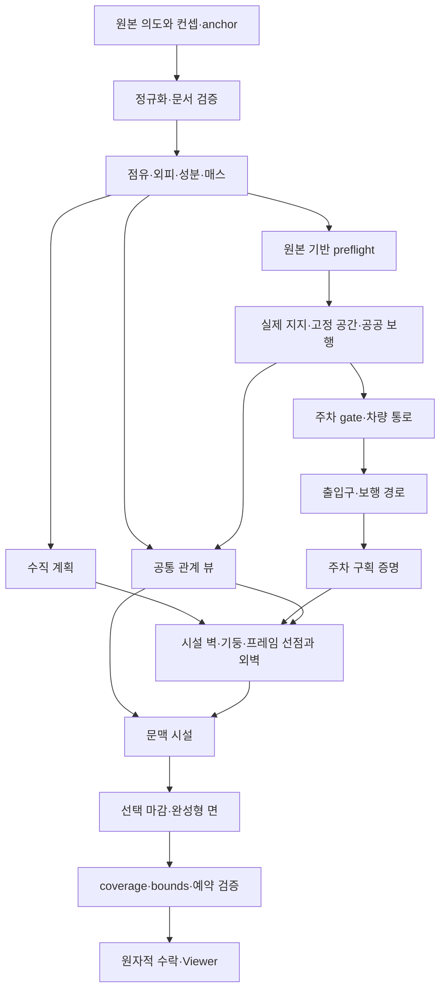

# 통합 규칙 명세 — 제안 설계

이 문서는 2026-09-25 분석 당시의 제안과 근거다. 현재 구현 계약은 [환경 계약](../PORTING_CONTRACT.md)과 [도로 규칙](../ROAD_RULES.md)을 따른다.

[진입](../VIDEO_RULE_STUDY.md) · [관찰](OBSERVATIONS.md) · [가설](HYPOTHESES.md) · [환경 계약](../PORTING_CONTRACT.md)

이 문서의 R01–R10은 **우리 프로젝트가 채택할 제안**이다. 영상은 필요한 공간 관계의 사례를 제공한다. 원본 Miniopolis의 데이터 구조·실행 순서·검사 수준을 확인한 것은 아니다. 좌표·우선순위·실패 정책의 구체적인 값은 영상에서 추출하지 않고 현재 프로젝트 계약을 보존한다.

## 1. 입력, 공간 표현, 출력

### 입력과 파생 정보의 경계

입력은 정수 점유 `grid`, 건물 컨셉/등록 rule 및 보존 `anchor`, 전역 seed, 도로 셀, 방향을 가진 오브젝트 의도 셀, 지상 주차 마스크다. 이미 있는 외벽 타일 설정과 구버전 명시 시설 종류도 보존한다. 새 사용자 파라미터 창을 만들지 않는다. 부피/도로/오브젝트 직접 편집과 컨셉 선택이 사용자 조작의 중심이다.

| 표현 | 내용과 책임 | 피해야 할 대체 |
|---|---|---|
| 정수 점유·연결 성분 | 실제 있는 셀과 없는 셀, 6이웃 연결, 상속된 컨셉·anchor | 건물 전체 AABB, 열별 최고 높이만으로 원본 복원 |
| 외피·면 영역 | 외부 공기에 닿는 면, wall/roof/terrace/underside, wallKind, 방향·평면·연속 run | 렌더 메시에서 역으로 면·지지 추론 |
| 수직/매스 관계 | 층별 섬, 겹침, split/merge/shrink/expand, 지역 높이 scope | 매스 라벨 하나로 모든 스타일의 비율 교체 |
| 공통 관계 뷰(확장) | 지지 면과 소유자, 경계 접촉, 덮임, 높이 차, 실제 빈 공간, 도로 frontage·junction 참조 | 거리만으로 같은 지지층/같은 통로라 판정 |
| 예약·접근 그래프 | 고정 본체, 보행 몸체/sweep, 차량 통로, portal, 시설 사용 공간, 정확한 Box16 | 화면상 통과해 보인다는 이유로 연결 허용 |
| 배치·진단 | sourceRefs, 면 소유, 안정 ID, 선택/탈락 이유, 실제 bounds, 접근 확인 수준 | 결과가 없으면 입력까지 삭제하거나 성공한 빈 계획 반환 |

공통 관계 뷰는 첫 단계에서 **실행 중 읽기 전용 파생 자료**로 둔다. 기존 `SurfaceRegion`, `MassRelations`, `SpatialAnalysis`, `VerticalPlan`을 연결하는 작은 인덱스부터 시작한다. 모든 표현을 새 그래프 하나로 다시 만들지 않는다. 사용할 소비자가 없는 관계·영구 캐시·문서 필드를 선제적으로 추가하지 않는다.

권장 최소 레코드는 `relationId`, `kind`, `sourceRefs`, `surfaceIds/runIds`, `supportOwner`, 정수 bounds/셀, `readDependencies`, `reasonCodes`다. 관계 종류는 `supported-by`, `covered-by`, `adjacent-to`, `fronts-road`, `bounds-open-space`부터 실제 소비되는 것만 선택한다. `reachable`은 거리 관계가 아니라 **확정 접근 계획의 별도 증명**으로 참조한다. 원본 building/object ID와 파생 relation ID를 혼동하지 않는다.

출력은 기존 `GenerationResult`의 배치·완성형 면·계획·예약·진단이다. 필요하면 관계 설명 trace를 추가하되 기존 `semantic-v1` 필드/순서의 호환성을 따로 검토한다. 새 내부 자료 자체를 저장 문서에 직렬화할 이유는 없다.

### 지지의 세 가지 의미

1. 설치 지지: 오브젝트 바닥/등 뒤에 실제 허용 면이 있는가. 현재 시스템이 다루는 필수 조건.
2. 이동 지지: 사람이 서거나 차량이 지나갈 바닥과 공간이 연결되는가. body/sweep 검증의 대상.
3. 건축 하중 지지: 기둥·보·기초가 하중을 전달하는가. **영상과 현재 코드 모두 이를 입증하지 않는다.** 이번 후속 핵심 구현에 구조 해석을 포함하지 않는다.

V02/V15의 기둥처럼 보이는 결과를 이유로 빈 셀을 자동 기둥으로 채우지 않는다. 명시 점유의 좁은 수직 run을 기둥 형태로 해석할 수 있지만, 그것은 구조 안전 증명이 아니다.

## 2. 생성 순서와 의존성

도식의 관계 뷰는 단계를 뛰어넘는 피드백 통로가 아니다. 초기에는 원본/분석 기반 관계만 담고, 접근 결과를 사용할 때는 완료된 단계의 읽기 전용 참조를 별도로 받는다. preflight가 이후 시설 배치를 읽게 해 순환 의존성을 만들지 않는다. 빈 건물 문서·도로만 있는 문서도 해당되는 단계로 같은 실행 경로를 통과한다.

## 3. 규칙 카탈로그

### R01 — 의도를 정규화하고 원본을 보존

- 근거: O01/O04/O12의 직접 부피 편집. 정확한 편집·호환 정책은 C01/C02/C11의 기존 계약.
- 입력 → 출력: 편집 명령+수락 문서 → 검증된 후보 문서+변경 셀/소유자. grid 중복 제거·XYZ 숫자 정렬; 방향 등록 순서 유지.
- 적용: 추가·삭제·컨셉 교체·JSON·Undo/Redo 전부. 기존 도로/오브젝트 소유 전환은 각 명령의 계약을 그대로 따른다. 지상 주차 마스크의 합집합/차집합과 anchor도 보존한다.
- 불변: 생성 결과는 원본 의도를 덮어쓰지 않는다. 지지 상실 오브젝트는 진단과 함께 남는다. 성분 병합 시 이전 부피 크기와 숫자 좌표 동점으로 design을 상속하며 새 bridge 셀은 투표하지 않는다.
- 실패: 형식·버전·좌표 계약 오류는 전체 명령 거절, 마지막 수락 상태 유지. 정상적인 생성 불가는 의도와 사유를 남기는 별도 상태다.

### R02 — 외피·빈 공간·관계를 하나의 사실에서 도출

- 근거: O02 24.91, O04 19.56, O06 23.68, O15 20.12. H01/H02.
- 입력 → 출력: 정규화 점유/외부 공기/원본 의도 → 외피, 방향별 실제 run, 지지/덮임 관계, 경계 인덱스.
- 적용: 인접 점유나 지지층이 바뀐 모든 성분. 내부 밀폐 공기 처리와 비다양체 fallback은 현재 외피 분석 계약 유지.
- 불변: 돌출부 밑 빈 공간·오목부·관통 구멍을 채우지 않는다. 같은 XZ에서도 서로 다른 Y의 면을 혼동하지 않는다. `roof`, `terrace`, `covered-terrace`, 최상단 `rooftop wall`, 이웃 위쪽 벽이 없는 `local-cap`은 서로 다른 판정이다.
- 실패: 비다양체에 닿은 면만 보수적 기본 패널·진단. 유효한 이웃 면의 스타일은 유지. 지지 없는 관계는 임의의 가까운 면으로 대체하지 않는다.

### R03 — 매스 관계 위에서 높이와 입면을 결정

- 근거: O01/O04/O09/O15의 서로 다른 높이, O06의 스타일 교체. H02/H04.
- 입력 → 출력: 성분 셀·컨셉·anchor·seed·확정 portal/시설 면 → 수직 구간, 지역 scope, 고정 선점, 반복 패턴과 에셋.
- 적용: 현재 A/B/D는 성분 전체 높이, C는 기존 지역 scope를 유지한다. 새 매스 정책이 필요하면 별도의 등록 정의/버전과 명시된 적용 조건으로 도입한다. 새 규칙 때문에 기존 A–D 비율을 몰래 바꾸지 않는다.
- 불변: portal → 승인된 시설 벽 → 기둥 → 다층 프레임 → 실제 run 끝 → 남은 반복 구간. complete group을 만들 공간이 없으면 등록 fallback. 물리 구멍과 역할 변경에서 run을 끊는다. 패턴 phase는 보존 anchor 기준이다.
- 실패: 필수 소유 중복은 오류. 좁은 폭은 fallback이며 억지 반쪽 창을 만들지 않는다. 기둥의 표시는 점유를 줄이거나 하중 지지 판정을 새로 만들지 않는다.

### R04 — 경계는 인접 관계와 단일 소유로 마감

- 근거: O01 9.52/19.04, O04 19.56/29.34, O05 38.73, O14 0. H03.
- 입력 → 출력: 노출 면 경계·주변 점유·컨셉·preflight envelope → cap/난간/마감 후보, 호스트 면 및 정수 예약.
- 적용: 실제 노출 경계만. 같은 면을 분할한 내부 선을 외곽 난간으로 취급하지 않는다. 상부가 덮인 테라스와 하늘에 노출된 낮은 옥상을 구분한다.
- 불변: 각 월드 경계의 마감 소유자가 하나이며 완성형 면 호스트에 결합된다. 높은 부피와 맞닿는 곳, 오목/볼록 코너의 접합 조건을 일관되게 처리한다.
- 실패: 보호 공간과 충돌하는 선택 마감은 탈락·진단. 필수 외피를 삭제하지 않는다. **물가 난간은 새로운 지형/부지 입력이 없는 현재 문서에서 추측 생성하지 않는다.** 해안 경계 도입은 별도 단계다.

### R05 — 도로 점유, 경계, 교차부 문맥

- 근거: O08 0/9.15, O14 2.82/11.27, O15 0/6.71. H05.
- 입력 → 출력: 지상 도로 마스크 → 현재 모듈/port/차선 표시, frontage와 교차부를 참조하는 관계.
- 적용: 직선·끝·L/T/십자 및 폭 변화. 기존 도로 분해와 표시를 먼저 보존하고, 장식·시설 소비자가 공유할 junction identity를 파생한다.
- 불변: 도로 표시는 접근 증명의 대체가 아니다. 높은 건물 아래라도 실제 도로 Y와 clearance로 판단한다. 교차부라서 안전 공간 검사를 면제하지 않는다.
- 제안 확장: **명시한 조명 의도**가 교차부 접근 방향에 놓였을 때만 정적 신호등형 후보를 고려할 수 있다. 교차부 참조·방향·실제 bounds를 먼저 정의한다. 증거가 부족한 동안 기존 lamp 결과 유지가 기본이며 자동 신호등 생성/교통 시뮬레이션은 핵심 단계의 필수 결과가 아니다.
- 실패: 공중 도로/건물 점유와 겹치는 도로는 기존 입력 오류. 분해 한계는 trace로 남기고 도로 셀을 확대하지 않는다.

### R06 — 입구와 접근은 검증 후 외벽이 소비

- 근거: O01 14.28, O08 36.60, O09 19.03, O12 13.56의 입구형 요소. 실제 경로 증명은 C06의 기존 코드 계약이고 H06은 미확정.
- 입력 → 출력: 실제 지지·보행 body/sweep·도로 도착점·현재 예약·건물 frontage → portal 면, landing, 경로, 접근 상태.
- 적용: 모든 일반 건물. 후보 수·간격은 내부 상수. 전면 판단은 확정 접근·frontage를 사용하며 카메라 쪽을 전면으로 쓰지 않는다.
- 불변: 높이 차에 가짜 계단/승강 연결을 만들지 않는다. 도로 없음, 지역 접근, 서비스 미검증은 공공 접근 성공과 구분한다. facade는 portal 결정을 다시 뽑지 않는다.
- 실패: 유효한 입구 부족은 unmet count/사유; 보호 공간을 침범한 출입구로 외관을 맞추지 않는다.

### R07 — 주차 구조와 지상 주차 증명을 분리

- 근거: O11 16.87/33.75, O12 0, O13 5.03/10.05. H07.
- 입력 → 출력: 건물 주차 rule은 개방 데크/기둥 구조; 별도의 지상 주차 마스크는 gate·차로·crossing·구획·차량 왕복/후면 보행 proof.
- 적용: 두 입력은 같은 예약 체계를 쓰되 다른 능력을 선언한다. 차량 모델은 기존 grid-car-v1, 예산은 parking-budget-v1.
- 불변: 다른 구획을 비었다고 가정하지 않는다. 상층에 차량 모델이 있다고 층간 이동 성공으로 표시하지 않는다. 도색은 구조면 소유자가 아니다.
- 실패: NO_ROAD, 공간 부족, 논리 탐색 예산 종료를 구분한다. 남은 미검증을 성공으로 채우지 않는다. 상층 경사로/실차 움직임은 별도 명시 범위가 없으면 구현하지 않는다.

### R08 — 오브젝트 의도를 지지·형태·이웃으로 해석

- 근거: O03의 지상/옥상 식생, O05/O08의 설비, O13/O14의 외벽 세로 시설. H08/H09.
- 입력 → 출력: category, 방향, 각 수직 열 높이, 실제 지지·주변 관계·확정 접근·예약 → 식생/조명/시설 후보, 고정 위치 배치와 설명 trace.
- 적용: 지상/옥상/외벽/도로변/중앙분리대. 원본 직육면체 object 입력과 editor의 분할 fragment를 유지하고, 공통 관계 뷰에서만 이웃 fragment를 읽는다.
- 불변: 명시적으로 그린 각 호환 칸을 슬롯으로 유지한다. 2×2를 대표 슬롯 하나로 축소하거나 자동 간격 조절로 사용자의 칸을 비우지 않는다. 절대 좌표에서 독립 hash를 사용하고 후보열 RNG 소비 순서에 의존하지 않는다.
- 현재 정책 보존: 옥상 한 칸 높이 설비/두 칸 이상 탱크, 외벽 한 높이 줄 발코니/여러 높이 비상계단/지면까지 여러 높이 엘리베이터. 기존 JSON의 명시 종류는 우선. 원본 영상의 정확한 규칙이라고 주장하지 않는다.
- 충돌: 지지 검증 → 등록 실제 본체 bounds → 선행 보호 공간 → 배치 전체의 사용/유지보수 접근. 본체 위치를 임의로 옮기지 않는다. 장식 시설은 `service-unverified`를 보일 수 있지만 public 접근이라고 속이지 않는다.
- 확장: 식생도 다른 계획과 같은 sourceRefs·지지 사유를 설명한다. 현재 식생 셀 전체 solid와 메시가 다르다는 이유만으로 예약을 수관 모양으로 약화하지 않는다. 새 나무·안테나·실외기 변형은 geometry보다 먼저 envelope와 의미 조건을 정의한다.
- 실패: 지지 상실·보호 공간 충돌 시 입력은 유지하고 부적합 출력만 배제한다. 판별 불가능하면 등록된 기본값 또는 미지원 진단을 쓰고 장면별 특례를 만들지 않는다.

### R09 — 편집 후 결정적으로 다시 평가

- 근거: O01/O04/O06의 갱신 관찰. 동일 입력 결정론·캐시·Undo/Redo는 영상 미관찰이며 C02/C10/C11의 보존 계약.
- 입력 → 출력: 수락 문서+edit delta → 새 전체 계획 또는 실패. 초기 구현은 전체 규칙 재평가를 정답 경로로 유지한다.
- 불변: 동일한 **완전한 입력**(컨셉, anchor, seed, 명시 override 포함)은 동일 출력·순서·trace를 낸다. 최종 grid만 같고 상속 anchor가 다르면 같은 입력이 아니다.
- 안정성: 의존성이 변하지 않은 기존 슬롯의 위치/형태는 유지한다. 높이를 바꾸면 같은 scope의 층 배분, 성분 병합은 design, 도로 단절은 멀리 있는 경로가 합법적으로 바뀔 수 있다. “항상 이웃 한 칸만 바뀜”을 약속하지 않는다.
- 실패: 후보 문서 생성·검증·Viewer 반영·이력 수락은 기존 원자적 경로. 부분 계획을 이전 계획에 섞어 publish하지 않는다.

### R10 — 의미 결과와 외형 표현 분리

- 근거: O06, O07, O08의 상세 패널/거리 시점, O13의 화면 효과. H04/H10.
- 입력 → 출력: 확정된 plan·asset key·orientation·palette → 엔진 어댑터의 mesh/material/선택 표시.
- 불변: 일반 건물 면당 실제 Mesh 하나, 채택 마감 포함, geometry/재질 공유. 단일 Mesh가 단일 draw call이라는 뜻은 아니다. 카메라·날씨·번짐·젖음·표시 원점은 원본 좌표·접근 결과에 영향을 주지 않는다.
- 적용: 기존 Viewer와 향후 엔진 어댑터. 날씨/물/후처리의 새 구현은 이번 후속 핵심 범위 밖이다. 영상의 상세 설정 UI도 도입하지 않는다.
- 실패: 등록 geometry/bounds 불일치는 계약 오류. 표시 효과로 구조 누락을 숨기지 않는다.

## 4. 우선순위와 충돌 해결

| 공간 예약 | 우선순위 | 처리 |
|---|---:|---|
| 고정 solid(건물, 유효 식생 의도 등) | 1000 | 원본·preflight의 불변 공간 |
| 공공 도로·보행 | 900 | 후속 시설이 막지 않음 |
| 차량 gate/차로 | 800 | 접근 계획 전에 확정 |
| 출입구·보행 경로 | 700 | facade가 소비 |
| 주차 구획 | 600 | 왕복 proof 뒤 채택 |
| 안전/외벽 시설 | 500 | 필수 portal을 덮지 않음 |
| 조명 | 400 | 선행 공간 준수 |
| 일반 시설 | 300 | 본체·사용 공간 검증 |
| 선택 마감 | 200 | 채택 후 완성형 면에 결합 |

우선순위 숫자는 뒤늦게 높은 후보가 기존 예약을 추방하는 일반 solver를 뜻하지 않는다. **단계 순서와 원자적 batch**로 선점한다. 동점은 기존 numeric 좌표·고정 방향·ASCII ID/등록 해시 순위를 따르며 배열 입력 순서에 의존하지 않는다. 기존 예약끼리 허용되는 보행 공유, 차량 공유, 인증 crossing, 호스트 마감 joint 외에는 묵시적 공유가 없다. 새 규칙은 같은 batch의 내부 충돌도 검사한다. 필수 구조 소유 충돌은 거절, 선택 장식의 충돌은 사유를 남기고 탈락한다.

## 5. 편집별 재평가 범위

아래는 **의미상 의존성 범위**다. 곧바로 부분 실행하라는 지시가 아니다.

| 변경 | 영향 전파 |
|---|---|
| 셀 추가/삭제 | 옛+새 성분 → 외피/구멍/매스/층 → preflight → 주변 지지·접근 → 출입구·주차·시설·마감 |
| 낮은 날개 높이 | 해당 열의 노출 경계뿐 아니라 연결된 수직 scope/완전 패턴 그룹 |
| 성분 병합/분리 | ancestor 선택·anchor·컨셉 상속, 바뀐 모든 성분의 외피와 주변 공간 |
| 도로 추가/단절 | 연결된 road/frontage/junction, 공공 도착점과 경로를 공유하는 모든 소비자; 고정 반경만으로 한정 불가 |
| 오브젝트 한 칸 삭제 | 해당 열·원본 fragment 재분할·지지/형태 판정, 겹치는 예약과 주변 접근 소비자 |
| 컨셉·기존 타일 설정 | 해당 성분의 수직/패턴/실제 geometry envelope. bounds가 바뀌면 공간 소비자까지 |
| seed 변경 | 해시를 읽는 모든 결정. 지역 안정성 보장 대상 아님 |
| 카메라·표시 효과 | 표시만. 생성 입력·예약 재평가 없음 |

증분 실행이 필요해지는 경우 옛 관계와 새 관계의 의존성 합집합으로 dirty closure를 계산한다. 근거가 없는 캐시 무효화 범위를 발명하지 않는다. 전체 실행과 canonical 의미 출력이 같다는 별도 검증 전에는 증분 결과를 정답 경로로 사용하지 않는다.

## 6. 정상 실패와 계약 오류

정상 실패에는 공간 부족, 도로 없음, 시설 지지 상실, 미검증 서비스 접근, 선택 마감 탈락이 있다. 입력·원인·관련 소유자를 남기고 가능한 나머지 결과를 유지한다. 계약 오류에는 잘못된 문서/버전, envelope 이탈, 필수 면 소유 중복, 무권한 crossing, 미구현 필수 단계가 있다. 마지막 수락 문서/화면을 보존한다. 두 범주를 `ok` 하나로 합치지 않는다. 일부 시설 미배치를 전체 geometry 실패로 과장하지도 않는다.

## 분석 당시 코드 대응표

기준 커밋은 `65701664aa9c4c4bb80320d58550e610511ea2b0`이다. C01–C12는 관찰과 검증 시나리오의 출처 ID이며 현재의 미구현 목록이 아니다. 이후 공통 관계와 도로 규칙이 수정되었으므로 현재 계약과 구분한다.

| ID | 이미 있는 기능과 파일 근거 | 일반화/확장 또는 새로 필요한 부분 | 판단 |
|---|---|---|---|
| C01 | [document.ts](../../src/core/document.ts)의 `createDocument` L92, schema6 L105, `loadDocument` L128; [scene-inputs.ts](../../src/core/scene-inputs.ts) L5–56: 입력 레이어, schema5 호환·폐기 설정 제거, object 직육면체·방향 검증 | 새 관계 자료는 파생 뷰로 추가. raw schema 변경은 실제 필요한 입력이 있을 때만 | 입력 체계 재작성 불필요. 영상에 맞춰 폐기 설정을 복원하지 않음 |
| C02 | [analysis.ts](../../src/core/analysis.ts) `partitionNormalizedCells` L102, `analyze` L123: 6이웃, 외부 공기, 실제 외피, rooftop/비다양체; [buildings.ts](../../src/core/buildings.ts) `inheritBuildings` L37; [design-profile.ts](../../src/core/design-profile.ts) 독립 해시 | 새 관계 identity가 성분 최소 좌표 변경 때문에 외형 seed를 바꾸지 않도록 기존 anchor와 연결 | R01/R02/R09의 대부분 존재. 큰 좌표/음수 지원을 작은 예제 좌표로 축소하지 않음 |
| C03 | [regions.ts](../../src/core/regions.ts) `analyzeVolume`, covered/annex 해석 L163 부근; [mass-relations.ts](../../src/core/mass-relations.ts) `analyzeMass` L255 및 층 DAG; [vertical-design.ts](../../src/core/vertical-design.ts) `planVertical` L50 | roof scope·관계·시설 지지를 함께 설명할 실행 인덱스. A/B/D 전체 높이와 C 지역 scope를 구분한 채 노출 | 매스 분석이 없는 것이 아님. DAG 라벨이 모든 층 배분을 통제하는 것도 아님 |
| C04 | [facade-layout.ts](../../src/core/facade-layout.ts) L51 `fixedAssignments`, L141 `planPhysicalRun`, L178 `planFacadeLayout`; [facade-face-selection.ts](../../src/core/facade-face-selection.ts), [facade-trims.ts](../../src/core/facade-trims.ts), [building-output.ts](../../src/core/building-output.ts): 선점·실제 run·마감/완성형 키 | 면/경계 판정 이유가 다른 소비자와 일치하도록 공통 관계 참조. 새로운 외형은 기존 출력 보존과 분리 | 현재 외벽 규칙을 영상별 프리셋으로 바꾸지 않음 |
| C05 | [roads.ts](../../src/core/roads.ts) L12 `analyzeRoads`: 큰 정사각형 분해, port·폭·L/T/십자, lane·crosswalk; [spatial-analysis.ts](../../src/core/spatial-analysis.ts) L19 `boundaryRuns`, L35 `analyzeSpatial` | road module과 frontage를 연결하는 교차부/경계 참조를 시설과 공유. 넓이 변화·노치에 대해 현재 분해 한계를 구분 실험 | 단순 도로 기능은 이미 있음. 신호등 문맥/교차부 소비 계약은 새 확장 후보. 기존 도로 버그라고 단정하지 않음 |
| C06 | [access-graph.ts](../../src/core/access-graph.ts) L27 `buildAccessGraph`, L58 `AccessSearch`: 지상/노출 상면, 동일 높이 4방향 edge, 몸체/sweep; [entrance-plan.ts](../../src/core/entrance-plan.ts) L27 `planEntrances` | 관계 뷰에서 접근 결과의 증명 수준·sourceRefs를 재사용. 수직 이동은 별도 입력·실체가 없으면 추가 금지 | 거리 기반 시설 배치보다 이미 강한 계약. 영상의 자유 카메라는 수직 접근 확장 근거가 아님 |
| C07 | [parking-rule.ts](../../src/core/parking-rule.ts) `PARKING_RULE`: open deck/column; [parking-circulation.ts](../../src/core/parking-circulation.ts), [parking-stalls.ts](../../src/core/parking-stalls.ts), [vehicle-motion.ts](../../src/core/vehicle-motion.ts), [parking-budget.ts](../../src/core/parking-budget.ts): 별도 지상 proof | 상층 주차의 실제 진입·경사로는 새 도메인. 현재 능력 표기·진단을 먼저 명확히 유지 | 외형 주차 구조와 차량 왕복 검증을 합쳐 “주차 완료”라 하지 않음 |
| C08 | [fixture-plan.ts](../../src/core/fixture-plan.ts) L53 `planFixtures`, L81 부근 문맥 family, L95 부근 각 칸 슬롯; [fixture-catalog.ts](../../src/core/fixture-catalog.ts) 13종; [wall-facilities.ts](../../src/core/wall-facilities.ts) L14 높이 기반 자동 종류, L21 원자적 조립 | 공통 support/context trace, fragment가 갈려도 같은 절대 칸의 의미 유지. 원본의 신호등·안테나 형태는 별도 envelope/후보 정책이 필요 | 시설 알고리즘 재작성보다 문맥 입력의 일관성이 우선. 외벽 계단/엘리베이터는 장식이며 `MOVEMENT_NOT_IMPLEMENTED` |
| C09 | [scene-inputs.ts](../../src/core/scene-inputs.ts) L65 식생 bottom/middle/top, L80 `vegetationPlacements`; [spatial-analysis.ts](../../src/core/spatial-analysis.ts) L53–54 유효 식생 전체 셀 solid; [environment-output.ts](../../src/core/environment-output.ts) L52 출력; [vegetation-geometry.ts](../../src/vegetation-geometry.ts) 전용 메시 | 식생 계획/지지 거절 설명을 동일 trace 방식으로 연결. 메시 수관 형태와 전셀 solid의 의미를 문서화 | **식생에 충돌 정보가 전혀 없다는 주장은 틀림.** 현재는 보수적 셀 solid이며 시설과 다른 출력 경로 |
| C10 | [environment-generation.ts](../../src/core/environment-generation.ts) `executeEnvironment`: 수직→preflight→spatial→차량→입구→구획→facade→시설→마감; [environment-cache.ts](../../src/core/environment-cache.ts): 제한 FIFO·논리 비용과 telemetry 분리 | 실행 중 관계 인덱스와 읽기 의존성 기록. 실제 병목 근거가 있기 전 증분 scheduler는 보류 | 규칙은 전체 재평가. Viewer 객체 재사용을 부분 생성이라 부르지 않음 |
| C11 | [surface-edit.ts](../../src/surface-edit.ts) `stepSurface`; [scene-editor.ts](../../src/scene-editor.ts) `objectFragments`, `editObjects`, `editRoads`; [environment-editor.ts](../../src/environment-editor.ts) `applyEnvironmentEdit`; [editor.ts](../../src/editor.ts) `DocumentHistory`; [main.ts](../../src/main.ts) L351 `regenerate`, L378 부근 `acceptDocument` | 새 관계 설명을 기존 Inspector에 표시. 편집 실패·no-op·상속을 기존 수락 경로에 연결 | 새 상세 편집 UI 불필요. 지지 상실은 보존된 의도와 진단이라는 현재 정책을 유지 |
| C12 | [viewer.ts](../../src/viewer.ts) L346 `sync`, L351 이전 face Mesh, L424 재사용; [face-mesh.ts](../../src/face-mesh.ts), [display-transform.ts](../../src/display-transform.ts); [column-prototype.ts](../../src/core/column-prototype.ts) `planColumns` | geometry와 의미의 분리 유지. 물/부지 경계·날씨·실제 이동·하중 해석은 별도 명세가 필요한 새 도메인 | 기둥은 기존 점유 run의 표시 해석. 실제 지형 입력/하중 solver가 있다고 볼 근거 없음 |

라인은 기준 커밋의 위치 안내이며 링크와 심볼명을 함께 사용한다. 오래된 설계 문서가 현재 코드와 다르면 현재 코드·최신 계약을 우선한다.
